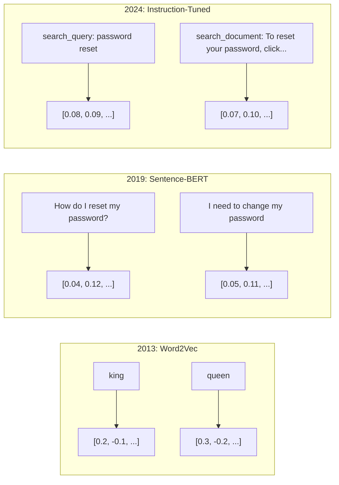
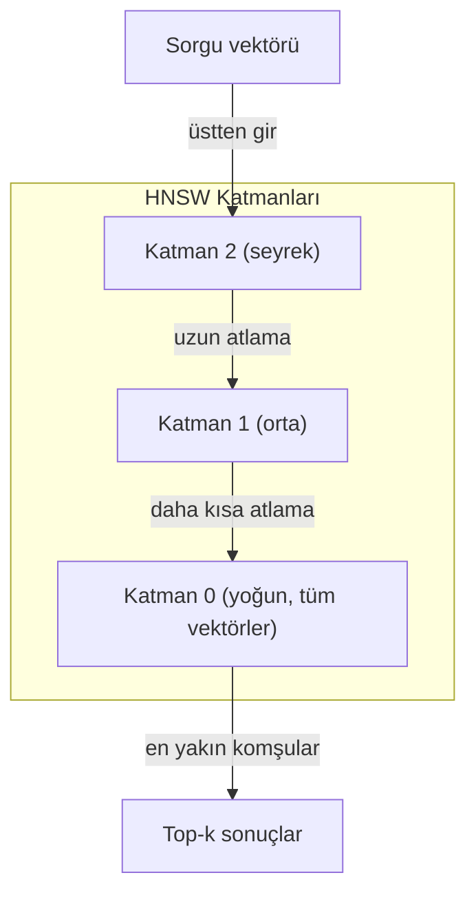
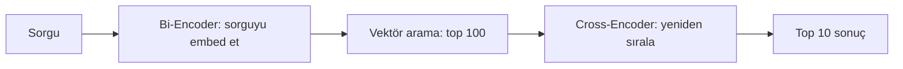

# Embedding'ler ve Vektör Temsilleri

> Metin kesikli. Matematik sürekli. Bir LLM'den "benzer" belgeler bulmasını, anlamları karşılaştırmasını ya da anahtar kelimelerin ötesinde aramasını istediğinde, bu iki dünya arasındaki köprüye güveniyorsun. O köprü bir embedding. Embedding'leri anlamıyorsan, modern AI'ı anlamıyorsun. Sadece kullanıyorsun.

**Tür:** Yapım
**Diller:** Python
**Ön koşullar:** Faz 11, Ders 01 (Prompt Engineering)
**Süre:** ~75 dakika
**İlgili:** Faz 5 · 22 (Embedding Modelleri Derinlemesine) dense vs sparse vs multi-vector, Matryoshka kırpma ve eksen başına model seçimini kapsar. Bu ders üretim pipeline'ına (vektör DB'leri, HNSW, benzerlik matematiği) odaklanır. Model seçmeden önce Faz 5 · 22'yi oku.

## Öğrenme Hedefleri

- API sağlayıcıları ve açık kaynak modellerle metin embedding'leri üret ve aralarında cosine similarity hesapla
- Embedding'lerin anahtar kelime aramasının halledemediği vocabulary mismatch problemini neden çözdüğünü açıkla
- Tam anahtar kelime eşleşmesi yerine anlamla belge çeken bir semantik arama indeksi inşa et
- Retrieval benchmark'larıyla (precision@k, recall) embedding kalitesini değerlendir ve görevin için doğru embedding modelini seç

## Sorun

10.000 destek talebin var. Bir müşteri "ödemem geçmedi" diye yazıyor. Benzer geçmiş talepleri bulman gerekiyor. Anahtar kelime araması "payment" ve "didn't go through" içeren talepleri bulur. "Transaction failed", "charge was declined" ve "billing error"ı kaçırır. Bu talepler tam aynı sorunu tamamen farklı kelimelerle anlatır.

Bu vocabulary mismatch problemi. İnsan dili aynı şeyi söylemenin onlarca yolu var. Anahtar kelime araması her kelimeyi anlamsız bağımsız bir sembol olarak ele alır. "Declined" ve "didn't go through"un aynı kavrama atıfta bulunduğunu bilemez.

Anlam değil yazılışın benzerliği belirlediği bir metin temsiline ihtiyacın var. "Ödemem geçmedi" ve "işlem reddedildi" arasında bir matematiksel uzayda yakın bir mesafede yerleştirebileceğin, ama "ödemem zamanında geldi"yi "payment" kelimesini paylaşmasına rağmen uzağa itebileceğin bir yola ihtiyacın var.

O temsil bir embedding.

## Kavram

### Embedding Nedir?

Bir embedding, metnin anlamını temsil eden yoğun (dense) bir floating-point sayı vektörüdür. "Dense" önemli — her boyut bilgi taşır, sparse temsillerin aksine (bag-of-words, TF-IDF) çoğu boyut sıfırdır.

"The cat sat on the mat" şuna benzer bir şeye dönüşür `[0.023, -0.041, 0.087, ..., 0.012]` — modele bağlı olarak 768 ile 3072 arasında bir sayı listesi. Bu sayılar anlamı kodlar. Onları asla doğrudan incelemezsin. Karşılaştırırsın.

### Word2Vec Atılımı

2013'te Tomas Mikolov ve Google'daki meslektaşları Word2Vec'i yayınladı. Çekirdek içgörü: bir nöral ağı bir kelimeyi komşularından (ya da komşuları bir kelimeden) tahmin etmesi için eğit ve gizli katman ağırlıkları anlamlı vektör temsilleri haline gelsin.

Ünlü sonuç:

```
king - man + woman = queen
```

Kelime embedding'leri üzerinde vektör aritmetiği semantik ilişkileri yakalar. "Man"den "woman"a giden yön, "king"ten "queen"e giden yönle kabaca aynıdır. Alanın geometrinin anlam kodlayabileceğini fark ettiği an buydu.

Word2Vec 300-boyutlu vektörler üretti. Her kelime bağlamdan bağımsız tek bir vektör aldı. "Bank" "river bank"te ve "bank account"ta aynı embedding'e sahipti. Bu sınırlama sonraki on yılın araştırmasını yönlendirdi.

### Kelimelerden Cümlelere

Kelime embedding'leri tek token'ları temsil eder. Üretim sistemleri tüm cümleleri, paragrafları ya da belgeleri embed etmeye ihtiyaç duyar. Dört yaklaşım ortaya çıktı:

**Averaging**: cümledeki tüm kelime vektörlerinin ortalamasını al. Ucuz, kayıplı, kısa metin için şaşırtıcı derecede iyi. Kelime sırasını tamamen kaybeder — "dog bites man" ve "man bites dog" özdeş embedding alır.

**CLS token**: transformer modelleri (BERT, 2018) tüm input'u temsil eden özel bir [CLS] token embedding'i çıktısı verir. Averaging'den iyi ama [CLS] token next-sentence prediction için eğitilmişti, benzerlik için değil.

**Contrastive learning**: modeli benzer çiftleri yakına itmeye ve benzemez çiftleri uzağa itmeye açıkça eğit. Sentence-BERT (Reimers & Gurevych, 2019) bu yaklaşımı kullandı ve modern embedding modellerinin temeli oldu. "How do I reset my password?" ve "I need to change my password" verildiğinde, model bunların neredeyse özdeş vektörlere sahip olması gerektiğini öğrenir.

**Instruction-tuned embedding'ler**: en son yaklaşım. E5 ve GTE gibi modeller, modele ne tür bir embedding üretmesi gerektiğini söyleyen bir task prefix'i ("search_query:", "search_document:") kabul eder. Bu, bir modelin birden fazla göreve hizmet etmesine olanak verir.



### Modern Embedding Modelleri

Pazar bir avuç üretim-sınıfı seçenekte oturdu (MTEB skorları 2026 başı itibarıyla, MTEB v2):

| Model | Sağlayıcı | Boyut | MTEB | Context | Maliyet / 1M token |
|-------|----------|-----------|------|---------|------------------|
| Gemini Embedding 2 | Google | 3072 (Matryoshka) | 67.7 (retrieval) | 8192 | $0.15 |
| embed-v4 | Cohere | 1024 (Matryoshka) | 65.2 | 128K | $0.12 |
| voyage-4 | Voyage AI | 1024/2048 (Matryoshka) | 66.8 | 32K | $0.12 |
| text-embedding-3-large | OpenAI | 3072 (Matryoshka) | 64.6 | 8192 | $0.13 |
| text-embedding-3-small | OpenAI | 1536 (Matryoshka) | 62.3 | 8192 | $0.02 |
| BGE-M3 | BAAI | 1024 (dense+sparse+ColBERT) | 63.0 multilingual | 8192 | Açık-ağırlıklı |
| Qwen3-Embedding | Alibaba | 4096 (Matryoshka) | 66.9 | 32K | Açık-ağırlıklı |
| Nomic-embed-v2 | Nomic | 768 (Matryoshka) | 63.1 | 8192 | Açık-ağırlıklı |

MTEB (Massive Text Embedding Benchmark) v2 retrieval, classification, clustering, reranking ve summarization üzerinde 100+ görevi kapsar. Yüksek daha iyi. 2026'ya gelindiğinde, açık-ağırlıklı modeller (Qwen3-Embedding, BGE-M3) çoğu eksende kapalı hosted modellerle eşleşiyor ya da onları yeniyor. Gemini Embedding 2 saf retrieval'da lider; Voyage/Cohere belirli alanlarda (finans, hukuk, kod) lider. Bağlanmadan önce her zaman kendi sorgularında benchmark yap.

### Benzerlik Metrikleri

İki embedding vektör verildiğinde, ne kadar benzer olduklarını ölçmenin üç yolu:

**Cosine similarity**: iki vektör arasındaki açının kosinüsü. -1'den (zıt) 1'e (özdeş yön) kadar değişir. Magnitude'u görmezden gelir — 10-kelimelik bir cümle ve 500-kelimelik bir belge aynı yönü gösteriyorlarsa 1.0 puan alabilir. Kullanım durumlarının %90'ı için varsayılan budur.

```
cosine_sim(a, b) = dot(a, b) / (||a|| * ||b||)
```

**Dot product**: iki vektörün ham iç çarpımı. Vektörler normalize (birim uzunluk) olduğunda cosine similarity ile özdeş. Hesaplaması daha hızlı. OpenAI'ın embedding'leri normalize, bu yüzden dot product ve cosine aynı sıralamayı verir.

```
dot(a, b) = sum(a_i * b_i)
```

**Öklid (L2) mesafesi**: vektör uzayında düz çizgi mesafesi. Küçük = daha benzer. Magnitude farklarına duyarlı. Yalnızca yön değil uzaydaki mutlak pozisyon önemli olduğunda kullan.

```
L2(a, b) = sqrt(sum((a_i - b_i)^2))
```

Hangisini ne zaman kullanmalı:

| Metrik | Şu durumda kullan | Şundan kaçın |
|--------|----------|------------|
| Cosine similarity | Farklı uzunluktaki metinleri karşılaştırırken; çoğu retrieval görevi | Magnitude bilgi taşıyor |
| Dot product | Embedding'ler zaten normalize; maksimum hız | Vektörler değişken magnitude'a sahip |
| Öklid mesafesi | Clustering; uzamsal en yakın komşu problemleri | Çok farklı uzunluktaki belgeleri karşılaştırırken |

### Vektör Veritabanları ve HNSW

Brute-force benzerlik araması sorguyu depolanan her vektörle karşılaştırır. 1536 boyutla 1 milyon vektörde, bu sorgu başına 1.5 milyar çarp-topla işlemi. Çok yavaş.

Vektör veritabanları bunu Approximate Nearest Neighbor (ANN) algoritmalarıyla çözer. Baskın algoritma HNSW (Hierarchical Navigable Small World):

1. Vektörlerin çok-katmanlı bir graph'ını inşa et
2. Üst katmanlar seyrek — uzak cluster'lar arası uzun mesafeli bağlantılar
3. Alt katmanlar yoğun — yakın vektörler arası ince taneli bağlantılar
4. Arama üst katmanda başlar, açgözlüce inerek refine eder
5. Yaklaşık top-k sonuçlarını O(n) yerine O(log n) zamanda döndürür

HNSW küçük bir doğruluk kaybını (tipik olarak %95-99 recall) büyük hız kazançları için takas eder. 10 milyon vektörde brute force saniyeler alır. HNSW milisaniyeler alır.



Üretim seçenekleri:

| Veritabanı | Tip | En iyi | Max ölçek |
|----------|------|----------|-----------|
| Pinecone | Yönetilen SaaS | Sıfır-ops üretim | Milyarlar |
| Weaviate | Açık kaynak | Self-host, hibrit arama | 100M+ |
| Qdrant | Açık kaynak | Yüksek performans, filtreleme | 100M+ |
| ChromaDB | Embedded | Prototipleme, yerel dev | 1M |
| pgvector | Postgres uzantısı | Zaten Postgres kullanıyorsa | 10M |
| FAISS | Kütüphane | In-process, araştırma | 1B+ |

### Chunking Stratejileri

Belgeler tek vektörler olarak embed edilemeyecek kadar uzun. 50-sayfalık bir PDF düzinelerce konuyu kapsar — embedding'i her şeyin ortalaması olur, hiçbir şeye özgül olarak benzemez. Belgeleri chunk'lara böler ve her birini embed edersin.

**Sabit-boyutlu chunking**: M-token overlap'le her N token'da böl. Basit ve öngörülebilir. Belgeler net bir yapıya sahip değilse iyi çalışır. 50-token overlap'li 512-token chunk: chunk 1 token 0-511, chunk 2 token 462-973.

**Cümle bazlı chunking**: cümle sınırlarında böl, token sınırına ulaşana kadar cümleleri grupla. Her chunk en azından tam bir cümle. Sabit boyuttan iyi çünkü hiçbir zaman bir düşünceyi ortadan kesmezsin.

**Recursive chunking**: önce en büyük sınırda (bölüm başlıkları) bölmeyi dene. Hâlâ çok büyükse paragraf sınırlarını dene. Sonra cümle sınırları. Sonra karakter sınırları. Bu LangChain'in `RecursiveCharacterTextSplitter`'ı ve karışık-format corpus'lar için iyi çalışır.

**Semantik chunking**: her cümleyi embed et, sonra embedding'leri benzer olan ardışık cümleleri grupla. Embedding benzerliği bir eşiğin altına düştüğünde yeni bir chunk başlat. Pahalı (her cümleyi ayrı embed etmeyi gerektirir) ama en tutarlı chunk'ları üretir.

| Strateji | Karmaşıklık | Kalite | En iyi |
|----------|-----------|---------|----------|
| Sabit boyutlu | Düşük | İdare eder | Yapısız metin, log'lar |
| Cümle bazlı | Düşük | İyi | Makaleler, e-postalar |
| Recursive | Orta | İyi | Markdown, HTML, karışık doc'lar |
| Semantik | Yüksek | En iyi | Kritik retrieval kalitesi |

Çoğu sistem için sweet spot: 50-token overlap'le 256-512 token chunk'lar.

### Bi-Encoder'lar vs Cross-Encoder'lar

Bir bi-encoder sorgu ve belgeleri bağımsız embed eder, sonra vektörleri karşılaştırır. Hızlı — sorguyu bir kez embed eder ve önceden hesaplanan belge embedding'leriyle karşılaştırırsın. Retrieval için kullandığın budur.

Bir cross-encoder sorgu ve bir belgeyi tek bir input olarak alır ve bir relevance skoru çıkarır. Yavaş — her sorgu-belge çiftini tam modelden geçirir. Ama sorgu ve belge token'larına aynı anda attention yapabildiği için çok daha doğru.

Üretim deseni: bi-encoder top-100 adayı çeker, cross-encoder bunları top-10'a yeniden sıralar. Bu retrieve-then-rerank pipeline'ı.



Reranking modelleri: Cohere Rerank 3.5 (1000 sorgu başına $2), BGE-reranker-v2 (bedava, açık kaynak), Jina Reranker v2 (bedava, açık kaynak).

### Matryoshka Embedding'ler

Geleneksel embedding'ler ya hep ya hiç. 1536-boyutlu bir vektör 1536 float kullanır. Yeniden eğitmeden 256 boyuta kırpamazsın.

Matryoshka Representation Learning (Kusupati et al., 2022) bunu düzeltir. Model, ilk N boyutun en önemli bilgiyi yakalayacağı şekilde eğitilir, Rus iç içe geçen bebek gibi. 1536-d Matryoshka embedding'ini 256 boyuta kırpmak biraz doğruluk kaybeder ama işlevsel kalır.

OpenAI'ın text-embedding-3-small ve text-embedding-3-large'ı `dimensions` parametresi üzerinden Matryoshka kırpmasını destekler. 1536 yerine 256 boyut istemek MTEB benchmark'larında kabaca %3-5 doğruluk kaybı ile storage'ı 6x azaltır.

### Binary Quantization

Float32 olarak depolanan 1536-boyutlu bir embedding 6.144 bayt kullanır. 10 milyon belgeyle çarp: yalnızca vektörler için 61 GB.

Binary quantization her float'u tek bir bite dönüştürür: pozitif değerler 1, negatif değerler 0 olur. Storage 6.144 bayttan 192 bayta düşer — 32x azalma. Benzerlik, CPU'ların tek bir komutla yapabileceği Hamming mesafesi (farklı bitleri say) kullanılarak hesaplanır.

Doğruluk darbesi retrieval recall'da yaklaşık %5-10. Yaygın desen: milyonlarca vektör üzerinde ilk geçiş araması için binary quantization, sonra top-1000'i tam-hassasiyet vektörleriyle yeniden skorla. Bu sana 32x daha az bellekte tam hassasiyet doğruluğunun %95+'ını verir.

## İnşa Et

Sıfırdan bir semantik arama motoru inşa ediyoruz. Vektör veritabanı yok. Dış embedding API yok. Saf Python, matematik için numpy.

### Adım 1: Metin Chunking

```python
def chunk_text(text, chunk_size=200, overlap=50):
    words = text.split()
    chunks = []
    start = 0
    while start < len(words):
        end = start + chunk_size
        chunk = " ".join(words[start:end])
        chunks.append(chunk)
        start += chunk_size - overlap
    return chunks


def chunk_by_sentences(text, max_chunk_tokens=200):
    sentences = text.replace("\n", " ").split(".")
    sentences = [s.strip() + "." for s in sentences if s.strip()]
    chunks = []
    current_chunk = []
    current_length = 0
    for sentence in sentences:
        sentence_length = len(sentence.split())
        if current_length + sentence_length > max_chunk_tokens and current_chunk:
            chunks.append(" ".join(current_chunk))
            current_chunk = []
            current_length = 0
        current_chunk.append(sentence)
        current_length += sentence_length
    if current_chunk:
        chunks.append(" ".join(current_chunk))
    return chunks
```

### Adım 2: Sıfırdan Embedding'ler İnşa Etmek

L2 normalizasyonu ile TF-IDF kullanarak basit bir dense embedding uyguluyoruz. Bu nöral embedding değil ama aynı sözleşmeyi takip eder: metin girer, sabit-boyutlu vektör çıkar, benzer metinler benzer vektörler üretir.

```python
import math
import numpy as np
from collections import Counter

class SimpleEmbedder:
    def __init__(self):
        self.vocab = []
        self.idf = []
        self.word_to_idx = {}

    def fit(self, documents):
        vocab_set = set()
        for doc in documents:
            vocab_set.update(doc.lower().split())
        self.vocab = sorted(vocab_set)
        self.word_to_idx = {w: i for i, w in enumerate(self.vocab)}
        n = len(documents)
        self.idf = np.zeros(len(self.vocab))
        for i, word in enumerate(self.vocab):
            doc_count = sum(1 for doc in documents if word in doc.lower().split())
            self.idf[i] = math.log((n + 1) / (doc_count + 1)) + 1

    def embed(self, text):
        words = text.lower().split()
        count = Counter(words)
        total = len(words) if words else 1
        vec = np.zeros(len(self.vocab))
        for word, freq in count.items():
            if word in self.word_to_idx:
                tf = freq / total
                vec[self.word_to_idx[word]] = tf * self.idf[self.word_to_idx[word]]
        norm = np.linalg.norm(vec)
        if norm > 0:
            vec = vec / norm
        return vec
```

### Adım 3: Benzerlik Fonksiyonları

```python
def cosine_similarity(a, b):
    dot = np.dot(a, b)
    norm_a = np.linalg.norm(a)
    norm_b = np.linalg.norm(b)
    if norm_a == 0 or norm_b == 0:
        return 0.0
    return float(dot / (norm_a * norm_b))


def dot_product(a, b):
    return float(np.dot(a, b))


def euclidean_distance(a, b):
    return float(np.linalg.norm(a - b))
```

### Adım 4: Brute-Force Aramalı Vektör İndeksi

```python
class VectorIndex:
    def __init__(self):
        self.vectors = []
        self.texts = []
        self.metadata = []

    def add(self, vector, text, meta=None):
        self.vectors.append(vector)
        self.texts.append(text)
        self.metadata.append(meta or {})

    def search(self, query_vector, top_k=5, metric="cosine"):
        scores = []
        for i, vec in enumerate(self.vectors):
            if metric == "cosine":
                score = cosine_similarity(query_vector, vec)
            elif metric == "dot":
                score = dot_product(query_vector, vec)
            elif metric == "euclidean":
                score = -euclidean_distance(query_vector, vec)
            else:
                raise ValueError(f"Unknown metric: {metric}")
            scores.append((i, score))
        scores.sort(key=lambda x: x[1], reverse=True)
        results = []
        for idx, score in scores[:top_k]:
            results.append({
                "text": self.texts[idx],
                "score": score,
                "metadata": self.metadata[idx],
                "index": idx
            })
        return results

    def size(self):
        return len(self.vectors)
```

### Adım 5: Semantik Arama Motoru

```python
class SemanticSearchEngine:
    def __init__(self, chunk_size=200, overlap=50):
        self.embedder = SimpleEmbedder()
        self.index = VectorIndex()
        self.chunk_size = chunk_size
        self.overlap = overlap

    def index_documents(self, documents, source_names=None):
        all_chunks = []
        all_sources = []
        for i, doc in enumerate(documents):
            chunks = chunk_text(doc, self.chunk_size, self.overlap)
            all_chunks.extend(chunks)
            name = source_names[i] if source_names else f"doc_{i}"
            all_sources.extend([name] * len(chunks))
        self.embedder.fit(all_chunks)
        for chunk, source in zip(all_chunks, all_sources):
            vec = self.embedder.embed(chunk)
            self.index.add(vec, chunk, {"source": source})
        return len(all_chunks)

    def search(self, query, top_k=5, metric="cosine"):
        query_vec = self.embedder.embed(query)
        return self.index.search(query_vec, top_k, metric)

    def search_with_scores(self, query, top_k=5):
        results = self.search(query, top_k)
        return [
            {
                "text": r["text"][:200],
                "source": r["metadata"].get("source", "unknown"),
                "score": round(r["score"], 4)
            }
            for r in results
        ]
```

### Adım 6: Benzerlik Metriklerini Karşılaştırmak

```python
def compare_metrics(engine, query, top_k=3):
    results = {}
    for metric in ["cosine", "dot", "euclidean"]:
        hits = engine.search(query, top_k=top_k, metric=metric)
        results[metric] = [
            {"score": round(h["score"], 4), "preview": h["text"][:80]}
            for h in hits
        ]
    return results
```

## Kullan

Üretim bir embedding API'siyle, mimari özdeş kalır. Yalnızca embedder değişir:

```python
from openai import OpenAI

client = OpenAI()

def openai_embed(texts, model="text-embedding-3-small", dimensions=None):
    kwargs = {"model": model, "input": texts}
    if dimensions:
        kwargs["dimensions"] = dimensions
    response = client.embeddings.create(**kwargs)
    return [item.embedding for item in response.data]
```

OpenAI ile Matryoshka kırpma — aynı model, daha az boyut, daha düşük storage:

```python
full = openai_embed(["semantic search query"], dimensions=1536)
compact = openai_embed(["semantic search query"], dimensions=256)
```

256-d vektör 6x daha az storage kullanır. 10 milyon belge için bu 10 GB'a karşı 61 GB. Doğruluk kaybı standart benchmark'larda kabaca %3-5.

Cohere ile reranking için:

```python
import cohere

co = cohere.ClientV2()

results = co.rerank(
    model="rerank-v3.5",
    query="What is the refund policy?",
    documents=["Full refund within 30 days...", "No refunds after 90 days..."],
    top_n=3
)
```

API bağımlılığı olmadan yerel embedding'ler için:

```python
from sentence_transformers import SentenceTransformer

model = SentenceTransformer("BAAI/bge-small-en-v1.5")
embeddings = model.encode(["semantic search query", "another document"])
```

İnşa'mızdaki VectorIndex sınıfı bunların herhangi biriyle çalışır. Embedding fonksiyonunu takas et, arama mantığını tut.

## Yayınla

Bu ders şunları üretir:
- `outputs/prompt-embedding-advisor.md` — belirli kullanım durumları için embedding modelleri ve stratejileri seçmek için bir prompt
- `outputs/skill-embedding-patterns.md` — agent'lara üretimde embedding'leri etkili kullanmayı öğreten bir skill

## Alıştırmalar

1. **Metrik karşılaştırması**: cosine similarity, dot product ve öklid mesafesi kullanarak örnek belgelere karşı aynı 5 sorguyu çalıştır. Her biri için top-3 sonuçları kaydet. Hangi sorgular için metrikler anlaşmazlık gösteriyor? Neden?

2. **Chunk boyutu deneyi**: örnek belgeleri 50, 100, 200 ve 500 kelimelik chunk boyutlarıyla indeksle. Her biri için 5 sorgu çalıştır ve top-1 benzerlik skorunu kaydet. Chunk boyutu ile retrieval kalitesi arasındaki ilişkiyi çiz. Daha büyük chunk'ların zarar vermeye başladığı noktayı bul.

3. **Matryoshka simülasyonu**: 500-d vektörler üreten bir SimpleEmbedder inşa et. 50, 100, 200 ve 500 boyuta kırp. Her kırpmada retrieval recall'un nasıl bozulduğunu ölç. Bu, gerçek eğitim numarasına ihtiyaç duymadan Matryoshka davranışını simüle eder.

4. **Binary quantization**: arama motorundan embedding'leri al, onları binary'ye (pozitifse 1, negatifse 0) dönüştür ve Hamming mesafesi araması uygula. Top-10 sonuçları tam hassasiyetli cosine similarity ile karşılaştır. Çakışma yüzdesini ölç.

5. **Cümle bazlı chunking**: sabit-boyutlu chunking'i `chunk_by_sentences` ile değiştir. Aynı sorguları çalıştır ve retrieval skorlarını karşılaştır. Cümle sınırlarına saygı duymak sonuçları iyileştiriyor mu?

## Anahtar Terimler

| Terim | İnsanlar ne diyor | Gerçekte ne anlama geliyor |
|------|----------------|----------------------|
| Embedding | "Metin sayıya" | Geometrik yakınlığın semantik benzerliği kodladığı yoğun bir vektör |
| Word2Vec | "Orijinal embedding" | Bağlam kelimelerini tahmin ederek kelime vektörleri öğrenen 2013 modeli; vektör aritmetiğinin anlamı kodladığını kanıtladı |
| Cosine similarity | "İki vektör ne kadar benzer" | Vektörler arası açının kosinüsü; 1 = özdeş yön, 0 = ortogonal, -1 = zıt |
| HNSW | "Hızlı vektör arama" | Hierarchical Navigable Small World graph — O(log n) yaklaşık en yakın komşu aramasını mümkün kılan çok-katmanlı yapı |
| Bi-encoder | "Ayrı embed et, hızlı karşılaştır" | Sorgu ve belgeyi bağımsız olarak vektörlere kodlar; ön-hesaplama ve hızlı retrieval'ı mümkün kılar |
| Cross-encoder | "Yavaş ama doğru reranker" | Sorgu-belge çiftini birlikte tam modelden geçirir; daha yüksek doğruluk, ön-hesaplama yok |
| Matryoshka embedding'ler | "Kırpılabilir vektörler" | İlk N boyutun en önemli bilgiyi yakalayacağı şekilde eğitilen embedding'ler, değişken boyutlu depolamayı mümkün kılar |
| Binary quantization | "1-bit embedding'ler" | Float vektörleri binary'ye (yalnızca sign bit) dönüştürmek, Hamming mesafesi araması ile 32x storage azaltma |
| Chunking | "Doc'ları embedding için böl" | Belgeleri her biri bağımsız embed edilip çekilebilsin diye 256-512 token segmentlere bölmek |
| Vektör veritabanı | "Embedding'ler için arama motoru" | Vektörleri depolamak ve ölçekte yaklaşık en yakın komşu araması yapmak için optimize edilmiş veri store'u |
| Contrastive learning | "Karşılaştırarak eğit" | Benzer çift embedding'lerini yakına ve benzemez çift embedding'lerini uzağa iten eğitim yaklaşımı |
| MTEB | "Embedding benchmark'ı" | Massive Text Embedding Benchmark — 8 görev üzerinde 56 veri kümesi; embedding modellerini karşılaştırmak için standart |

## İleri Okuma

- Mikolov et al., "Efficient Estimation of Word Representations in Vector Space" (2013) — king-queen analojisiyle embedding devrimini başlatan Word2Vec makalesi
- Reimers & Gurevych, "Sentence-BERT: Sentence Embeddings using Siamese BERT-Networks" (2019) — cümle seviyesi benzerlik için bi-encoder'ları nasıl eğiteceğin, modern embedding modellerinin temeli
- Kusupati et al., "Matryoshka Representation Learning" (2022) — OpenAI'ın text-embedding-3 için benimsediği değişken-boyutlu embedding'lerin arkasındaki teknik
- Malkov & Yashunin, "Efficient and Robust Approximate Nearest Neighbor using Hierarchical Navigable Small World Graphs" (2018) — çoğu üretim vektör aramasının arkasındaki algoritma olan HNSW makalesi
- OpenAI Embeddings Kılavuzu (platform.openai.com/docs/guides/embeddings) — Matryoshka boyut azaltma dahil text-embedding-3 modelleri için pratik referans
- MTEB Leaderboard (huggingface.co/spaces/mteb/leaderboard) — tüm embedding modellerini görev ve diller arasında karşılaştıran canlı benchmark
- [Muennighoff et al., "MTEB: Massive Text Embedding Benchmark" (EACL 2023)](https://arxiv.org/abs/2210.07316) — leaderboard'un raporladığı 8 görev kategorisini (classification, clustering, pair classification, reranking, retrieval, STS, summarization, bitext mining) tanımlayan benchmark; herhangi bir tek MTEB skoruna güvenmeden önce oku.
- [Sentence Transformers dokümantasyonu](https://www.sbert.net/) — bi-encoder vs cross-encoder, pooling stratejileri ve bu dersin uyguladığı ingest-split-embed-store RAG pipeline'ı için kanonik referans.
