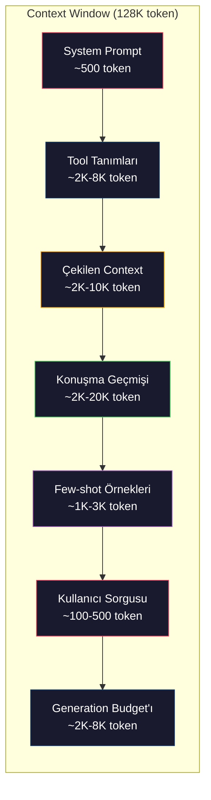
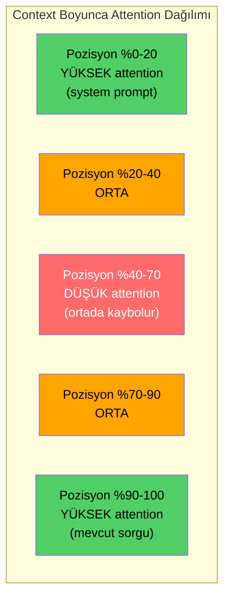
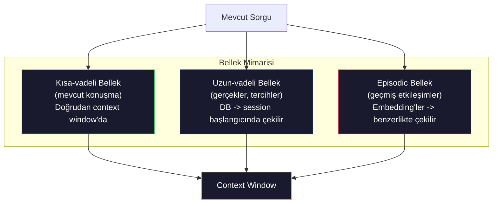

# Context Engineering: Window'lar, Budget'lar, Bellek ve Retrieval

> Prompt engineering bir alt küme. Context engineering tüm oyun. Bir prompt yazdığın bir string. Context, modelin pencere'sine giren her şey: system talimatlar, çekilen belgeler, tool tanımları, konuşma geçmişi, few-shot örnekleri ve prompt'un kendisi. 2026'da en iyi AI mühendisleri context engineer'lardır. Neyin gireceğine, neyin dışarıda kalacağına ve hangi sırada olacağına karar verirler.

**Tür:** Yapım
**Diller:** Python
**Ön koşullar:** Faz 10 (Sıfırdan LLM'ler), Faz 11 Ders 01-02
**Süre:** ~90 dakika
**İlgili:** Faz 11 · 15 (Prompt Caching) — cache-dostu yerleşim context engineering'in bir uzantısıdır. NIAH/RULER ile lost-in-the-middle'ı nasıl ölçeceğin için Faz 5 · 28 (Long-Context Evaluation).

## Öğrenme Hedefleri

- Tüm context window bileşenleri (system prompt, tool'lar, geçmiş, çekilen doc'lar, generation headroom) arasında token budget'larını hesapla
- Context window yönetim stratejilerini uygula: konuşma geçmişi için truncation, summarization ve sliding window
- Modelin attention'ını en alakalı bilgiye maksimize etmek için context bileşenlerini önceliklendir ve sırala
- Sorgu türü ve mevcut pencere alanına göre token'ları dinamik tahsis eden bir context assembler inşa et

## Sorun

Claude Opus 4.7'nin 200K token penceresi var (1M beta). GPT-5'in 400K. Gemini 3 Pro'nun 2M. Llama 4 10M iddia ediyor. Bu sayılar onları doldurana kadar muazzam geliyor.

İşte bir coding asistanı için gerçek bir döküm. System prompt: 500 token. 50 tool için tool tanımları: 8.000 token. Çekilen dokümantasyon: 4.000 token. Konuşma geçmişi (10 tur): 6.000 token. Mevcut kullanıcı sorgusu: 200 token. Generation budget'ı (max output): 4.000 token. Toplam: 22.700 token. Bu 128K pencerenin yalnızca %18'i.

Ama attention context uzunluğuyla lineer ölçeklenmez. 128K token context'li bir model kuadratik attention maliyeti öder (vanilla transformer'larda O(n^2), çoğu üretim modeli verimli attention varyantları kullansa da). Daha önemlisi, retrieval doğruluğu bozulur. "Needle in a Haystack" testi modellerin uzun context'lerin ortasına yerleştirilmiş bilgiyi bulmakta zorlandığını gösterir. Liu et al. (2023) araştırması LLM'lerin uzun context'lerin başında ve sonunda bilgiyi neredeyse mükemmel doğrulukla çektiğini ama ortaya yerleştirilen bilgi için (context'in %40-70 pozisyonları) doğruluğun %10-20 düştüğünü gösterdi. Bu "lost-in-the-middle" etkisi modele göre değişir ama tüm mevcut mimarileri etkiler.

Pratik ders: 200K token'a sahip olmak, 200K token kullanmanın etkili olduğu anlamına gelmez. Dikkatle küratörlü bir 10K token context sıklıkla dökülmüş 100K token context'ten üstündür. Context engineering, context window içinde sinyal-gürültü oranını maksimize etme disiplinidir.

Pencereye koyduğun her token, daha alakalı bilgi taşıyabilecek bir token'ı yerinden eder. İlgisiz her tool tanımı, bayatlamış her konuşma turu, soruyu yanıtlamayan her çekilen metin parçası — her biri modeli görevde biraz daha kötü yapar.

## Kavram

### Context Window Kıt Bir Kaynak

Context window'u disk değil RAM olarak düşün. Hızlı ve doğrudan erişilebilir, ama sınırlı. Her şeyi sığdıramazsın. Seçmen gerekir.



Her bileşen alan için yarışır. Daha fazla tool tanımı eklemek konuşma geçmişi için daha az yer demek. Daha fazla çekilen context eklemek few-shot örnekleri için daha az yer demek. Context engineering bu budget'ı görev performansını maksimize etmek için tahsis etme sanatıdır.

### Lost-in-the-Middle

Context engineering'deki en önemli ampirik bulgu. Modeller context'in başındaki ve sonundaki bilgiye daha iyi attention yapar. Ortadaki bilgi daha düşük attention skorları alır ve görmezden gelinme olasılığı daha yüksektir.

Liu et al. (2023) bunu sistematik test etti. Alakalı bir belgeyi 20 alakasız belge arasına çeşitli pozisyonlara yerleştirdiler ve yanıt doğruluğunu ölçtüler. Alakalı belge ilk ya da son olduğunda, doğruluk %85-90'dı. Ortada olduğunda (20'nin 10. pozisyonu), doğruluk %60-70'e düştü.

Bunun doğrudan mühendislik etkileri var:

- En önemli bilgiyi en başa koy (system prompt, kritik talimatlar)
- Mevcut sorguyu ve en alakalı context'i en sona koy (recency bias yardımcı olur)
- Context'in ortasını en düşük öncelikli bölge olarak ele al
- Ortaya bilgi dahil etmek zorundaysan, anahtar noktayı sonda çoğalt



### Context Bileşenleri

**System prompt**: persona, kısıtlar ve davranış kurallarını belirler. Bu önce gider ve turlar arasında sabit kalır. Claude Code tool tanımları ve davranış talimatları dahil system prompt'u için kabaca 6.000 token kullanır. Sıkı tut. System prompt'taki her kelime her API çağrısında tekrarlanır.

**Tool tanımları**: her tool 50-200 token ekler (isim, açıklama, parametre şeması). 50 tool, her biri 150 token, herhangi bir konuşma başlamadan önce 7.500 token. Dinamik tool seçimi — yalnızca mevcut sorguya alakalı tool'ları dahil etmek — bunu %60-80 azaltabilir.

**Çekilen context**: vektör veritabanından belgeler, arama sonuçları, dosya içerikleri. Retrieval kalitesi doğrudan yanıt kalitesini belirler. Kötü retrieval retrieval olmamasından daha kötüdür — pencereyi gürültüyle doldurur ve modeli aktif olarak yanıltır.

**Konuşma geçmişi**: her önceki kullanıcı mesajı ve asistan yanıtı. Konuşma uzunluğuyla lineer büyür. Tur başına 200 token ile 50 turlu bir konuşma 10.000 token geçmiş demektir. Çoğu mevcut sorguyla alakasız.

**Few-shot örnekleri**: istenen davranışı gösteren girdi/çıktı çiftleri. İki ila üç iyi seçilmiş örnek sıklıkla binlerce token'lık talimattan daha fazla çıktı kalitesi iyileştirir. Ama alana mal olurlar.

**Generation budget'ı**: modelin yanıtı için ayrılan token'lar. Pencereyi kapasiteye doldurursan, modelin yanıt vermek için yeri yok. Generation için en az 2.000-4.000 token rezerve et.

### Context Sıkıştırma Stratejileri

**Geçmiş summarization**: tüm önceki turları kelimesi kelimesine tutmak yerine, konuşmayı periyodik olarak özetle. 2.000 token tutan 10 turun yerine "X'i tartıştık, Y'ye karar verdik ve kullanıcı Z istiyor" 100 token. Geçmiş bir eşiği (örn., 5.000 token) geçtiğinde summarization çalıştır.

**Relevance filtreleme**: her çekilen belgeyi mevcut sorguya karşı skorla ve bir eşiğin altındaki belgeleri at. 10 chunk çektiysen ama yalnızca 3'ü alakalıysa, diğer 7'yi at. 10 vasat olandansa 3 yüksek alakalı chunk'a sahip olmak daha iyi.

**Tool budama**: kullanıcının sorgu niyetini sınıflandır ve yalnızca o niyetle alakalı tool'ları dahil et. Bir kod sorusunun takvim tool'larına ihtiyacı yok. Bir takvim sorusunun dosya sistemi tool'larına ihtiyacı yok. Bu tool tanımlarını 8.000 token'dan 1.000'e indirebilir.

**Özyinelemeli summarization**: çok uzun belgeler için, aşamalı özetle. Önce her bölümü özetle, sonra özetleri özetle. 50-sayfalık bir belge anahtar noktaları yakalayan 500-token'lık bir özete dönüşür.

### Bellek Sistemleri

Context engineering üç zaman ufkunu kapsar.

**Kısa-vadeli bellek**: mevcut konuşma. Doğrudan context window'da depolanır. Her turla büyür. Summarization ve truncation ile yönetilir.

**Uzun-vadeli bellek**: konuşmalar arasında kalıcı olan gerçekler ve tercihler. "Kullanıcı TypeScript tercih ediyor." "Proje PostgreSQL kullanıyor." Bir veritabanında depolanır, session başlangıcında çekilir. Claude Code bunu CLAUDE.md dosyalarında saklar. ChatGPT bunu memory özelliğinde saklar.

**Episodic bellek**: alakalı olabilecek belirli geçmiş etkileşimler. "Geçen salı, auth modülünde benzer bir sorunu debug ettik." Embedding olarak depolanır, mevcut konuşma geçmiş bir bölümle eşleştiğinde çekilir.



### Dinamik Context Assembly

Anahtar içgörü: farklı sorgular farklı context'e ihtiyaç duyar. Statik system prompt + statik tool'lar + statik geçmiş savurganlıktır. En iyi sistemler context'i sorgu başına dinamik birleştirir.

1. Sorgu niyetini sınıflandır
2. Alakalı tool'ları seç (tüm tool'ları değil)
3. Alakalı belgeleri çek (sabit bir küme değil)
4. Alakalı geçmiş turlarını dahil et (tüm geçmişi değil)
5. Görev türüyle eşleşen few-shot örnekler ekle
6. Her şeyi önemine göre sırala: kritik önce, önemli son, opsiyonel ortada

Bu iyi bir AI uygulamasını harika bir AI uygulamasından ayıran şey. Model aynı. Context ayırt edicidir.

## İnşa Et

### Adım 1: Token Sayacı

Ölçemediğini bütçeleyemezsin. Basit bir token sayacı inşa et (whitespace bölme kullanarak yaklaşım, çünkü tam sayı tokenizer'a bağlı).

```python
import json
import numpy as np
from collections import OrderedDict

def count_tokens(text):
    if not text:
        return 0
    return int(len(text.split()) * 1.3)

def count_tokens_json(obj):
    return count_tokens(json.dumps(obj))
```

### Adım 2: Context Budget Manager

Çekirdek abstraction. Bir budget manager her bileşenin kaç token kullandığını izler ve sınırları zorlar.

```python
class ContextBudget:
    def __init__(self, max_tokens=128000, generation_reserve=4000):
        self.max_tokens = max_tokens
        self.generation_reserve = generation_reserve
        self.available = max_tokens - generation_reserve
        self.allocations = OrderedDict()

    def allocate(self, component, content, max_tokens=None):
        tokens = count_tokens(content)
        if max_tokens and tokens > max_tokens:
            words = content.split()
            target_words = int(max_tokens / 1.3)
            content = " ".join(words[:target_words])
            tokens = count_tokens(content)

        used = sum(self.allocations.values())
        if used + tokens > self.available:
            allowed = self.available - used
            if allowed <= 0:
                return None, 0
            words = content.split()
            target_words = int(allowed / 1.3)
            content = " ".join(words[:target_words])
            tokens = count_tokens(content)

        self.allocations[component] = tokens
        return content, tokens

    def remaining(self):
        used = sum(self.allocations.values())
        return self.available - used

    def utilization(self):
        used = sum(self.allocations.values())
        return used / self.max_tokens

    def report(self):
        total_used = sum(self.allocations.values())
        lines = []
        lines.append(f"Context Budget Report ({self.max_tokens:,} token window)")
        lines.append("-" * 50)
        for component, tokens in self.allocations.items():
            pct = tokens / self.max_tokens * 100
            bar = "#" * int(pct / 2)
            lines.append(f"  {component:<25} {tokens:>6} tokens ({pct:>5.1f}%) {bar}")
        lines.append("-" * 50)
        lines.append(f"  {'Used':<25} {total_used:>6} tokens ({total_used/self.max_tokens*100:.1f}%)")
        lines.append(f"  {'Generation reserve':<25} {self.generation_reserve:>6} tokens")
        lines.append(f"  {'Remaining':<25} {self.remaining():>6} tokens")
        return "\n".join(lines)
```

### Adım 3: Lost-in-the-Middle Yeniden Sıralama

Yeniden sıralama stratejisini uygula: en önemli öğeler önce ve son, en az önemliler ortada.

```python
def reorder_lost_in_middle(items, scores):
    paired = sorted(zip(scores, items), reverse=True)
    sorted_items = [item for _, item in paired]

    if len(sorted_items) <= 2:
        return sorted_items

    first_half = sorted_items[::2]
    second_half = sorted_items[1::2]
    second_half.reverse()

    return first_half + second_half

def score_relevance(query, documents):
    query_words = set(query.lower().split())
    scores = []
    for doc in documents:
        doc_words = set(doc.lower().split())
        if not query_words:
            scores.append(0.0)
            continue
        overlap = len(query_words & doc_words) / len(query_words)
        scores.append(round(overlap, 3))
    return scores
```

### Adım 4: Konuşma Geçmişi Sıkıştırıcı

Token budget'ını geri kazanmak için eski konuşma turlarını özetle.

```python
class ConversationManager:
    def __init__(self, max_history_tokens=5000):
        self.turns = []
        self.summaries = []
        self.max_history_tokens = max_history_tokens

    def add_turn(self, role, content):
        self.turns.append({"role": role, "content": content})
        self._compress_if_needed()

    def _compress_if_needed(self):
        total = sum(count_tokens(t["content"]) for t in self.turns)
        if total <= self.max_history_tokens:
            return

        while total > self.max_history_tokens and len(self.turns) > 4:
            old_turns = self.turns[:2]
            summary = self._summarize_turns(old_turns)
            self.summaries.append(summary)
            self.turns = self.turns[2:]
            total = sum(count_tokens(t["content"]) for t in self.turns)

    def _summarize_turns(self, turns):
        parts = []
        for t in turns:
            content = t["content"]
            if len(content) > 100:
                content = content[:100] + "..."
            parts.append(f"{t['role']}: {content}")
        return "Previous: " + " | ".join(parts)

    def get_context(self):
        parts = []
        if self.summaries:
            parts.append("[Conversation Summary]")
            for s in self.summaries:
                parts.append(s)
        parts.append("[Recent Conversation]")
        for t in self.turns:
            parts.append(f"{t['role']}: {t['content']}")
        return "\n".join(parts)

    def token_count(self):
        return count_tokens(self.get_context())
```

### Adım 5: Dinamik Tool Seçici

Yalnızca mevcut sorguyla alakalı tool'ları dahil et. Niyeti sınıflandır, sonra filtrele.

```python
TOOL_REGISTRY = {
    "read_file": {
        "description": "Read contents of a file",
        "tokens": 120,
        "categories": ["code", "files"],
    },
    "write_file": {
        "description": "Write content to a file",
        "tokens": 150,
        "categories": ["code", "files"],
    },
    "search_code": {
        "description": "Search for patterns in codebase",
        "tokens": 130,
        "categories": ["code"],
    },
    "run_command": {
        "description": "Execute a shell command",
        "tokens": 140,
        "categories": ["code", "system"],
    },
    "create_calendar_event": {
        "description": "Create a new calendar event",
        "tokens": 180,
        "categories": ["calendar"],
    },
    "list_emails": {
        "description": "List recent emails",
        "tokens": 160,
        "categories": ["email"],
    },
    "send_email": {
        "description": "Send an email message",
        "tokens": 200,
        "categories": ["email"],
    },
    "web_search": {
        "description": "Search the web for information",
        "tokens": 140,
        "categories": ["research"],
    },
    "query_database": {
        "description": "Run a SQL query on the database",
        "tokens": 170,
        "categories": ["code", "data"],
    },
    "generate_chart": {
        "description": "Generate a chart from data",
        "tokens": 190,
        "categories": ["data", "visualization"],
    },
}

def classify_intent(query):
    query_lower = query.lower()

    intent_keywords = {
        "code": ["code", "function", "bug", "error", "file", "implement", "refactor", "debug", "test"],
        "calendar": ["meeting", "schedule", "calendar", "appointment", "event"],
        "email": ["email", "mail", "send", "inbox", "message"],
        "research": ["search", "find", "what is", "how does", "explain", "look up"],
        "data": ["data", "query", "database", "chart", "graph", "analytics", "sql"],
    }

    scores = {}
    for intent, keywords in intent_keywords.items():
        score = sum(1 for kw in keywords if kw in query_lower)
        if score > 0:
            scores[intent] = score

    if not scores:
        return ["code"]

    max_score = max(scores.values())
    return [intent for intent, score in scores.items() if score >= max_score * 0.5]

def select_tools(query, token_budget=2000):
    intents = classify_intent(query)
    relevant = {}
    total_tokens = 0

    for name, tool in TOOL_REGISTRY.items():
        if any(cat in intents for cat in tool["categories"]):
            if total_tokens + tool["tokens"] <= token_budget:
                relevant[name] = tool
                total_tokens += tool["tokens"]

    return relevant, total_tokens
```

### Adım 6: Tam Context Assembly Pipeline'ı

Her şeyi birbirine bağla. Bir sorgu verildiğinde, optimal context'i dinamik birleştir.

```python
class ContextEngine:
    def __init__(self, max_tokens=128000, generation_reserve=4000):
        self.budget = ContextBudget(max_tokens, generation_reserve)
        self.conversation = ConversationManager(max_history_tokens=5000)
        self.system_prompt = (
            "You are a helpful AI assistant. You have access to tools for "
            "code editing, file management, web search, and data analysis. "
            "Use the appropriate tools for each task. Be concise and accurate."
        )
        self.knowledge_base = [
            "Python 3.12 introduced type parameter syntax for generic classes using bracket notation.",
            "The project uses PostgreSQL 16 with pgvector for embedding storage.",
            "Authentication is handled by Supabase Auth with JWT tokens.",
            "The frontend is built with Next.js 15 using the App Router.",
            "API rate limits are set to 100 requests per minute per user.",
            "The deployment pipeline uses GitHub Actions with Docker multi-stage builds.",
            "Test coverage must be above 80% for all new modules.",
            "The codebase follows the repository pattern for data access.",
        ]

    def assemble(self, query):
        self.budget = ContextBudget(self.budget.max_tokens, self.budget.generation_reserve)

        system_content, _ = self.budget.allocate("system_prompt", self.system_prompt, max_tokens=1000)

        tools, tool_tokens = select_tools(query, token_budget=2000)
        tool_text = json.dumps(list(tools.keys()))
        tool_content, _ = self.budget.allocate("tools", tool_text, max_tokens=2000)

        relevance = score_relevance(query, self.knowledge_base)
        threshold = 0.1
        relevant_docs = [
            doc for doc, score in zip(self.knowledge_base, relevance)
            if score >= threshold
        ]

        if relevant_docs:
            doc_scores = [s for s in relevance if s >= threshold]
            reordered = reorder_lost_in_middle(relevant_docs, doc_scores)
            doc_text = "\n".join(reordered)
            doc_content, _ = self.budget.allocate("retrieved_context", doc_text, max_tokens=3000)

        history_text = self.conversation.get_context()
        if history_text.strip():
            history_content, _ = self.budget.allocate("conversation_history", history_text, max_tokens=5000)

        query_content, _ = self.budget.allocate("user_query", query, max_tokens=500)

        return self.budget

    def chat(self, query):
        self.conversation.add_turn("user", query)
        budget = self.assemble(query)
        response = f"[Response to: {query[:50]}...]"
        self.conversation.add_turn("assistant", response)
        return budget


def run_demo():
    print("=" * 60)
    print("  Context Engineering Pipeline Demo")
    print("=" * 60)

    engine = ContextEngine(max_tokens=128000, generation_reserve=4000)

    print("\n--- Query 1: Code task ---")
    budget = engine.chat("Fix the bug in the authentication module where JWT tokens expire too early")
    print(budget.report())

    print("\n--- Query 2: Research task ---")
    budget = engine.chat("What is the best approach for implementing vector search in PostgreSQL?")
    print(budget.report())

    print("\n--- Query 3: After conversation history builds up ---")
    for i in range(8):
        engine.conversation.add_turn("user", f"Follow-up question number {i+1} about the implementation details of the system")
        engine.conversation.add_turn("assistant", f"Here is the response to follow-up {i+1} with technical details about the architecture")

    budget = engine.chat("Now implement the changes we discussed")
    print(budget.report())

    print("\n--- Tool Selection Examples ---")
    test_queries = [
        "Fix the bug in auth.py",
        "Schedule a meeting with the team for Tuesday",
        "Show me the database query performance stats",
        "Search for best practices on error handling",
    ]

    for q in test_queries:
        tools, tokens = select_tools(q)
        intents = classify_intent(q)
        print(f"\n  Query: {q}")
        print(f"  Intents: {intents}")
        print(f"  Tools: {list(tools.keys())} ({tokens} tokens)")

    print("\n--- Lost-in-the-Middle Reordering ---")
    docs = ["Doc A (most relevant)", "Doc B (somewhat relevant)", "Doc C (least relevant)",
            "Doc D (relevant)", "Doc E (moderately relevant)"]
    scores = [0.95, 0.60, 0.20, 0.80, 0.50]
    reordered = reorder_lost_in_middle(docs, scores)
    print(f"  Original order: {docs}")
    print(f"  Scores:         {scores}")
    print(f"  Reordered:      {reordered}")
    print(f"  (Most relevant at start and end, least relevant in middle)")
```

## Kullan

### Claude Code'un Context Stratejisi

Claude Code context'i katmanlı bir yaklaşımla yönetir. System prompt davranış kuralları ve tool tanımlarını içerir (~6K token). Bir dosyayı açtığında, içerikleri context olarak enjekte edilir. Aradığında, sonuçlar eklenir. Eski konuşma turları özetlenir. CLAUDE.md session'lar arasında kalıcı olan uzun-vadeli bellek sağlar.

Anahtar mühendislik kararı: Claude Code tüm codebase'ini context'e dökmez. Alakalı dosyaları talep üzerine çeker. Bu pratikte context engineering'dir.

### Cursor'un Dinamik Context Yüklemesi

Cursor tüm codebase'ini embedding'lere indeksler. Bir sorgu yazdığında, vektör benzerliği kullanarak en alakalı dosyaları ve kod bloklarını çeker. Yalnızca bu parçalar context window'a gider. 500K satırlık bir codebase en alakalı 5-10 kod bloğuna sıkıştırılır.

Desen bu: her şeyi embed et, talep üzerine çek, yalnızca önemli olanı dahil et.

### ChatGPT Memory

ChatGPT kullanıcı tercihlerini ve gerçekleri uzun-vadeli bellek olarak saklar. Her konuşma başlangıcında, alakalı bellekler çekilir ve system prompt'a dahil edilir. "Kullanıcı Python tercih ediyor" 5 token'a mal olur ama konuşmalar arasında yüzlerce token'lık tekrarlanan talimattan tasarruf eder.

### Context Engineering Olarak RAG

Retrieval-Augmented Generation, formalize edilmiş context engineering'dir. Bilgiyi modelin ağırlıklarına (eğitim) ya da system prompt'a (statik context) tıkıştırmak yerine, sorgu zamanında alakalı belgeleri çekersin ve context window'a enjekte edersin. Tüm RAG pipeline'ı — chunking, embedding, retrieval, reranking — tek bir problemi çözmek için var: doğru bilgiyi context window'a koymak.

## Yayınla

Bu ders `outputs/prompt-context-optimizer.md` üretir — bir context assembly stratejisini denetleyen ve optimizasyonlar öneren yeniden kullanılabilir bir prompt. Ona system prompt'unu, tool sayısını, ortalama geçmiş uzunluğunu ve retrieval stratejini besle ve token israfını belirler ve iyileştirmeler önerir.

Ayrıca `outputs/skill-context-engineering.md` üretir — görev türü, context window boyutu ve gecikme budget'ına dayalı context assembly pipeline'ları tasarlamak için bir karar framework'ü.

## Alıştırmalar

1. ContextBudget sınıfına bir "token israfı detektörü" ekle. Budget'ın %30'undan fazlasını kullanan bileşenleri işaretlemeli ve her bileşen türüne özel sıkıştırma stratejileri önermelidir (geçmişi özetle, tool'ları buda, belgeleri yeniden sırala).

2. Çekilen context için semantik dedüplikasyon uygula. İki çekilen belge %80'den fazla benzerse (kelime çakışması ya da embedding'lerinin cosine similarity'siyle), yalnızca daha yüksek skorlu olanı tut. Bunun ne kadar token budget'ı geri kazandığını ölç.

3. Bir "context replay" tool'u inşa et. Bir konuşma transkripti verildiğinde, ContextEngine üzerinden onu tekrar oynat ve budget tahsisinin tur tur nasıl değiştiğini görselleştir. Zaman içinde bileşen başına token kullanımını çiz. Context'in sıkıştırılmaya başladığı turu belirle.

4. Öncelik tabanlı bir tool seçici uygula. İkili dahil/hariç yerine, her tool'a mevcut sorguya bir relevance skoru ata. Tool budget'ı tükenene kadar relevance azalan sırada tool'ları dahil et. 5, 10, 20 ve 50 tool dahil edilmiş görev performansını karşılaştır.

5. Bir multi-strateji context sıkıştırıcı inşa et. Üç sıkıştırma stratejisi uygula (truncation, summarization, anahtar cümle çıkarımı) ve 20 belge kümesinde benchmark et. Sıkıştırma oranı ile bilgi tutma (sıkıştırılmış versiyon hâlâ sorgunun yanıtını içeriyor mu?) arasındaki tradeoff'u ölç.

## Anahtar Terimler

| Terim | İnsanlar ne diyor | Gerçekte ne anlama geliyor |
|------|----------------|----------------------|
| Context window | "Modelin ne kadar okuyabileceği" | Modelin tek bir forward pass'te işlediği maksimum token sayısı (input + output) — GPT-5 için 400K, Claude Opus 4.7 için 200K (1M beta), Gemini 3 Pro için 2M |
| Context engineering | "Gelişmiş prompt engineering" | Context window'a neyin gireceğine, hangi sırada ve hangi öncelikte karar verme disiplini — retrieval, sıkıştırma, tool seçimi ve bellek yönetimini kapsar |
| Lost-in-the-middle | "Modeller ortadaki şeyleri unutuyor" | LLM'lerin context'in başına ve sonuna daha iyi attention yaptığı, ortaya yerleştirilen bilgi için %10-20 doğruluk düşüşü gösteren ampirik bulgu |
| Token budget | "Kaç token'ın kaldığı" | Context window kapasitesinin bileşen başına sınırlarla bileşenler (system prompt, tool'lar, geçmiş, retrieval, generation) arasında açık tahsisi |
| Dinamik context | "Anlık olarak şey yüklemek" | Niyet sınıflandırması, alakalı tool seçimi ve retrieval sonuçlarına dayalı her sorgu için context window'u farklı birleştirmek |
| Geçmiş summarization | "Konuşmayı sıkıştırma" | Kelimesi kelimesine eski konuşma turlarını özlü bir özetle değiştirmek, anahtar bilgiyi korurken token maliyetini azaltmak |
| Tool budama | "Yalnızca alakalı tool'ları dahil etmek" | Sorgu niyetini sınıflandırmak ve yalnızca eşleşen tool tanımlarını dahil etmek, tool token maliyetini %60-80 azaltmak |
| Uzun-vadeli bellek | "Session'lar arası hatırlama" | Veritabanında saklanan ve session başlangıcında çekilen gerçekler ve tercihler — CLAUDE.md, ChatGPT Memory ve benzer sistemler |
| Episodic bellek | "Belirli geçmiş olayları hatırlama" | Embedding olarak depolanan ve mevcut sorgu geçmiş bir konuşmaya benzediğinde çekilen geçmiş etkileşimler |
| Generation budget | "Yanıt için yer" | Modelin çıktısı için ayrılan token'lar — context pencereyi tamamen doldurursa, modelin yanıt vermek için yeri yoktur |

## İleri Okuma

- [Liu et al., 2023 — "Lost in the Middle: How Language Models Use Long Contexts"](https://arxiv.org/abs/2307.03172) — pozisyon-bağımlı attention üzerine kesin çalışma, modellerin uzun context'lerin ortasındaki bilgiyle zorlandığını gösterir
- [Anthropic'in Contextual Retrieval blog yazısı](https://www.anthropic.com/news/contextual-retrieval) — Anthropic'in context-farkında chunk retrieval'a nasıl yaklaştığı, retrieval başarısızlığını %49 azaltır
- [Simon Willison'ın "Context Engineering"](https://simonwillison.net/2025/Jun/27/context-engineering/) — disiplini adlandıran ve onu prompt engineering'den ayıran blog yazısı
- [LangChain RAG dokümantasyonu](https://python.langchain.com/docs/tutorials/rag/) — bir context engineering deseni olarak retrieval-augmented generation'ın pratik uygulaması
- [Greg Kamradt'ın Needle in a Haystack testi](https://github.com/gkamradt/LLMTest_NeedleInAHaystack) — tüm büyük modellerde pozisyon-bağımlı retrieval başarısızlıklarını ortaya çıkaran benchmark
- [Pope et al., "Efficiently Scaling Transformer Inference" (2022)](https://arxiv.org/abs/2211.05102) — context uzunluğunun bellek ve gecikmeyi neden sürüklediği ve KV cache, MQA ve GQA'nın budget hesabını nasıl değiştirdiği.
- [Agrawal et al., "SARATHI: Efficient LLM Inference by Piggybacking Decodes with Chunked Prefills" (2023)](https://arxiv.org/abs/2308.16369) — uzun prompt'ları TTFT'de pahalı ama TPOT'ta ucuz yapan iki çıkarım fazı; context-paketleme tradeoff'larının arkasındaki temel gerçek.
- [Ainslie et al., "GQA: Training Generalized Multi-Query Transformer Models from Multi-Head Checkpoints" (EMNLP 2023)](https://arxiv.org/abs/2305.13245) — üretim decoder'larında kalite kaybı olmadan KV belleğini 8× kesen grouped-query attention makalesi.
