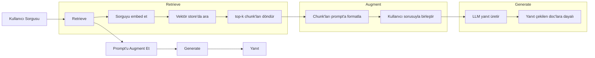
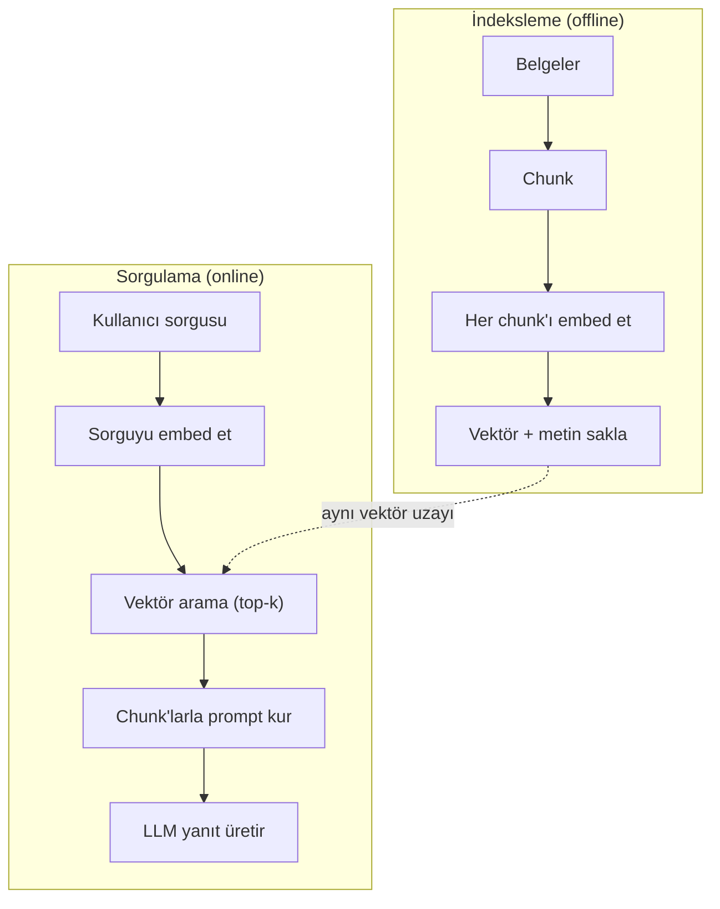

# RAG (Retrieval-Augmented Generation)

> LLM'in eğitim kesim tarihine kadar her şeyi biliyor. Şirketinin doc'ları, codebase'in ya da geçen haftaki toplantı notları hakkında hiçbir şey bilmiyor. RAG bunu, ilgili belgeleri çekip prompt'a tıkıştırarak çözer. Üretim AI'da en çok yayınlanan desen. Bu kurstan bir şey inşa edeceksen, bir RAG pipeline'ı inşa et.

**Tür:** Yapım
**Diller:** Python
**Ön koşullar:** Faz 10 (Sıfırdan LLM'ler), Faz 11 Ders 01-05
**Süre:** ~90 dakika
**İlgili:** Altı chunking algoritması ve her birinin ne zaman kazandığı için Faz 5 · 23 (RAG için Chunking Stratejileri). Embedder seçimi için Faz 5 · 22 (Embedding Modelleri Derinlemesine). Hibrit arama, reranking ve query dönüşümü için Faz 11 · 07 (Gelişmiş RAG).

## Öğrenme Hedefleri

- Eksiksiz bir RAG pipeline'ı inşa et: belge yükleme, chunking, embedding, vektör depolama, retrieval ve generation
- Uygun indeksleme ile bir vektör veritabanı (ChromaDB, FAISS veya Pinecone) kullanarak semantik arama uygula
- Bilgi temelli uygulamalar için RAG'in fine-tuning'e neden tercih edildiğini açıkla (maliyet, tazelik, atıf)
- Retrieval metrikleri (precision, recall) ve generation metrikleri (faithfulness, relevance) kullanarak RAG kalitesini değerlendir

## Sorun

Şirketin için bir chatbot inşa ediyorsun. Bir müşteri soruyor "Enterprise planlar için iade politikası nedir?" LLM tipik SaaS iade politikaları hakkında genel bir yanıt veriyor. Asıl politika, 200 sayfalık bir iç wiki'ye gömülü, enterprise müşterilerin pro-rata iadelerle 60 günlük bir pencereye sahip olduğunu söylüyor. LLM bu belgeyi hiç görmedi. Eğitilmediği bir şeyi bilemez.

Fine-tuning bir çözüm. LLM'i al, iç doc'ların üzerinde eğit ve güncellenmiş modeli deploy et. Bu işe yarar ama ciddi sorunları var. Fine-tuning compute'ta binlerce dolara mal olur. Model bir belge değiştiği an bayatlar. Modelin hangi kaynaktan çektiğini bilme yolu yok. Ve şirket gelecek ay başka bir ürün hattı satın alırsa, yeniden fine-tune yaparsın.

RAG diğer çözüm. Modeli olduğu gibi bırak. Bir soru geldiğinde, belge store'unda ilgili pasajları ara, soru öncesinde prompt'a yapıştır ve modelin bu pasajları context olarak kullanarak yanıt vermesine izin ver. Belge store'u dakikalar içinde güncellenebilir. Hangi belgelerin çekildiğini tam olarak görebilirsin. Modelin kendisi asla değişmez. Bu yüzden RAG üretimde baskın desendir: daha ucuz, daha taze, daha denetlenebilir ve herhangi bir LLM'le çalışır.

## Kavram

### RAG Deseni

Tüm desen dört adıma sığar:



Sorgu -> Retrieve -> Prompt'u augment et -> Generate. Her RAG sistemi bu deseni takip eder. Üretim RAG sistemleri arasındaki farklar her adımın detaylarındadır: nasıl chunk yaparsın, nasıl embed edersin, nasıl ararsın ve prompt'u nasıl kurarsın.

### RAG Neden Fine-Tuning'i Yener

| Kaygı | Fine-tuning | RAG |
|---------|------------|-----|
| Maliyet | Eğitim çalışması başına $1.000-$100.000+ | Sorgu başına $0.01-$0.10 (embedding + LLM) |
| Tazelik | Yeniden eğitilene kadar bayat | Doc'ları yeniden indeksleyerek dakikalar içinde güncellenir |
| Denetlenebilirlik | Yanıtı kaynağa izleyemez | Tam olarak çekilen pasajları gösterebilir |
| Halüsinasyon | Hâlâ özgürce halüsinasyon görür | Çekilen belgelere dayalı |
| Veri gizliliği | Eğitim verisi ağırlıklara işlenir | Belgeler senin vektör store'unda kalır |

Fine-tuning modelin ağırlıklarını kalıcı olarak değiştirir. RAG modelin context'ini geçici olarak değiştirir. Çoğu uygulama için geçici context istediğin şeydir.

Fine-tuning'in kazandığı tek durum: modelin yalnızca prompting ile sağlanamayan belirli bir stili, tonu ya da reasoning desenini benimsemesi gerektiğinde. Olgusal bilgi retrieval'ı için, RAG her seferinde kazanır.

### Embedding Modelleri

Bir embedding modeli metni yoğun bir vektöre dönüştürür. Benzer metinler bu yüksek-boyutlu uzayda birbirine yakın vektörler üretir. "How do I reset my password?" ve "I need to change my password" çok az kelime paylaşmalarına rağmen neredeyse özdeş vektörler üretir. "The cat sat on the mat" çok farklı bir vektör üretir.

Yaygın embedding modelleri (2026 listesi — tam analiz için Faz 5 · 22'ye bak):

| Model | Boyut | Sağlayıcı | Notlar |
|-------|-----------|----------|-------|
| text-embedding-3-small | 1536 (Matryoshka) | OpenAI | Çoğu kullanım durumu için en iyi fiyat/performans |
| text-embedding-3-large | 3072 (Matryoshka) | OpenAI | Daha yüksek doğruluk, 256/512/1024'e kırpılabilir |
| Gemini Embedding 2 | 3072 (Matryoshka) | Google | Top MTEB retrieval; 8K context |
| voyage-4 | 1024/2048 (Matryoshka) | Voyage AI | Alan varyantları (kod, finans, hukuk) |
| Cohere embed-v4 | 1024 (Matryoshka) | Cohere | Güçlü multilingual, 128K context |
| BGE-M3 | 1024 (dense + sparse + ColBERT) | BAAI (açık-ağırlıklı) | Tek modelden üç görünüm |
| Qwen3-Embedding | 4096 (Matryoshka) | Alibaba (açık-ağırlıklı) | En iyi açık-ağırlıklı retrieval skoru |
| all-MiniLM-L6-v2 | 384 | Açık-ağırlıklı (Sentence Transformers) | Prototipleme baseline'ı |

Bu ders için TF-IDF kullanan kendi basit embedding'imizi inşa ediyoruz. TF-IDF üretim sistemlerinin kullandığı şey olduğundan değil, kavramı somutlaştırdığı için: metin girer, vektör çıkar, benzer metinler benzer vektörler üretir.

### Vektör Benzerliği

İki vektör verildiğinde, benzerliği nasıl ölçersin? Üç seçenek:

**Cosine similarity**: iki vektör arasındaki açının kosinüsü. -1'den (zıt) 1'e (özdeş) kadar değişir. Magnitude'u görmezden gelir, yalnızca yönü umursar. RAG için varsayılan budur.

```
cosine_sim(a, b) = dot(a, b) / (||a|| * ||b||)
```

**Dot product**: ham iç çarpım. Daha büyük vektörler daha yüksek skor alır. Magnitude bilgi taşıdığında yararlı (daha uzun belgeler daha alakalı olabilir).

```
dot(a, b) = sum(a_i * b_i)
```

**L2 (Öklid) mesafesi**: vektör uzayında düz çizgi mesafesi. Daha küçük mesafe = daha benzer. Magnitude farklarına duyarlı.

```
L2(a, b) = sqrt(sum((a_i - b_i)^2))
```

Cosine similarity standarttır. Magnitude'a göre normalize ettiği için farklı uzunluktaki belgeleri zarif şekilde işler. Biri "vektör arama" dediğinde, neredeyse her zaman cosine similarity'yi kastediyordur.

### Chunking Stratejileri

Belgeler tek vektörler olarak embed edilemeyecek kadar uzun. 50-sayfalık bir PDF düzinelerce konu içerdiği için berbat bir embedding üretebilir. Onun yerine, belgeleri chunk'lara böler ve her chunk'ı ayrı embed edersin.

**Sabit-boyutlu chunking**: her N token'da böl. Basit ve öngörülebilir. 50-token overlap ile 512-token chunk demek chunk 1 token 0-511, chunk 2 token 462-973 vb. Overlap, şanssız bir sınırda cümle bölmediğini garanti eder.

**Semantik chunking**: doğal sınırlarda böl. Paragraflar, bölümler ya da markdown başlıkları. Her chunk tutarlı bir anlam birimi. Uygulaması daha karmaşık ama daha iyi retrieval üretir.

**Recursive chunking**: önce en büyük sınırda (bölüm başlıkları) bölmeyi dene. Bölüm hâlâ çok büyükse, paragraf sınırlarında böl. Paragraf hâlâ çok büyükse, cümle sınırlarında böl. Bu LangChain'in RecursiveCharacterTextSplitter yaklaşımıdır ve pratikte iyi çalışır.

Chunk boyutu insanların düşündüğünden daha önemli:

- Çok küçük (64-128 token): her chunk bağlamdan yoksun. "It increased 15% last quarter" "it"in neye atıfta bulunduğunu bilmeden bir anlam ifade etmez.
- Çok büyük (2048+ token): her chunk birden fazla konuyu kapsar, ilgiyi sulandırır. Gelir verisi ararken, %10'u gelir ve %90'ı çalışan sayısı ile ilgili bir chunk alırsın.
- Sweet spot (256-512 token): kendi başına yeterli bağlam, alakalı olacak kadar odaklı.

Çoğu üretim RAG sistemi 50-token overlap'li 256-512 token chunk'lar kullanır. Anthropic'in RAG kılavuzları bu aralığı önerir.

### Vektör Veritabanları

Embedding'lere sahip olduğunda, onları depolayacak ve arayacak bir yere ihtiyacın var. Seçenekler:

| Veritabanı | Tip | En iyi |
|----------|------|----------|
| FAISS | Kütüphane (in-process) | Prototipleme, küçük-orta veri kümeleri |
| Chroma | Hafif DB | Yerel geliştirme, küçük deployment'lar |
| Pinecone | Yönetilen servis | Ops yükü olmadan üretim |
| Weaviate | Açık kaynak DB | Self-host üretim |
| pgvector | Postgres uzantısı | Zaten Postgres kullanıyorsa |
| Qdrant | Açık kaynak DB | Yüksek performanslı self-host |

Bu ders için basit bir in-memory vektör store inşa ediyoruz. Vektörleri bir listede saklar ve brute-force cosine similarity araması yapar. Bu, flat indeksli FAISS'a eşdeğer. Yavaşlamadan önce belki 100.000 vektöre kadar ölçeklenir. Üretim sistemleri milisaniyeler içinde milyonlarca vektörü aramak için HNSW gibi yaklaşık en yakın komşu (ANN) algoritmaları kullanır.

### Tam Pipeline



İndeksleme fazı belge başına (ya da belgeler güncellendiğinde) bir kere çalışır. Sorgulama fazı her kullanıcı isteğinde çalışır. Üretimde, indeksleme saatlerce milyonlarca belgeyi işleyebilir. Sorgulama bir saniyenin altında yanıt vermeli.

### Gerçek Sayılar

Çoğu üretim RAG sistemi bu parametreleri kullanır:

- **k = 5 ile 10** sorgu başına çekilen chunk
- **Chunk boyutu = 256 ile 512 token** 50-token overlap ile
- **Context budget'ı**: sorgu başına 2.500-5.000 token çekilen içerik
- **Toplam prompt**: ~8.000-16.000 token (system prompt + çekilen chunk'lar + konuşma geçmişi + kullanıcı sorgusu)
- **Embedding boyutu**: modele bağlı olarak 384-3072
- **İndeksleme throughput**: API embedding'leriyle saniyede 100-1.000 belge
- **Sorgu gecikmesi**: retrieval için 50-200ms, generation için 500-3000ms

## İnşa Et

### Adım 1: Belge Chunking

```python
def chunk_text(text, chunk_size=200, overlap=50):
    words = text.split()
    chunks = []
    start = 0
    while start < len(words):
        end = start + chunk_size
        chunk = " ".join(words[start:end])
        chunks.append(chunk)
        start += chunk_size - overlap
    return chunks
```

### Adım 2: TF-IDF Embedding'ler

Basit bir embedding fonksiyonu inşa ediyoruz. TF-IDF (Term Frequency-Inverse Document Frequency) nöral embedding değildir, ama metni kelime önemini yakalayan bir şekilde vektörlere dönüştürür. Bir belgedeki sık kelimeler daha yüksek TF alır. Corpus genelinde nadir kelimeler daha yüksek IDF alır. Çarpım, önemli ve ayırt edici kelimelerin yüksek değerlere sahip olduğu bir vektör verir.

```python
import math
from collections import Counter

def build_vocabulary(documents):
    vocab = set()
    for doc in documents:
        vocab.update(doc.lower().split())
    return sorted(vocab)

def compute_tf(text, vocab):
    words = text.lower().split()
    count = Counter(words)
    total = len(words)
    return [count.get(word, 0) / total for word in vocab]

def compute_idf(documents, vocab):
    n = len(documents)
    idf = []
    for word in vocab:
        doc_count = sum(1 for doc in documents if word in doc.lower().split())
        idf.append(math.log((n + 1) / (doc_count + 1)) + 1)
    return idf

def tfidf_embed(text, vocab, idf):
    tf = compute_tf(text, vocab)
    return [t * i for t, i in zip(tf, idf)]
```

### Adım 3: Cosine Similarity Arama

```python
def cosine_similarity(a, b):
    dot = sum(x * y for x, y in zip(a, b))
    norm_a = math.sqrt(sum(x * x for x in a))
    norm_b = math.sqrt(sum(x * x for x in b))
    if norm_a == 0 or norm_b == 0:
        return 0.0
    return dot / (norm_a * norm_b)

def search(query_embedding, stored_embeddings, top_k=5):
    scores = []
    for i, emb in enumerate(stored_embeddings):
        sim = cosine_similarity(query_embedding, emb)
        scores.append((i, sim))
    scores.sort(key=lambda x: x[1], reverse=True)
    return scores[:top_k]
```

### Adım 4: Prompt İnşası

RAG'deki "augmented" burada gerçekleşir. Çekilen chunk'ları al, bir prompt'a formatla ve LLM'den sağlanan bağlama dayalı yanıt vermesini iste.

```python
def build_rag_prompt(query, retrieved_chunks):
    context = "\n\n---\n\n".join(
        f"[Source {i+1}]\n{chunk}"
        for i, chunk in enumerate(retrieved_chunks)
    )
    return f"""Answer the question based ONLY on the following context.
If the context doesn't contain enough information, say "I don't have enough information to answer that."

Context:
{context}

Question: {query}

Answer:"""
```

### Adım 5: Tam RAG Pipeline'ı

```python
class RAGPipeline:
    def __init__(self):
        self.chunks = []
        self.embeddings = []
        self.vocab = []
        self.idf = []

    def index(self, documents):
        all_chunks = []
        for doc in documents:
            all_chunks.extend(chunk_text(doc))
        self.chunks = all_chunks
        self.vocab = build_vocabulary(all_chunks)
        self.idf = compute_idf(all_chunks, self.vocab)
        self.embeddings = [
            tfidf_embed(chunk, self.vocab, self.idf)
            for chunk in all_chunks
        ]

    def query(self, question, top_k=5):
        query_emb = tfidf_embed(question, self.vocab, self.idf)
        results = search(query_emb, self.embeddings, top_k)
        retrieved = [(self.chunks[i], score) for i, score in results]
        prompt = build_rag_prompt(
            question, [chunk for chunk, _ in retrieved]
        )
        return prompt, retrieved
```

### Adım 6: Generation (simüle edilmiş)

Üretimde LLM API'sini çağırdığın yer burası. Bu ders için, çekilen bağlamdan en alakalı cümleyi çıkararak generation'ı simüle ediyoruz.

```python
def simple_generate(prompt, retrieved_chunks):
    query_words = set(prompt.lower().split("question:")[-1].split())
    best_sentence = ""
    best_score = 0
    for chunk in retrieved_chunks:
        for sentence in chunk.split("."):
            sentence = sentence.strip()
            if not sentence:
                continue
            words = set(sentence.lower().split())
            overlap = len(query_words & words)
            if overlap > best_score:
                best_score = overlap
                best_sentence = sentence
    return best_sentence if best_sentence else "I don't have enough information."
```

## Kullan

Gerçek bir embedding modeli ve LLM ile, kod neredeyse değişmez:

```python
from openai import OpenAI

client = OpenAI()

def embed(text):
    response = client.embeddings.create(
        model="text-embedding-3-small",
        input=text
    )
    return response.data[0].embedding

def generate(prompt):
    response = client.chat.completions.create(
        model="gpt-4o-mini",
        messages=[{"role": "user", "content": prompt}],
        temperature=0
    )
    return response.choices[0].message.content
```

Ya da Anthropic ile:

```python
import anthropic

client = anthropic.Anthropic()

def generate(prompt):
    response = client.messages.create(
        model="claude-sonnet-4-20250514",
        max_tokens=1024,
        messages=[{"role": "user", "content": prompt}]
    )
    return response.content[0].text
```

Pipeline aynı. Embedding fonksiyonunu takas et. Generation fonksiyonunu takas et. Retrieval mantığı, chunking, prompt inşası — hangi modelleri kullanırsan kullan tamamen özdeş.

Ölçekte vektör depolama için, brute-force aramayı uygun bir vektör veritabanıyla değiştir:

```python
import chromadb

client = chromadb.Client()
collection = client.create_collection("my_docs")

collection.add(
    documents=chunks,
    ids=[f"chunk_{i}" for i in range(len(chunks))]
)

results = collection.query(
    query_texts=["What is the refund policy?"],
    n_results=5
)
```

Chroma embedding'i içeride işler (varsayılan olarak all-MiniLM-L6-v2 kullanır) ve vektörleri yerel bir veritabanında saklar. Aynı desen, farklı tesisat.

## Yayınla

Bu ders şunları üretir:
- `outputs/prompt-rag-architect.md` — belirli kullanım durumları için RAG sistemleri tasarlamak için bir prompt
- `outputs/skill-rag-pipeline.md` — agent'lara RAG pipeline'larını inşa etmeyi ve debug etmeyi öğreten bir skill

## Alıştırmalar

1. TF-IDF embedding'lerini basit bir bag-of-words yaklaşımıyla (binary: kelime varsa 1, yoksa 0) değiştir. Örnek belgeler üzerinde retrieval kalitesini karşılaştır. TF-IDF daha iyi olmalı çünkü nadir kelimelere daha yüksek ağırlık verir.

2. Chunk boyutlarıyla deney yap: aynı belge kümesinde 50, 100, 200 ve 500 kelime dene. Her boyut için aynı 5 sorguyu çalıştır ve kaçının top-3'te ilgili bir chunk döndürdüğünü say. Retrieval kalitesinin tepe yaptığı sweet spot'u bul.

3. Her chunk'a metadata ekle (kaynak belge adı, chunk pozisyonu). Prompt şablonunu, LLM'in kaynaklarını atfetmesi için kaynak atfını içerecek şekilde değiştir.

4. Basit bir değerlendirme uygula: 10 soru-yanıt çifti verildiğinde, her soruyu RAG pipeline'ı üzerinden çalıştır ve çekilen chunk'ların yüzde kaçının yanıtı içerdiğini ölç. Bu k'da retrieval recall'dur.

5. Konuşma-farkında bir RAG pipeline'ı inşa et: son 3 etkileşimin geçmişini tut ve çekilen chunk'larla birlikte prompt'a dahil et. Fiyatlandırma sorduktan sonra "Peki ya enterprise?" gibi takip sorularıyla test et.

## Anahtar Terimler

| Terim | İnsanlar ne diyor | Gerçekte ne anlama geliyor |
|------|----------------|----------------------|
| RAG | "Doc'larını okuyan AI" | İlgili belgeleri çek, prompt'a yapıştır ve bu belgelere dayalı bir yanıt üret |
| Embedding | "Metni sayıya çevir" | Benzer anlamların benzer vektörler ürettiği metnin yoğun vektör temsili |
| Vektör veritabanı | "AI için arama motoru" | Vektörleri depolamak ve benzerliğe göre en yakın komşuları bulmak için optimize edilmiş veri store'u |
| Chunking | "Doc'ları parçalara böl" | Belgeleri daha küçük segmentlere (tipik olarak 256-512 token) bölmek, böylece her biri bağımsız olarak embed edilip çekilebilir |
| Cosine similarity | "İki vektör ne kadar benzer" | İki vektör arasındaki açının kosinüsü; 1 = özdeş yön, 0 = ortogonal, -1 = zıt |
| Top-k retrieval | "K en iyi eşleşmeyi al" | Vektör store'undan sorguya en benzer k chunk'ı döndür |
| Context window | "LLM ne kadar metin görebilir" | LLM'in tek bir istekte işleyebileceği maksimum token sayısı; çekilen chunk'lar buna sığmalı |
| Augmented generation | "Verilen bağlamı kullanarak yanıt ver" | Yalnızca eğitilmiş bilgiye dayanmak yerine çekilen belgeleri bağlam olarak kullanarak yanıt üretmek |
| TF-IDF | "Kelime önem skorlaması" | Term Frequency çarpı Inverse Document Frequency; kelimeleri corpus içinde ne kadar ayırt edici olduklarına göre ağırlıklandırır |
| İndeksleme | "Doc'ları aramaya hazırlama" | Belgeleri sorgu zamanında aranabilmesi için chunk'lama, embed etme ve depolamanın offline süreci |

## İleri Okuma

- Lewis et al., "Retrieval-Augmented Generation for Knowledge-Intensive NLP Tasks" (2020) — retrieve-then-generate desenini formalize eden, Facebook AI Research'ten orijinal RAG makalesi
- Anthropic'in RAG dokümantasyonu (docs.anthropic.com) — chunk boyutları, prompt inşası ve değerlendirme için pratik kılavuzlar
- Pinecone Learning Center, "What is RAG?" — üretim düşünceleriyle RAG pipeline'ının net görsel açıklamaları
- Sentence-BERT: Reimers & Gurevych (2019) — all-MiniLM embedding modellerinin arkasındaki makale, semantik benzerlik için bi-encoder'ları nasıl eğiteceğini gösterir
- [Karpukhin et al., "Dense Passage Retrieval for Open-Domain Question Answering" (EMNLP 2020)](https://arxiv.org/abs/2004.04906) — yoğun bi-encoder retrieval'ın açık-alan QA'da BM25'i yendiğini kanıtlayan ve modern RAG retriever'ları için deseni belirleyen DPR makalesi.
- [LlamaIndex Yüksek-Seviye Kavramlar](https://docs.llamaindex.ai/en/stable/getting_started/concepts.html) — RAG pipeline'ları inşa ederken bilinmesi gereken ana kavramlar: data loader'lar, node parser'lar, indeksler, retriever'lar, response synthesizer'lar.
- [LangChain RAG tutorial](https://python.langchain.com/docs/tutorials/rag/) — zıt-çeşni orchestrator; aynı retrieve-then-generate deseninin chain-of-runnables görüşü.
