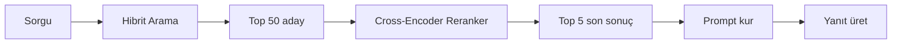
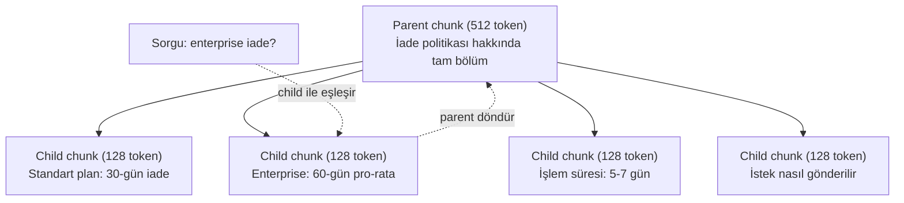
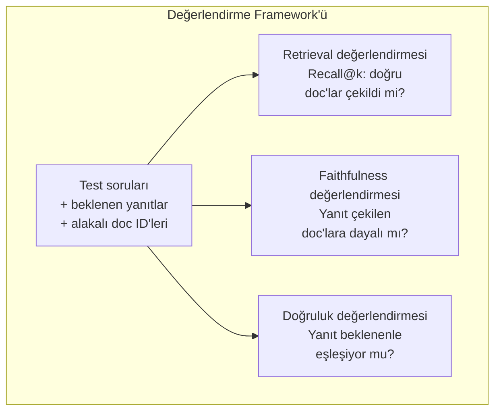

# Gelişmiş RAG (Chunking, Reranking, Hibrit Arama)

> Temel RAG en benzer top-k chunk'ı çeker. Bu basit sorular için çalışır. Multi-hop reasoning, belirsiz sorgular ve büyük corpus'larda bozulur. Gelişmiş RAG, 10 belge üzerinde çalışan bir demo ile 10 milyon üzerinde çalışan bir sistem arasındaki farktır.

**Tür:** Yapım
**Diller:** Python
**Ön koşullar:** Faz 11, Ders 06 (RAG)
**Süre:** ~90 dakika
**İlgili:** Faz 5 · 23 (RAG için Chunking Stratejileri) altı chunking algoritmasının hepsini — recursive, semantic, sentence, parent-document, late chunking, contextual retrieval — Vectara/Anthropic benchmark'larıyla kapsar. Bu ders üzerine inşa eder: hibrit arama, reranking, sorgu dönüşümü.

## Öğrenme Hedefleri

- Belge yapısını ve bağlamı koruyan gelişmiş chunking stratejilerini (semantic, recursive, parent-child) uygula
- BM25 anahtar kelime eşleştirmesini semantik vektör araması ve bir cross-encoder reranker ile birleştiren hibrit arama pipeline'ı inşa et
- Belirsiz ya da karmaşık sorularda retrieval'ı iyileştirmek için sorgu dönüşüm tekniklerini (HyDE, multi-query, step-back) uygula
- Yaygın RAG hatalarını teşhis et ve düzelt: yanlış chunk çekildi, yanıt context'te yok, multi-hop reasoning bozulması

## Sorun

Ders 06'da temel bir RAG pipeline'ı inşa ettin. Küçük bir corpus üzerinde basit sorular için çalışır. Şimdi bunları dene:

**Belirsiz sorgu**: "Geçen çeyrek gelir neydi?" Semantik arama gelir stratejisi, gelir projeksiyonları ve CFO'nun gelir büyümesi hakkındaki düşünceleri ile ilgili chunk'lar döndürür. Hepsi semantik olarak "revenue" kelimesine benzer. Hiçbiri gerçek sayıyı içermez. Doğru chunk "Q3 2025'te $47.2M" der ama "revenue" yerine "earnings" kelimesini kullanır. Embedding modeli "gelir stratejisinin" sorguya "Q3 earnings $47.2M" idi'den daha yakın olduğunu düşünür.

**Multi-hop soru**: "Hangi takımın müşteri memnuniyet skoru artışı en yüksekti?" Bu her takım için memnuniyet skorlarını bulmayı, karşılaştırmayı ve maksimumu belirlemeyi gerektirir. Hiçbir tek chunk yanıtı içermez. Bilgi takım raporları arasında dağılmış.

**Büyük corpus problemi**: 2 milyon chunk'ın var. Doğru yanıt chunk #1.847.293'te. Top-5 retrieval'ın chunk #14, #89.201, #1.200.000, #44 ve #901.333'ü çeker. Embedding uzayında yakın, ama hiçbiri yanıtı içermiyor. Bu ölçekte, yaklaşık en yakın komşu araması alakalı sonuçların top-k'dan çıkmasına neden olacak kadar hata getirir.

Temel RAG vektör benzerliği ve relevance aynı şey olmadığı için başarısız olur. Bir chunk bir sorguya semantik olarak benzer olabilir ama yanıtlamak için yararsız olabilir. Gelişmiş RAG bunu dört teknikle ele alır: hibrit arama (anahtar kelime eşleştirmesi ekle), reranking (adayları daha dikkatli skorla), sorgu dönüşümü (aramadan önce sorguyu düzelt) ve daha iyi chunking (doğru tanecikte çek).

## Kavram

### Hibrit Arama: Semantik + Anahtar Kelime

Semantik arama (vektör benzerliği) anlamı anlamada iyidir. "How do I cancel my subscription?" "Steps to terminate your plan" ile hiçbir kelime paylaşmamalarına rağmen eşleşir. Ama tam eşleşmeleri kaçırır. "Error code E-4021" embedding modeli onu gürültü olarak ele alırsa "E-4021" içeren bir chunk'la eşleşmeyebilir.

Anahtar kelime araması (BM25) tam tersidir. Tam eşleşmelerde mükemmel. "E-4021" mükemmel eşleşir. Ama belge "terminate your plan" diyorsa "cancel my subscription" sıfır sonuç döndürür.

Hibrit arama her ikisini de çalıştırır, sonra sonuçları birleştirir.

**BM25** (Best Matching 25) standart anahtar kelime arama algoritmasıdır. 1990'lardan beri arama motorlarının omurgası. Formül:

```
BM25(q, d) = q'daki t terimleri için toplam:
    IDF(t) * (tf(t,d) * (k1 + 1)) / (tf(t,d) + k1 * (1 - b + b * |d| / avgdl))
```

Burada tf(t,d) t'nin d belgesindeki terim frekansı, IDF(t) inverse document frequency, |d| belge uzunluğu, avgdl ortalama belge uzunluğu, k1 terim frekansı doygunluğunu kontrol eder (varsayılan 1.2) ve b uzunluk normalizasyonunu kontrol eder (varsayılan 0.75).

Düz terimlerle: BM25 sorgu terimleri içeren belgeleri (özellikle nadir olanları) daha yüksek skorlar, ama tekrarlanan terimler için azalan getirilerle. "Revenue" kelimesini 50 kez içeren bir belge bir kez içerene göre 50x daha alakalı değildir.

### Reciprocal Rank Fusion (RRF)

İki sıralı listen var: biri vektör aramasından, biri BM25'ten. Onları nasıl birleştirirsin? Reciprocal Rank Fusion standart yaklaşım.

```
RRF_score(d) = R sıralamaları için toplam:
    1 / (k + rank_R(d))
```

Burada k, en üst-sıralı sonucun baskın olmasını önleyen bir sabittir (tipik olarak 60).

Vektör aramasında #1 ve BM25'te #5 sıralı bir belge alır: 1/(60+1) + 1/(60+5) = 0.0164 + 0.0154 = 0.0318

Vektör aramasında #3 ve BM25'te #2 sıralı bir belge alır: 1/(60+3) + 1/(60+2) = 0.0159 + 0.0161 = 0.0320

RRF doğal olarak iki sinyali dengeler. Her iki listede yüksek sıralı bir belge en iyi skoru alır. Bir listede #1 olan ama diğerinden eksik olan bir belge orta skor alır. Bu sağlamdır çünkü ham skor değil rank kullanır, dolayısıyla iki sistem arasındaki skor dağılımı farkları önemli değildir.

### Reranking

Retrieval (vektör, anahtar kelime ya da hibrit) hızlı ama kesin değil. Bi-encoder kullanır: sorgu ve her belge bağımsız embed edilir, sonra karşılaştırılır. Embedding'ler bir kez hesaplanır ve cache'lenir. Bu milyonlarca belgeye ölçeklenir.

Reranking cross-encoder kullanır: sorgu ve aday belge bir relevance skoru çıkaran bir modele birlikte beslenir. Model her iki metni aynı anda görür ve aralarındaki ince taneli etkileşimleri yakalayabilir. Bir cross-encoder, bir bi-encoder bağlantıyı kaçırsa bile "Q3 earnings neydi?"nin "$47.2M in Q3" içeren bir chunk'a yüksek alakalı olduğunu anlayabilir.

Tradeoff: cross-encoder'lar sorgu-belge çiftini birlikte işledikleri için bi-encoder'lardan 100-1000x daha yavaştır. Bir milyon belge için cross-encoder skorlarını ön-hesaplayamazsın. Çözüm: daha büyük bir aday kümesi çek (hibrit aramadan top-50), sonra final top-5'i almak için cross-encoder ile rerank et.



Yaygın reranking modelleri (2026 listesi):
- Cohere Rerank 3.5: yönetilen API, multilingual, karışık corpus'larda en iyi recall kazancı
- Voyage rerank-2.5: yönetilen API, hosted seçenekler arasında en düşük gecikme
- Jina-Reranker-v2 Multilingual: açık-ağırlıklı, 100+ dil
- bge-reranker-v2-m3: açık-ağırlıklı, güçlü baseline
- cross-encoder/ms-marco-MiniLM-L-6-v2: açık-ağırlıklı, prototipleme için CPU'da çalışır
- ColBERTv2 / Jina-ColBERT-v2: late-interaction multi-vector reranker'lar — skorlama zamanında O(belgeler) değil O(token'lar)

### Sorgu Dönüşümü

Bazen problem retrieval değil, sorgunun kendisidir. "Yeni politika değişikliği hakkındaki o şey neydi?" berbat bir arama sorgusudur. Belirli terim içermez. Embedding belirsiz. Hiçbir retrieval sistemi bundan doğru belgeleri bulamaz.

**Sorgu yeniden yazma**: kullanıcının sorgusunu daha iyi bir arama sorgusuna yeniden ifade et. Bir LLM bunu yapabilir:

```
Kullanıcı: "Yeni politika değişikliği hakkındaki o şey neydi?"
Yeniden yazılmış: "Recent policy changes and updates"
```

**HyDE (Hypothetical Document Embeddings)**: sorguyla aramak yerine, hipotetik bir yanıt üret, onu embed et ve ona benzer gerçek belgeler için ara.

```
Sorgu: "What is the refund policy for enterprise?"
Hipotetik yanıt: "Enterprise customers are eligible for a full refund
within 60 days of purchase. Refunds are pro-rated based on the remaining
subscription period and processed within 5-7 business days."
```

Hipotetik yanıtı embed et ve ona benzer gerçek belgeler için ara. Sezgi: hipotetik yanıt embedding uzayında gerçek yanıta orijinal sorudan daha yakın yaşar. Sorular ve yanıtlar farklı dilsel yapılara sahip. Hipotetik bir yanıt üreterek, embedding'de "soru uzayı" ile "yanıt uzayı" arasındaki boşluğu köprülüyorsun.

HyDE retrieval öncesi bir LLM çağrısı ekler. Bu gecikmeyi 500-2000ms artırır. Ham sorgularda retrieval kalitesi kötü olduğunda buna değer.

### Parent-Child Chunking

Standart chunking bir tradeoff zorlar: kesin retrieval için küçük chunk'lar, yeterli bağlam için büyük chunk'lar. Parent-child chunking bu tradeoff'u eler.

Retrieval için küçük chunk'lar (128 token) indeksle. Küçük bir chunk çekildiğinde, prompt için onun parent chunk'ını (512 token) döndür. Küçük chunk sorguyla tam eşleşir. Parent chunk LLM'in iyi bir yanıt üretmesi için yeterli bağlam sağlar.



"Enterprise iade?" sorgusu child chunk C2 ile kesin eşleşir. Ama prompt, işlem süresi ve gönderme süreciyle ilgili çevre bağlamı içeren tam parent chunk P'yi alır.

### Metadata Filtreleme

Vektör araması çalıştırmadan önce, corpus'u metadata'ya göre filtrele: tarih, kaynak, kategori, yazar, dil. Bu arama alanını azaltır ve alakasız sonuçları önler.

"Güvenlik politikasında geçen ay ne değişti?" yalnızca son 30 gündeki güvenlik kategorisindeki belgeleri aramalıdır. Metadata filtreleme olmadan, tüm corpus'u ararsın ve semantik olarak benzer olmasına rağmen 2 yıl önce bir güvenlik belgesi çekebilirsin.

Üretim RAG sistemleri her chunk'ın yanında metadata depolar: kaynak belge, oluşturma tarihi, kategori, yazar, versiyon. Vektör veritabanları benzerlik aramasından önce metadata ile ön-filtrelemeyi destekler, bu ölçekte performans için kritiktir.

### Değerlendirme

Bir RAG sistemi inşa ettin. Çalıştığını nasıl bilirsin? Üç metrik:

**Retrieval relevance (Recall@k)**: bilinen alakalı belgelerle test sorularının bir kümesi için, alakalı belgelerin yüzde kaçı top-k sonuçlarında görünür? Bir sorunun yanıtı chunk #47'de ise, chunk #47 top-5'te görünür mü?

**Faithfulness**: üretilen yanıt çekilen belgelere dayalı mı? Çekilen chunk'lar "60-gün iade penceresi" diyorsa ve model "90-gün iade penceresi" diyorsa, bu bir faithfulness hatasıdır. Model doğru bağlama sahip olmasına rağmen halüsinasyon görmüştür.

**Yanıt doğruluğu**: üretilen yanıt beklenen yanıtla eşleşiyor mu? Bu uçtan uca metriktir. Retrieval kalitesini ve generation kalitesini birleştirir.

Basit bir faithfulness kontrolü: üretilen yanıttaki her iddiayı al ve çekilen chunk'larda (özünde) göründüğünü doğrula. Yanıt çekilen herhangi bir chunk'ta olmayan bir gerçek içeriyorsa, muhtemelen halüsinasyondur.



## İnşa Et

### Adım 1: BM25 Uygulaması

```python
import math
from collections import Counter

class BM25:
    def __init__(self, k1=1.2, b=0.75):
        self.k1 = k1
        self.b = b
        self.docs = []
        self.doc_lengths = []
        self.avg_dl = 0
        self.doc_freqs = {}
        self.n_docs = 0

    def index(self, documents):
        self.docs = documents
        self.n_docs = len(documents)
        self.doc_lengths = []
        self.doc_freqs = {}

        for doc in documents:
            words = doc.lower().split()
            self.doc_lengths.append(len(words))
            unique_words = set(words)
            for word in unique_words:
                self.doc_freqs[word] = self.doc_freqs.get(word, 0) + 1

        self.avg_dl = sum(self.doc_lengths) / self.n_docs if self.n_docs else 1

    def score(self, query, doc_idx):
        query_words = query.lower().split()
        doc_words = self.docs[doc_idx].lower().split()
        doc_len = self.doc_lengths[doc_idx]
        word_counts = Counter(doc_words)
        score = 0.0

        for term in query_words:
            if term not in word_counts:
                continue
            tf = word_counts[term]
            df = self.doc_freqs.get(term, 0)
            idf = math.log((self.n_docs - df + 0.5) / (df + 0.5) + 1)
            numerator = tf * (self.k1 + 1)
            denominator = tf + self.k1 * (1 - self.b + self.b * doc_len / self.avg_dl)
            score += idf * numerator / denominator

        return score

    def search(self, query, top_k=10):
        scores = [(i, self.score(query, i)) for i in range(self.n_docs)]
        scores.sort(key=lambda x: x[1], reverse=True)
        return scores[:top_k]
```

### Adım 2: Reciprocal Rank Fusion

```python
def reciprocal_rank_fusion(ranked_lists, k=60):
    scores = {}
    for ranked_list in ranked_lists:
        for rank, (doc_id, _) in enumerate(ranked_list):
            if doc_id not in scores:
                scores[doc_id] = 0.0
            scores[doc_id] += 1.0 / (k + rank + 1)
    fused = sorted(scores.items(), key=lambda x: x[1], reverse=True)
    return fused
```

### Adım 3: Hibrit Arama Pipeline'ı

```python
def hybrid_search(query, chunks, vector_embeddings, vocab, idf, bm25_index, top_k=5, fusion_k=60):
    query_emb = tfidf_embed(query, vocab, idf)
    vector_results = search(query_emb, vector_embeddings, top_k=top_k * 3)
    bm25_results = bm25_index.search(query, top_k=top_k * 3)
    fused = reciprocal_rank_fusion([vector_results, bm25_results], k=fusion_k)
    return fused[:top_k]
```

### Adım 4: Basit Reranker

Üretimde bir cross-encoder modeli kullanırdın. Burada sorgu-belge relevance'ını kelime çakışması, terim önemi ve cümle eşleştirme kullanarak skorlayan bir reranker inşa ediyoruz.

```python
def rerank(query, candidates, chunks):
    query_words = set(query.lower().split())
    stop_words = {"the", "a", "an", "is", "are", "was", "were", "what", "how",
                  "why", "when", "where", "do", "does", "for", "of", "in", "to",
                  "and", "or", "on", "at", "by", "it", "its", "this", "that",
                  "with", "from", "be", "has", "have", "had", "not", "but"}
    query_terms = query_words - stop_words

    scored = []
    for doc_id, initial_score in candidates:
        chunk = chunks[doc_id].lower()
        chunk_words = set(chunk.split())

        term_overlap = len(query_terms & chunk_words)

        query_bigrams = set()
        q_list = [w for w in query.lower().split() if w not in stop_words]
        for i in range(len(q_list) - 1):
            query_bigrams.add(q_list[i] + " " + q_list[i + 1])
        bigram_matches = sum(1 for bg in query_bigrams if bg in chunk)

        position_boost = 0
        for term in query_terms:
            pos = chunk.find(term)
            if pos != -1 and pos < len(chunk) // 3:
                position_boost += 0.5

        rerank_score = (
            term_overlap * 1.0
            + bigram_matches * 2.0
            + position_boost
            + initial_score * 5.0
        )
        scored.append((doc_id, rerank_score))

    scored.sort(key=lambda x: x[1], reverse=True)
    return scored
```

### Adım 5: HyDE (Hypothetical Document Embeddings)

```python
def hyde_generate_hypothesis(query):
    templates = {
        "what": "The answer to '{query}' is as follows: Based on our documentation, {topic} involves specific policies and procedures that define how the process works.",
        "how": "To address '{query}': The process involves several steps. First, you need to initiate the request. Then, the system processes it according to the defined rules.",
        "default": "Regarding '{query}': Our records indicate specific details and policies related to this topic that provide a comprehensive answer."
    }
    query_lower = query.lower()
    if query_lower.startswith("what"):
        template = templates["what"]
    elif query_lower.startswith("how"):
        template = templates["how"]
    else:
        template = templates["default"]

    topic_words = [w for w in query.lower().split()
                   if w not in {"what", "is", "the", "how", "do", "does", "a", "an",
                                "for", "of", "to", "in", "on", "at", "by", "and", "or"}]
    topic = " ".join(topic_words) if topic_words else "this topic"

    return template.format(query=query, topic=topic)


def hyde_search(query, chunks, vector_embeddings, vocab, idf, top_k=5):
    hypothesis = hyde_generate_hypothesis(query)
    hypothesis_emb = tfidf_embed(hypothesis, vocab, idf)
    results = search(hypothesis_emb, vector_embeddings, top_k)
    return results, hypothesis
```

### Adım 6: Parent-Child Chunking

```python
def create_parent_child_chunks(text, parent_size=200, child_size=50):
    words = text.split()
    parents = []
    children = []
    child_to_parent = {}

    parent_idx = 0
    start = 0
    while start < len(words):
        parent_end = min(start + parent_size, len(words))
        parent_text = " ".join(words[start:parent_end])
        parents.append(parent_text)

        child_start = start
        while child_start < parent_end:
            child_end = min(child_start + child_size, parent_end)
            child_text = " ".join(words[child_start:child_end])
            child_idx = len(children)
            children.append(child_text)
            child_to_parent[child_idx] = parent_idx
            child_start += child_size

        parent_idx += 1
        start += parent_size

    return parents, children, child_to_parent
```

### Adım 7: Faithfulness Değerlendirmesi

```python
def evaluate_faithfulness(answer, retrieved_chunks):
    answer_sentences = [s.strip() for s in answer.split(".") if len(s.strip()) > 10]
    if not answer_sentences:
        return 1.0, []

    grounded = 0
    ungrounded = []
    context = " ".join(retrieved_chunks).lower()

    for sentence in answer_sentences:
        words = set(sentence.lower().split())
        stop_words = {"the", "a", "an", "is", "are", "was", "were", "and", "or",
                      "to", "of", "in", "for", "on", "at", "by", "it", "this", "that"}
        content_words = words - stop_words
        if not content_words:
            grounded += 1
            continue

        matched = sum(1 for w in content_words if w in context)
        ratio = matched / len(content_words) if content_words else 0

        if ratio >= 0.5:
            grounded += 1
        else:
            ungrounded.append(sentence)

    score = grounded / len(answer_sentences) if answer_sentences else 1.0
    return score, ungrounded


def evaluate_retrieval_recall(queries_with_relevant, retrieval_fn, k=5):
    total_recall = 0.0
    results = []

    for query, relevant_indices in queries_with_relevant:
        retrieved = retrieval_fn(query, k)
        retrieved_indices = set(idx for idx, _ in retrieved)
        relevant_set = set(relevant_indices)
        hits = len(retrieved_indices & relevant_set)
        recall = hits / len(relevant_set) if relevant_set else 1.0
        total_recall += recall
        results.append({
            "query": query,
            "recall": recall,
            "hits": hits,
            "total_relevant": len(relevant_set)
        })

    avg_recall = total_recall / len(queries_with_relevant) if queries_with_relevant else 0
    return avg_recall, results
```

## Kullan

Reranking için gerçek bir cross-encoder ile:

```python
from sentence_transformers import CrossEncoder

reranker = CrossEncoder("cross-encoder/ms-marco-MiniLM-L-6-v2")

def rerank_with_cross_encoder(query, candidates, chunks, top_k=5):
    pairs = [(query, chunks[doc_id]) for doc_id, _ in candidates]
    scores = reranker.predict(pairs)
    scored = list(zip([doc_id for doc_id, _ in candidates], scores))
    scored.sort(key=lambda x: x[1], reverse=True)
    return scored[:top_k]
```

Cohere'nin yönetilen reranker'ı ile:

```python
import cohere

co = cohere.Client()

def rerank_with_cohere(query, candidates, chunks, top_k=5):
    docs = [chunks[doc_id] for doc_id, _ in candidates]
    response = co.rerank(
        model="rerank-english-v3.0",
        query=query,
        documents=docs,
        top_n=top_k
    )
    return [(candidates[r.index][0], r.relevance_score) for r in response.results]
```

Gerçek bir LLM ile HyDE için:

```python
import anthropic

client = anthropic.Anthropic()

def hyde_with_llm(query):
    response = client.messages.create(
        model="claude-sonnet-4-20250514",
        max_tokens=256,
        messages=[{
            "role": "user",
            "content": f"Write a short paragraph that would be a good answer to this question. Do not say you don't know. Just write what the answer would look like.\n\nQuestion: {query}"
        }]
    )
    return response.content[0].text
```

Weaviate ile üretim hibrit araması için:

```python
import weaviate

client = weaviate.connect_to_local()

collection = client.collections.get("Documents")
response = collection.query.hybrid(
    query="enterprise refund policy",
    alpha=0.5,
    limit=10
)
```

Alpha parametresi dengeyi kontrol eder: 0.0 = saf anahtar kelime (BM25), 1.0 = saf vektör, 0.5 = eşit ağırlık. Çoğu üretim sistemi 0.3 ile 0.7 arası alpha kullanır.

## Yayınla

Bu ders şunları üretir:
- `outputs/prompt-advanced-rag-debugger.md` — RAG kalite sorunlarını teşhis etmek ve düzeltmek için bir prompt
- `outputs/skill-advanced-rag.md` — hibrit arama ve reranking ile üretim-sınıfı RAG inşa etmek için bir skill

## Alıştırmalar

1. Örnek belgelerde BM25 vs vektör araması vs hibrit aramayı karşılaştır. 5 test sorgusunun her biri için, hangi yaklaşımın pozisyon #1'de en alakalı chunk'ı döndürdüğünü kaydet. Hibrit arama 5'in en az 3'ünde kazanmalı.

2. Bir metadata filtresi uygula. Her belgeye bir "category" alanı ekle (security, billing, api, product). Vektör araması çalıştırmadan önce, chunk'ları yalnızca alakalı kategoriye filtrele. "What encryption is used?" ile test et ve yalnızca security-kategorisi chunk'larını aradığını doğrula.

3. Ders 06'daki basit generate fonksiyonunu kullanarak tam bir HyDE pipeline'ı inşa et. Tüm 5 test sorgusunda doğrudan sorgu araması ile HyDE araması arasındaki retrieval kalitesini (top-3 relevance) karşılaştır. HyDE belirsiz sorgular için sonuçları iyileştirmeli.

4. Örnek belgelerde parent-child chunking stratejisini uygula. child_size=30 ve parent_size=100 kullan. Child chunk'larla ara ama prompt'ta parent chunk'ları döndür. chunk_size=50 olan standart chunking ile üretilen yanıtları karşılaştır.

5. Bir değerlendirme veri kümesi oluştur: bilinen yanıt chunk'larıyla 10 soru. (a) yalnızca vektör araması, (b) yalnızca BM25, (c) hibrit arama, (d) hibrit + reranking için Recall@3, Recall@5 ve Recall@10 ölç. Sonuçları çiz ve reranking'in en çok yardım ettiği yeri belirle.

## Anahtar Terimler

| Terim | İnsanlar ne diyor | Gerçekte ne anlama geliyor |
|------|----------------|----------------------|
| BM25 | "Anahtar kelime araması" | Belgeleri terim frekansı, inverse document frequency ve belge uzunluğu normalizasyonu ile skorlayan olasılıksal sıralama algoritması |
| Hibrit arama | "İki dünyanın en iyisi" | Semantik (vektör) ve anahtar kelime (BM25) aramasını paralel çalıştırma, sonra sonuçları rank fusion ile birleştirme |
| Reciprocal Rank Fusion | "Sıralı listeleri birleştir" | Tüm listelerde her belge için 1/(k + rank) toplama ile birden fazla sıralı listeyi birleştirme |
| Reranking | "İkinci geçiş skorlama" | İlk retrieval'dan bir aday kümesini yeniden skorlamak için daha pahalı bir cross-encoder modeli kullanma |
| Cross-encoder | "Birleşik sorgu-belge modeli" | Bir sorgu ve belgeyi tek bir girdi olarak alan, bir relevance skoru üreten model; bi-encoder'lardan daha doğru ama tam corpus araması için çok yavaş |
| Bi-encoder | "Bağımsız embedding modeli" | Sorguları ve belgeleri bağımsız embed eden model; embedding'ler ön-hesaplandığı için hızlı, ama cross-encoder'lardan daha az doğru |
| HyDE | "Sahte yanıtla ara" | Sorguya hipotetik bir yanıt üret, embed et ve ona benzer gerçek belgeler için ara |
| Parent-child chunking | "Küçük arama, büyük bağlam" | Kesin retrieval için küçük chunk'ları indeksle ama yeterli bağlam sağlamak için daha büyük parent chunk'ı döndür |
| Metadata filtreleme | "Aramadan önce daralt" | Arama alanını azaltmak için vektör araması çalıştırmadan önce belgeleri özniteliklere (tarih, kaynak, kategori) göre filtreleme |
| Faithfulness | "Temele bağlı kaldı mı" | Üretilen yanıtın modelin eğitim verisinden halüsine edilmek yerine çekilen belgeler tarafından desteklenip desteklenmediği |

## İleri Okuma

- Robertson & Zaragoza, "The Probabilistic Relevance Framework: BM25 and Beyond" (2009) — formülün arkasındaki olasılıksal temelleri açıklayan, BM25 için kesin referans
- Cormack et al., "Reciprocal Rank Fusion Outperforms Condorcet and Individual Rank Learning Methods" (2009) — daha karmaşık fusion yöntemlerini yendiğini gösteren orijinal RRF makalesi
- Gao et al., "Precise Zero-Shot Dense Retrieval without Relevance Labels" (2022) — hipotetik belge embedding'lerinin hiçbir eğitim verisi olmadan retrieval'ı iyileştirdiğini gösteren HyDE makalesi
- Nogueira & Cho, "Passage Re-ranking with BERT" (2019) — BM25 üzerinde cross-encoder reranking'in retrieval kalitesini önemli ölçüde iyileştirdiğini gösterdi
- [Khattab et al., "DSPy: Compiling Declarative Language Model Calls into Self-Improving Pipelines" (2023)](https://arxiv.org/abs/2310.03714) — prompt yapımı ve ağırlık seçimini retrieval pipeline'ları üzerinde bir optimizasyon problemi olarak ele alır; "LLM'leri prompt'la" yerine "LLM'leri programla" için bunu oku.
- [Edge et al., "From Local to Global: A Graph RAG Approach to Query-Focused Summarization" (Microsoft Research 2024)](https://arxiv.org/abs/2404.16130) — GraphRAG makalesi: sorgu-odaklı özetleme için varlık-ilişki çıkarımı + Leiden community detection; global vs yerel retrieval ayrımı.
- [Asai et al., "Self-RAG: Learning to Retrieve, Generate, and Critique through Self-Reflection" (ICLR 2024)](https://arxiv.org/abs/2310.11511) — reflection token'ları ile kendini değerlendiren RAG; statik retrieve-then-generate'in ötesinde agentic sınır.
- [LangChain Query Construction blog](https://blog.langchain.dev/query-construction/) — pre-retrieval adımı olarak doğal-dil sorgularını yapılandırılmış veritabanı sorgularına (Text-to-SQL, Cypher) nasıl çevireceğin.
