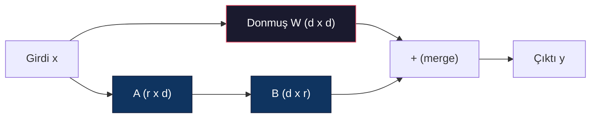
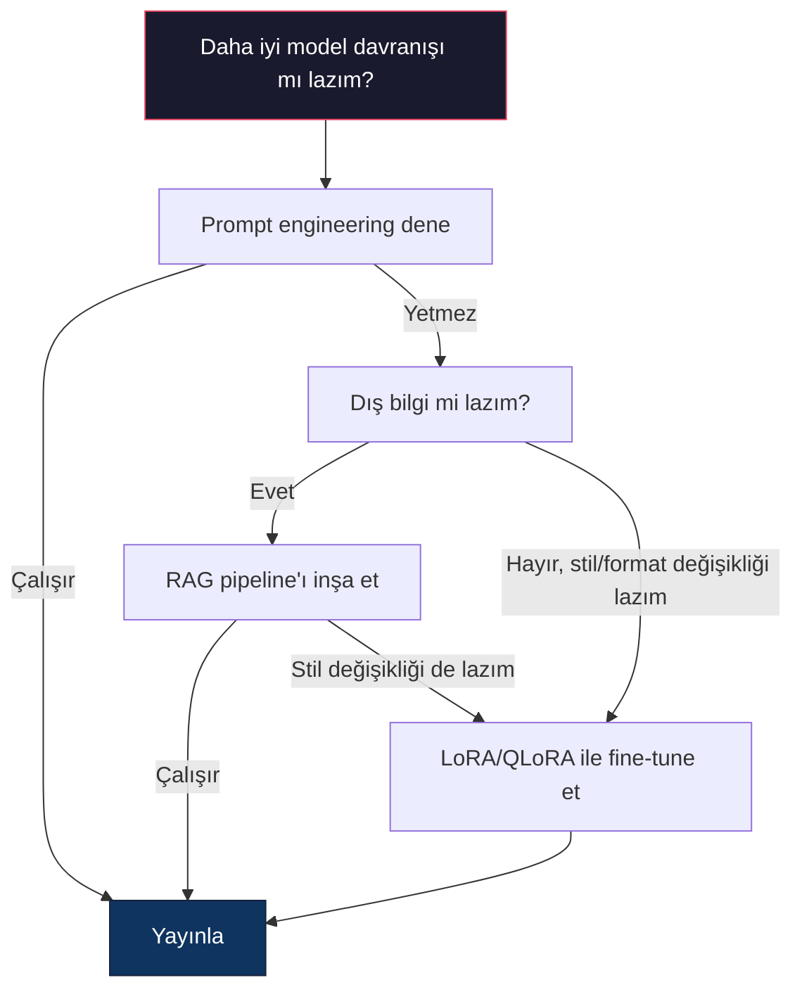

# LoRA ve QLoRA ile Fine-Tuning

> 7B bir modeli full fine-tune etmek 56GB VRAM gerektirir. Sende o yok. Çoğu şirkette de yok. LoRA aynı modeli parametrelerin %1'inden azını eğiterek 6GB'de fine-tune etmene olanak verir. Bu bir taviz değil — çoğu görevde full fine-tuning kalitesine eşleşir. Tüm açık kaynak fine-tuning ekosistemi bu tek numara üzerinden çalışır.

**Tür:** Yapım
**Diller:** Python
**Ön koşullar:** Faz 10, Ders 06 (Instruction Tuning / SFT)
**Süre:** ~75 dakika
**İlgili:** Faz 10 SFT/DPO döngülerini sıfırdan kapsar. Bu ders bunları 2026 PEFT toolkit'lerine (PEFT, TRL, Unsloth, Axolotl, LLaMA-Factory) takar.

## Öğrenme Hedefleri

- Önceden eğitilmiş bir modelin attention katmanlarına low-rank adapter matrisleri (A ve B) enjekte ederek LoRA'yı uygula
- LoRA vs full fine-tuning'in parametre tasarrufunu hesapla: d_model boyutlu rank r, d^2 yerine 2*r*d parametre eğitir
- Bir modeli QLoRA (4-bit kuantize edilmiş base + LoRA adapter'ları) kullanarak tüketici GPU belleğine sığacak şekilde fine-tune et
- LoRA ağırlıklarını deployment için base modele geri merge et ve adapter'lar ile ve olmadan inference hızını karşılaştır

## Sorun

Bir base modelin var. Llama 3 8B. Şirketinin sesinde müşteri destek taleplerini yanıtlamasını istiyorsun. SFT yanıt. Ama SFT'nin bir maliyet problemi var.

Full fine-tuning modeldeki her parametreyi günceller. Llama 3 8B 8 milyar parametreye sahip. fp16'da her parametre 2 bayt alır. Sadece ağırlıkları yüklemek için 16GB. Eğitim sırasında ayrıca gradient'lere (16GB), Adam için optimizer state'lerine (momentum + variance için 32GB) ve activation'lara ihtiyaç duyarsın. Toplam: tek bir 8B model için kabaca 56GB VRAM.

Bir A100 80GB bunu zar zor sığdırabilir. İki A100 bulut sağlayıcılarında saatte $3-4. 50.000 örnek üzerinde 3 epoch eğitim 6-10 saat alır. Bu deney başına $30-40. Hiperparametreleri doğru almak için 10 deney çalıştır ve hiçbir şey deploy etmeden önce $400 harcamış olursun.

Bunu Llama 3 70B'ye ölçeklendir ve sayılar saçma olur. Yalnız ağırlıklar için 140GB. Bir cluster'a ihtiyacın var. Deney başına $100+.

Daha derin bir problem de var. Full fine-tuning modeldeki her ağırlığı değiştirir. Müşteri destek verisi üzerinde fine-tune edersen, modelin genel yeteneklerini bozabilirsin. Buna catastrophic forgetting denir. Model görevinde daha iyi olur ve her şeyde daha kötü olur.

Daha az parametre eğiten, daha az bellek kullanan ve modelin mevcut bilgisini bozmayan bir yönteme ihtiyacın var.

## Kavram

### LoRA: Low-Rank Adaptation

Edward Hu ve Microsoft'taki meslektaşları LoRA'yı Haziran 2021'de yayınladı. Makalenin içgörüsü: fine-tuning sırasında ağırlık güncellemelerinin düşük intrinsic rank'ı vardır. 4096x4096 bir ağırlık matrisindeki tüm 16.7 milyon parametreyi güncellemen gerekmiyor. Güncellemedeki yararlı bilgi rank 16 ya da 32 olan bir matrisle yakalanabilir.

İşte matematik. Standart bir lineer katman hesaplar:

```
y = Wx
```

Burada W d_out x d_in matristir. 4096x4096 bir attention projeksiyonu için bu 16.777.216 parametre.

LoRA W'yi dondurur ve low-rank decomposition ekler:

```
y = Wx + BAx
```

Burada B (d_out x r) ve A (r x d_in)'dir. r rank'ı d'den çok daha küçüktür — tipik olarak 8, 16 ya da 32.

4096x4096 katmanda r=16 için:
- Orijinal parametreler: 4096 x 4096 = 16.777.216
- LoRA parametreleri: (4096 x 16) + (16 x 4096) = 65.536 + 65.536 = 131.072
- Azalma: 131.072 / 16.777.216 = %0.78

Parametrelerin %0.78'ini eğitiyor ve kalitenin %95-100'ünü alıyorsun.



A rastgele bir Gaussian ile başlatılır. B sıfırla başlatılır. Bu, LoRA katkısının sıfırdan başladığı anlamına gelir — model orijinal davranışından eğitime başlar ve kademeli olarak adaptasyonu öğrenir.

### Ölçeklendirme Faktörü: Alpha

LoRA, low-rank güncellemenin çıktıyı ne kadar etkilediğini kontrol eden bir alpha ölçeklendirme faktörü tanıtır:

```
y = Wx + (alpha / r) * BAx
```

alpha = r olduğunda, ölçeklendirme 1x'tir. alpha = 2r olduğunda (yaygın varsayılan), ölçeklendirme 2x'tir. Bu hiperparametre LoRA yolunun learning rate'ini base learning rate'inden bağımsız kontrol eder.

Pratik kılavuz:
- alpha = 2 * rank yaygın bir topluluk konvansiyonudur (orijinal makale çoğu deneyde alpha = rank kullandı)
- alpha = rank 1x ölçeklendirme verir, muhafazakar ama kararlı
- Daha yüksek alpha adım başına daha büyük güncelleme demektir, bu yakınsamayı hızlandırabilir ya da kararsızlığa neden olabilir

### LoRA Nereye Uygulanır

Bir transformer'ın birçok lineer katmanı vardır. Hepsine LoRA eklemen gerekmez. Orijinal makale farklı kombinasyonları test etti:

| Hedef Katmanlar | Eğitilebilir Param (7B) | Kalite |
|--------------|----------------------|---------|
| Yalnız q_proj | 4.7M | İyi |
| q_proj + v_proj | 9.4M | Daha iyi |
| q_proj + k_proj + v_proj + o_proj | 18.9M | Attention için en iyi |
| Tüm lineer (attention + MLP) | 37.7M | Marjinal kazanç, 2x param |

Çoğu görev için sweet spot: q_proj + v_proj. Bu self-attention'daki query ve value projeksiyonlarını hedefler, bunlar modelin neye attention yaptığını ve hangi bilgiyi çıkardığını kontrol eder. MLP katmanları eklemek kod üretimi gibi karmaşık görevler için yardımcı olur ama daha basit görevlerde azalan getiriler için parametre sayısını iki katına çıkarır.

### Rank Seçimi

r rank'ı adaptasyonun ifade gücünü kontrol eder:

| Rank | Eğitilebilir Param (katman başına) | En iyi |
|------|---------------------------|----------|
| 4 | 32.768 | Basit classification, sentiment |
| 8 | 65.536 | Tek-alan Q&A, summarization |
| 16 | 131.072 | Multi-alan görevler, instruction following |
| 32 | 262.144 | Karmaşık reasoning, kod üretimi |
| 64 | 524.288 | Çoğu görev için azalan getiriler |
| 128 | 1.048.576 | Nadir gerekçelidir |

Hu et al. r=4'ün basit görevler için adaptasyonun çoğunu zaten yakaladığını gösterdi. r=8 ve r=16 pratikte en yaygın seçimlerdir. r=64'ün ötesine geçmek kaliteyi nadir iyileştirir ve LoRA'nın bellek avantajını kaybetmeye başlar.

### QLoRA: 4-Bit Quantization + LoRA

Tim Dettmers ve Washington Üniversitesi'ndeki meslektaşları QLoRA'yı Mayıs 2023'te yayınladı. Fikir: donmuş base modeli 4-bit hassasiyete kuantize et, sonra üstüne fp16'da LoRA adapter'ları ekle.

Bu bellek denklemini dramatik değiştirir:

| Yöntem | Ağırlık Belleği (7B) | Eğitim Belleği (7B) | Gerekli GPU |
|--------|-------------------|---------------------|-------------|
| Full fine-tune (fp16) | 14GB | ~56GB | 1x A100 80GB |
| LoRA (fp16 base) | 14GB | ~18GB | 1x A100 40GB |
| QLoRA (4-bit base) | 3.5GB | ~6GB | 1x RTX 3090 24GB |

QLoRA üç teknik katkıda bulunur:

**NF4 (Normal Float 4-bit)**: özellikle nöral ağ ağırlıkları için tasarlanmış yeni bir veri tipi. Nöral ağ ağırlıkları kabaca normal dağılım izler. NF4, 16 quantization seviyesini standart normal dağılımın quantile'larına yerleştirir. Bu, normal dağılımlı veri için bilgi-teorik olarak optimaldir. Uniform 4-bit quantization (INT4) ya da standart Float4'ten daha az bilgi kaybeder.

**Double quantization**: quantization sabitleri kendileri bellek alır. Her 64 ağırlık bloğu bir fp32 ölçek faktörüne (4 bayt) ihtiyaç duyar. 7B model için bu ekstra 0.4GB. Double quantization bu sabitleri fp8'e kuantize ederek overhead'i 0.1GB'a düşürür. Küçük ama eklenir.

**Paged optimizer'lar**: eğitim sırasında, optimizer state'leri (Adam'ın momentum ve variance'ı) uzun sequence'lerde GPU belleğini aşabilir. Paged optimizer'lar GPU belleği tükendiğinde optimizer state'lerini CPU RAM'e otomatik page eder ve ihtiyaç olduğunda geri page eder. Bu, biraz throughput karşılığında OOM crash'leri önler.

### Kalite Sorusu

Parametreleri azaltmak ya da base'i kuantize etmek kaliteye zarar verir mi? Birden fazla makalenin sonuçları:

| Yöntem | MMLU (5-shot) | MT-Bench | HumanEval |
|--------|--------------|----------|-----------|
| Full fine-tune (Llama 2 7B) | 48.3 | 6.72 | 14.6 |
| LoRA r=16 | 47.9 | 6.68 | 14.0 |
| QLoRA r=16 (NF4) | 47.5 | 6.61 | 13.4 |
| QLoRA r=64 (NF4) | 48.1 | 6.70 | 14.2 |

r=16'da LoRA çoğu benchmark'ta full fine-tuning'in %1'i içinde. r=16'da QLoRA bir başka kesir yüzdesi kaybeder. r=64'te QLoRA esasen full fine-tuning'le eşleşir, %90 daha az bellek kullanarak.

### Gerçek Dünya Maliyetleri

50.000 örnek üzerinde Llama 3 8B'yi fine-tune etmek (3 epoch):

| Yöntem | GPU | Süre | Maliyet |
|--------|-----|------|------|
| Full fine-tune | 2x A100 80GB | 8 saat | ~$32 |
| LoRA r=16 | 1x A100 40GB | 4 saat | ~$8 |
| QLoRA r=16 | 1x RTX 4090 24GB | 6 saat | ~$5 |
| QLoRA r=16 (Unsloth) | 1x RTX 4090 24GB | 2.5 saat | ~$2 |
| QLoRA r=16 | 1x T4 16GB | 12 saat | ~$4 |

Tek bir tüketici GPU'da QLoRA bir öğle yemeğinden daha az maliyetli. Açık-ağırlıklı fine-tuning topluluğunun 2023'te patlamasının ve aşağıdaki her eğitim framework'ünün 2026'da QLoRA'yı varsayılan olarak yayınlamasının nedeni budur.

### 2026 PEFT stack'i

| Framework | Ne olduğu | Şu zaman seç |
|-----------|-----------|-----------|
| **Hugging Face PEFT** | Kanonik LoRA/QLoRA/DoRA/IA3 kütüphanesi | Ham kontrol istediğinde ve eğitim döngün zaten `transformers.Trainer` üzerinde |
| **TRL** | HF'in reinforcement-from-feedback trainer'ları (SFT, DPO, GRPO, PPO, ORPO) | SFT'den sonra DPO/GRPO'ya ihtiyacın var; PEFT üzerine inşa edilmiş |
| **Unsloth** | Forward/backward pass'in Triton-kernel yeniden yazımı | Doğruluk kaybı olmadan 2-5x hızlanma + yarı VRAM istiyorsan; Llama/Mistral/Qwen ailesi |
| **Axolotl** | PEFT + TRL + DeepSpeed + Unsloth üzerinde YAML-config wrapper | Yeniden üretilebilir, versiyon-kontrollü eğitim çalışmaları istiyorsan |
| **LLaMA-Factory** | PEFT + TRL üzerinde GUI/CLI/API | Sıfır-kod fine-tuning istiyorsan; 100+ model ailesi desteklenir |
| **torchtune** | Native PyTorch reçeteleri, `transformers` bağımlılığı yok | Minimal bağımlılıklar istiyorsan ve org'un zaten PyTorch'a standardize ediyorsa |

Kural: araştırma kullanımı ya da tek seferlik deney → PEFT. Tekrarlanabilir üretim pipeline'ı → Unsloth kernel'leri etkin Axolotl. Atılabilir prototipleme → LLaMA-Factory.

### Adapter'ları Merge Etmek

Eğitimden sonra iki şeyin var: donmuş base model ve küçük bir LoRA adapter (tipik olarak 10-100MB). Şunlardan birini yapabilirsin:

1. **Ayrı tut**: Base modeli yükle, üstüne adapter yükle. Farklı görevler için adapter'ları takas et. Birden fazla fine-tune edilmiş varyantı bir base modelden böyle servis edersin.

2. **Kalıcı merge et**: W' = W + (alpha/r) * BA hesapla ve sonucu yeni bir tam model olarak kaydet. Merge edilmiş model orijinalle aynı boyutta. Inference overhead yok. Yönetilecek adapter yok.

Birden fazla görevi servis etmek için (customer support adapter, kod adapter, çeviri adapter), ayrı tut. Tek özelleşmiş bir modeli deploy etmek için, merge et.

Birden fazla adapter'ı birleştirmek için gelişmiş merging teknikleri:

- **TIES-Merging** (Yadav et al. 2023): Küçük-magnitude parametreleri kırpar, sign çatışmalarını çözer, sonra merge eder. Adapter'lar arası girişimi azaltır.
- **DARE** (Yu et al. 2023): Merge öncesi adapter parametrelerini rastgele drop eder ve geri kalanı yeniden ölçeklendirir. Yetenekleri birleştirmede şaşırtıcı derecede etkili.
- **Task arithmetic**: Adapter ağırlıklarını basitçe ekle ya da çıkar. Bir "kod" adapter'ı ve "matematik" adapter'ı eklemek sıklıkla her ikisinde de iyi bir model üretir.

### NE ZAMAN Fine-Tune Etmemeli

Fine-tuning ilk değil, üçüncü seçenektir.

**Önce: prompt engineering.** Daha iyi bir system prompt yaz. Few-shot örnekleri ekle. Chain-of-thought kullan. Bu hiçbir şeye mal olmaz ve dakikalar alır. Prompting seni yolun %80'ine getiriyorsa, muhtemelen fine-tune etmen gerekmez.

**İkinci: RAG.** Modelin senin spesifik veriler hakkında (belgeler, knowledge base, ürün kataloğu) bilmesi gerekiyorsa, retrieval ağırlıklara işlemekten daha ucuz ve daha sürdürülebilir. Bkz. Ders 06.

**Üçüncü: fine-tuning.** Bunu modelin yalnızca prompting ile sağlanamayan belirli bir stili, formatı ya da reasoning desenini benimsemesi gerektiğinde kullan. Tutarlı yapılandırılmış çıktıya ihtiyacın olduğunda. Daha büyük bir modeli daha küçük olana distile etmen gerektiğinde. Gecikme önemli olduğunda ve few-shot prompting'ten gelen ekstra token'ları karşılayamadığında.



## İnşa Et

LoRA'yı saf PyTorch'ta sıfırdan uyguluyoruz. Kütüphane yok. Sihir yok. LoRA katmanını inşa edecek, bir modele enjekte edecek, onu eğitecek ve ağırlıkları geri merge edeceksin.

### Adım 1: LoRA Katmanı

```python
import torch
import torch.nn as nn
import math

class LoRALayer(nn.Module):
    def __init__(self, in_features, out_features, rank=8, alpha=16):
        super().__init__()
        self.rank = rank
        self.alpha = alpha
        self.scaling = alpha / rank

        self.A = nn.Parameter(torch.randn(in_features, rank) * (1 / math.sqrt(rank)))
        self.B = nn.Parameter(torch.zeros(rank, out_features))

    def forward(self, x):
        return (x @ self.A @ self.B) * self.scaling
```

A ölçeklenmiş rastgele değerlerle başlatılır. B sıfırla başlatılır. BA çarpımı sıfırdan başlar, dolayısıyla model orijinal davranışıyla başlar.

### Adım 2: LoRA-Sarmalanmış Linear Katman

```python
class LinearWithLoRA(nn.Module):
    def __init__(self, linear, rank=8, alpha=16):
        super().__init__()
        self.linear = linear
        self.lora = LoRALayer(
            linear.in_features, linear.out_features, rank, alpha
        )

        for param in self.linear.parameters():
            param.requires_grad = False

    def forward(self, x):
        return self.linear(x) + self.lora(x)
```

Orijinal linear katman donduruldu. Yalnızca LoRA parametreleri (A ve B) eğitilebilir.

### Adım 3: Modele LoRA Enjekte Et

```python
def inject_lora(model, target_modules, rank=8, alpha=16):
    for param in model.parameters():
        param.requires_grad = False

    lora_layers = {}
    for name, module in model.named_modules():
        if isinstance(module, nn.Linear):
            if any(t in name for t in target_modules):
                parent_name = ".".join(name.split(".")[:-1])
                child_name = name.split(".")[-1]
                parent = dict(model.named_modules())[parent_name]
                lora_linear = LinearWithLoRA(module, rank, alpha)
                setattr(parent, child_name, lora_linear)
                lora_layers[name] = lora_linear
    return lora_layers
```

Önce, modeldeki her parametreyi dondur. Sonra model ağacında yürü, hedef isimlerinle eşleşen lineer katmanları bul ve onları LoRA-sarmalanmış versiyonlarla değiştir. LoRA A ve B matrisleri tüm modeldeki tek eğitilebilir parametrelerdir.

### Adım 4: Parametreleri Say

```python
def count_parameters(model):
    total = sum(p.numel() for p in model.parameters())
    trainable = sum(p.numel() for p in model.parameters() if p.requires_grad)
    frozen = total - trainable
    return {
        "total": total,
        "trainable": trainable,
        "frozen": frozen,
        "trainable_pct": 100 * trainable / total if total > 0 else 0
    }
```

### Adım 5: Ağırlıkları Geri Merge Et

```python
def merge_lora_weights(model):
    for name, module in model.named_modules():
        if isinstance(module, LinearWithLoRA):
            with torch.no_grad():
                merged = (
                    module.lora.A @ module.lora.B
                ) * module.lora.scaling
                module.linear.weight.data += merged.T
            parent_name = ".".join(name.split(".")[:-1])
            child_name = name.split(".")[-1]
            if parent_name:
                parent = dict(model.named_modules())[parent_name]
            else:
                parent = model
            setattr(parent, child_name, module.linear)
```

Merge'den sonra LoRA katmanları gitti. Model orijinalle aynı boyutta, adaptasyon ağırlıklara işlenmiş. Inference overhead yok.

### Adım 6: Simüle Edilmiş QLoRA Quantization

```python
def quantize_to_nf4(tensor, block_size=64):
    blocks = tensor.reshape(-1, block_size)
    scales = blocks.abs().max(dim=1, keepdim=True).values / 7.0
    scales = torch.clamp(scales, min=1e-8)
    quantized = torch.round(blocks / scales).clamp(-8, 7).to(torch.int8)
    return quantized, scales

def dequantize_from_nf4(quantized, scales, original_shape):
    dequantized = quantized.float() * scales
    return dequantized.reshape(original_shape)
```

Bu, ağırlıkları 64 bloğunda 16 ayrık seviyeye eşleyerek 4-bit quantization'ı simüle eder. Üretim QLoRA, GPU'da gerçek NF4 için bitsandbytes kütüphanesini kullanır.

### Adım 7: Eğitim Döngüsü

```python
def train_lora(model, data, epochs=5, lr=1e-3, batch_size=4):
    optimizer = torch.optim.AdamW(
        [p for p in model.parameters() if p.requires_grad], lr=lr
    )
    criterion = nn.MSELoss()

    losses = []
    for epoch in range(epochs):
        epoch_loss = 0.0
        n_batches = 0
        indices = torch.randperm(len(data["inputs"]))

        for i in range(0, len(indices), batch_size):
            batch_idx = indices[i:i + batch_size]
            x = data["inputs"][batch_idx]
            y = data["targets"][batch_idx]

            output = model(x)
            loss = criterion(output, y)

            optimizer.zero_grad()
            loss.backward()
            optimizer.step()

            epoch_loss += loss.item()
            n_batches += 1

        avg_loss = epoch_loss / n_batches
        losses.append(avg_loss)

    return losses
```

### Adım 8: Tam Demo

```python
def demo():
    torch.manual_seed(42)
    d_model = 256
    n_classes = 10

    model = nn.Sequential(
        nn.Linear(d_model, 512),
        nn.ReLU(),
        nn.Linear(512, 512),
        nn.ReLU(),
        nn.Linear(512, n_classes),
    )

    n_samples = 500
    x = torch.randn(n_samples, d_model)
    y = torch.randint(0, n_classes, (n_samples,))
    y_onehot = torch.zeros(n_samples, n_classes).scatter_(1, y.unsqueeze(1), 1.0)

    data = {"inputs": x, "targets": y_onehot}

    params_before = count_parameters(model)

    lora_layers = inject_lora(
        model, target_modules=["0", "2"], rank=8, alpha=16
    )

    params_after = count_parameters(model)

    losses = train_lora(model, data, epochs=20, lr=1e-3)

    merge_lora_weights(model)
    params_merged = count_parameters(model)

    return {
        "params_before": params_before,
        "params_after": params_after,
        "params_merged": params_merged,
        "losses": losses,
    }
```

Demo küçük bir model oluşturur, iki katmana LoRA enjekte eder, onu eğitir ve ağırlıkları geri merge eder. Parametre sayısı full eğitilebilirden LoRA eğitimi sırasında ~%1 eğitilebilire düşer, sonra merge'den sonra orijinal mimariye geri döner.

## Kullan

Hugging Face ekosistemiyle, gerçek bir modelde LoRA yaklaşık 20 satır alır:

```python
from transformers import AutoModelForCausalLM, AutoTokenizer
from peft import LoraConfig, get_peft_model, TaskType

model = AutoModelForCausalLM.from_pretrained("meta-llama/Llama-3.1-8B")
tokenizer = AutoTokenizer.from_pretrained("meta-llama/Llama-3.1-8B")

lora_config = LoraConfig(
    task_type=TaskType.CAUSAL_LM,
    r=16,
    lora_alpha=32,
    lora_dropout=0.05,
    target_modules=["q_proj", "v_proj"],
)

model = get_peft_model(model, lora_config)
model.print_trainable_parameters()
```

QLoRA için, bitsandbytes quantization ekle:

```python
from transformers import BitsAndBytesConfig

bnb_config = BitsAndBytesConfig(
    load_in_4bit=True,
    bnb_4bit_quant_type="nf4",
    bnb_4bit_compute_dtype=torch.bfloat16,
    bnb_4bit_use_double_quant=True,
)

model = AutoModelForCausalLM.from_pretrained(
    "meta-llama/Llama-3.1-8B",
    quantization_config=bnb_config,
    device_map="auto",
)

model = get_peft_model(model, lora_config)
```

Hepsi bu. Aynı eğitim döngüsü. Aynı data pipeline. Base model artık 4-bit'te yaşar, LoRA adapter'ları fp16'da eğitilir ve tüm şey 6GB'a sığar.

Hugging Face Trainer ile eğitim için:

```python
from transformers import TrainingArguments, Trainer
from datasets import load_dataset

dataset = load_dataset("tatsu-lab/alpaca", split="train[:5000]")

training_args = TrainingArguments(
    output_dir="./lora-llama",
    num_train_epochs=3,
    per_device_train_batch_size=4,
    gradient_accumulation_steps=4,
    learning_rate=2e-4,
    fp16=True,
    logging_steps=10,
    save_strategy="epoch",
    optim="paged_adamw_8bit",
)

trainer = Trainer(
    model=model,
    args=training_args,
    train_dataset=dataset,
)

trainer.train()

model.save_pretrained("./lora-adapter")
```

Kaydedilen adapter 10-100MB. Base model dokunulmamış kalır. Adapter'ları Hugging Face Hub'da tam modeli yeniden dağıtmadan paylaşabilirsin.

## Yayınla

Bu ders şunları üretir:
- `outputs/prompt-lora-advisor.md` — belirli görevin için LoRA rank, hedef modüller ve hiperparametrelere karar vermene yardım eden bir prompt
- `outputs/skill-fine-tuning-guide.md` — agent'lara fine-tune'un ne zaman ve nasıl yapılacağının karar ağacını öğreten bir skill

## Alıştırmalar

1. **Rank ablation çalışması.** Demo'yu rank 2, 4, 8, 16, 32 ve 64 ile çalıştır. Son loss vs rank çiz. Rank'i ikiye katlamanın artık loss'u yarıya indirmediği azalan getiriler noktasını bul. 256-boyutlu özelliklerde basit bir classification görevi için, bu r=8-16 civarında olmalı.

2. **Hedef modül karşılaştırması.** inject_lora'yı yalnızca katman "0"ı, yalnızca katman "2"yi, yalnızca katman "4"ü ve üçünü hedeflemek için değiştir. Her varyantı 20 epoch eğit. Yakınsama hızı ve son loss'u karşılaştır. Bu, q_proj vs v_proj vs tüm lineer katmanları hedeflemenin gerçek kararını yansıtır.

3. **Quantization hata analizi.** Eğitilmiş modelin ağırlık matrislerini quantize_to_nf4 / dequantize_from_nf4 öncesi ve sonrası al. Ortalama kare hata, max mutlak hata ve orijinal ile yeniden yapılandırılmış ağırlıklar arasındaki korelasyonu hesapla. block_size değerleriyle 32, 64, 128 ve 256 deney yap.

4. **Multi-adapter servis.** Veriin farklı alt kümelerinde (çift indeksler vs tek indeksler) iki LoRA adapter eğit. İkisini de kaydet. Base modeli bir kez yükle, sonra adapter'ları takas et ve her birinin aynı girdide farklı çıktılar ürettiğini doğrula. Üretim sistemlerinin bir base'ten birden fazla fine-tune edilmiş modeli böyle servis ettiği yöntem.

5. **Merge vs unmerge inference.** Aynı 100 girdide merge_lora_weights öncesi ve sonrası LoRA modelinin çıktısını karşılaştır. Çıktıların özdeş olduğunu doğrula (1e-5 floating-point toleransı içinde). Sonra ikisi için de inference hızını benchmark et — merge edilmiş iki çarpım yerine tek matris çarpımı olduğu için biraz daha hızlı olmalı.

## Anahtar Terimler

| Terim | İnsanlar ne diyor | Gerçekte ne anlama geliyor |
|------|----------------|----------------------|
| LoRA | "Verimli fine-tuning" | Low-Rank Adaptation: base ağırlıkları dondur, çarpımları tam ağırlık güncellemesini yaklaşan iki küçük matris A ve B'yi eğit |
| QLoRA | "Laptop'ta fine-tune" | Quantized LoRA: base modeli 4-bit NF4'te yükle, üstüne fp16'da LoRA adapter'ları eğit, 6GB VRAM'de 7B fine-tuning'i mümkün kılar |
| Rank (r) | "Modelin ne kadar öğrenebileceği" | A ve B matrislerinin iç boyutu; ifade gücü vs parametre sayısını kontrol eder |
| Alpha | "LoRA learning rate" | LoRA çıktısına uygulanan ölçeklendirme faktörü; alpha/r adaptasyonun son çıktıya katkısını ölçeklendirir |
| NF4 | "4-bit quantization" | Normal Float 4: normal dağılım quantile'larında quantization seviyelerine sahip 4-bit veri tipi, nöral ağ ağırlıkları için optimal |
| Adapter | "Eğitilen küçük parça" | Ayrı bir dosya olarak kaydedilen (10-100MB), base modelin herhangi bir kopyasının üzerine yüklenebilen LoRA A ve B matrisleri |
| Hedef modüller | "Hangi katmanlara LoRA uygulanacak" | LoRA adapter'larının enjekte edildiği belirli lineer katmanlar (q_proj, v_proj, vs.) |
| Merging | "İçeri pişir" | W + (alpha/r) * BA hesaplama ve orijinal ağırlığı değiştirme, inference'ta adapter overhead'ini eleme |
| Paged optimizer'lar | "Eğitim sırasında OOM olma" | GPU belleği tükendiğinde optimizer state'lerini (Adam momentum, variance) CPU'ya offload etme |
| Catastrophic forgetting | "Fine-tuning her şeyi bozdu" | Tüm ağırlıkları güncellemek modelin önceden öğrenilmiş yeteneklerini kaybetmesine neden olur |

## İleri Okuma

- Hu et al., "LoRA: Low-Rank Adaptation of Large Language Models" (2021) — rank 4 kadar düşükle GPT-3 175B üzerinde test edilen, low-rank decomposition yöntemini tanıtan orijinal makale
- Dettmers et al., "QLoRA: Efficient Finetuning of Quantized Language Models" (2023) — NF4, double quantization ve paged optimizer'ları tanıtır, tek 48GB GPU'da 65B fine-tuning'i mümkün kılar
- PEFT kütüphane dokümantasyonu (huggingface.co/docs/peft) — Hugging Face ekosisteminde LoRA, QLoRA ve diğer parameter-efficient yöntemler için standart kütüphane
- Yadav et al., "TIES-Merging: Resolving Interference When Merging Models" (2023) — kalite bozulması olmadan birden fazla LoRA adapter'ını birleştirmek için teknikler
- [Rafailov et al., "Direct Preference Optimization: Your Language Model is Secretly a Reward Model" (NeurIPS 2023)](https://arxiv.org/abs/2305.18290) — DPO türetimi; SFT'den sonra gelen, reward modeli gerektirmeyen preference-tuning aşaması.
- [TRL dokümantasyonu](https://huggingface.co/docs/trl/) — `SFTTrainer`, `DPOTrainer`, `KTOTrainer` ve PEFT/bitsandbytes/Unsloth ile entegrasyon yüzeyi için resmi referans.
- [Unsloth dokümantasyonu](https://docs.unsloth.ai/) — fine-tuning throughput'unu iki katına çıkaran ve belleği yarıya indiren fused kernel'ler; TRL altındaki performans katmanı.
- [Axolotl dokümantasyonu](https://axolotl-ai-cloud.github.io/axolotl/) — YAML-yapılandırmalı multi-GPU SFT/DPO/QLoRA trainer'ı; elle yazılmış script'lere config-as-code alternatif.
