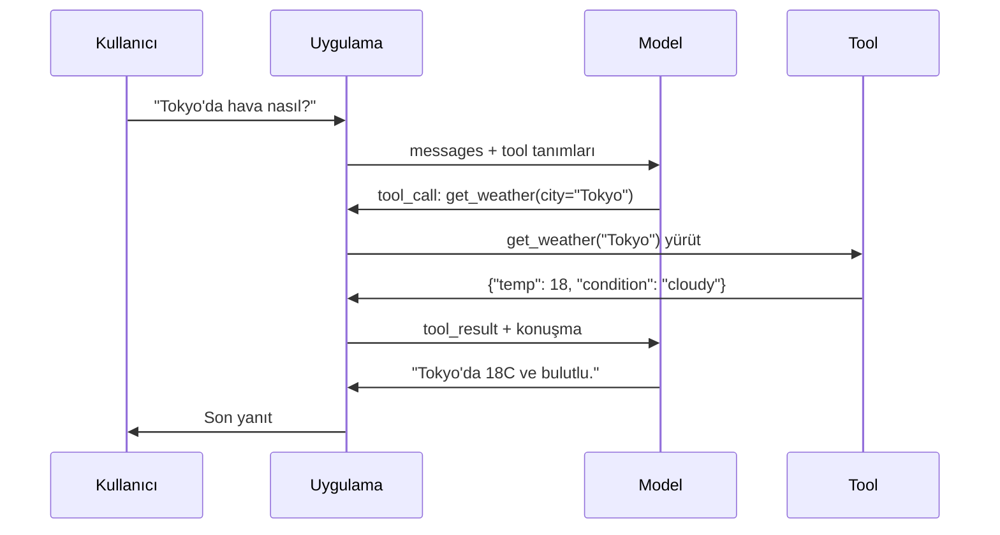

# Function Calling ve Tool Use

> LLM'ler hiçbir şey yapamaz. Metin üretirler. Tüm yetenek bu. Hava durumunu kontrol edemezler, veritabanı sorgulayamazlar, e-posta gönderemezler, kod çalıştıramazlar ya da dosya okuyamazlar. Gördüğün her "AI agent" hangi fonksiyonun çağrılacağını söyleyen JSON üreten bir LLM'dir — ve sonra senin kodun gerçekten çağırır. Model beyindir. Tool'lar ellerdir. Function calling onları bağlayan sinir sistemidir.

**Tür:** Yapım
**Diller:** Python
**Ön koşullar:** Faz 11 Ders 03 (Yapılandırılmış Çıktılar)
**Süre:** ~75 dakika
**İlgili:** Faz 11 · 14 (Model Context Protocol) — bir tool host'lar arasında paylaşıldığında, inline function-calling'ten bir MCP sunucusuna yükselt. Bu ders inline durumunu kapsar; MCP protokol durumunu kapsar.

## Öğrenme Hedefleri

- Bir function calling döngüsü uygula: tool şemaları tanımla, modelin tool-call JSON'unu parse et, fonksiyonları yürüt ve sonuçları döndür
- Modelin güvenilir şekilde çağırabileceği net açıklamalı ve tipli parametreli tool şemaları tasarla
- Karmaşık sorguları yanıtlamak için birden fazla function call zincirleyen multi-turn agent döngüsü inşa et
- Function calling edge case'lerini işle: paralel tool çağrıları, hata propagasyonu ve sonsuz tool döngülerini önleme

## Sorun

Bir chatbot inşa ediyorsun. Bir kullanıcı soruyor: "Tokyo'da şu an hava nasıl?"

Model yanıt veriyor: "Gerçek zamanlı hava durumu verisine erişimim yok, ama mevsime bağlı olarak, Tokyo muhtemelen 15 derece civarındadır..."

Bu bir feragatname giydirilmiş halüsinasyon. Model hava durumunu bilmiyor. Asla bilmeyecek. Hava her saat değişir. Modelin eğitim verisi aylarca eski.

Doğru yanıt OpenWeatherMap API'sini çağırmayı, mevcut sıcaklığı almayı ve gerçek sayıyı döndürmeyi gerektirir. Model API çağıramaz. Senin kodun çağırabilir. Eksik parça: modelin "Bu argümanlarla hava durumu API'sini çağırmam gerek" demesine ve senin kodun onu yürütüp sonucu geri beslemesine izin veren yapılandırılmış bir protokol.

Bu function calling. Model hangi fonksiyonu hangi argümanlarla çağıracağını anlatan yapılandırılmış JSON çıktısı verir. Uygulaman fonksiyonu yürütür. Sonuç konuşmaya geri girer. Model sonucu son yanıtını üretmek için kullanır.

Function calling olmadan, LLM'ler ansiklopedilerdir. Onunla, agent'lar olurlar.

## Kavram

### Function Calling Döngüsü

Her tool-use etkileşimi aynı 5-adımlı döngüyü takip eder.



Adım 1: kullanıcı bir mesaj gönderir. Adım 2: model mesajı tool tanımlarıyla birlikte alır (mevcut fonksiyonları tanımlayan JSON Schema). Adım 3: metinle yanıt vermek yerine, model bir tool çağrısı çıkarır — fonksiyon adı ve argümanları olan yapılandırılmış bir JSON nesnesi. Adım 4: kodun fonksiyonu yürütür ve sonucu yakalar. Adım 5: sonuç modele geri gider, modelin artık son yanıtını üretmek için gerçek verisi var.

Model hiçbir şey yürütmez. Yalnızca neyi hangi argümanlarla çağıracağına karar verir. Senin kodun yürütücüdür.

### Tool Tanımları: JSON Schema Sözleşmesi

Her tool, modele fonksiyonun ne yaptığını, hangi argümanları aldığını ve bu argümanların hangi tiplerde olması gerektiğini anlatan bir JSON Schema ile tanımlanır.

```json
{
  "type": "function",
  "function": {
    "name": "get_weather",
    "description": "Get current weather for a city. Returns temperature in Celsius and conditions.",
    "parameters": {
      "type": "object",
      "properties": {
        "city": {
          "type": "string",
          "description": "City name, e.g. 'Tokyo' or 'San Francisco'"
        },
        "units": {
          "type": "string",
          "enum": ["celsius", "fahrenheit"],
          "description": "Temperature units"
        }
      },
      "required": ["city"]
    }
  }
}
```

`description` alanları kritik. Model bunları tool'u ne zaman ve nasıl kullanacağına karar vermek için okur. "Hava alır" gibi belirsiz bir açıklama "Get current weather for a city. Returns temperature in Celsius and conditions."tan daha kötü tool seçimi üretir. Açıklama tool seçimi için bir prompt'tur.

### Sağlayıcı Karşılaştırması

Her büyük sağlayıcı function calling'i destekler, ama API yüzeyi farklılık gösterir.

| Sağlayıcı | API Parametresi | Tool Call Formatı | Paralel Çağrı | Zorla Çağrı |
|----------|--------------|-----------------|---------------|----------------|
| OpenAI (GPT-5, o4) | `tools` | `tool_calls[].function` | Evet (tur başına birden fazla) | `tool_choice="required"` |
| Anthropic (Claude 4.6/4.7) | `tools` | `content[].type="tool_use"` | Evet (birden fazla blok) | `tool_choice={"type":"any"}` |
| Google (Gemini 3) | `function_declarations` | `functionCall` | Evet | `function_calling_config` |
| Açık-ağırlıklı (Llama 4, Qwen3, DeepSeek-V3) | Llama 4'te native `tools`; diğerlerinde Hermes ya da ChatML | Karışık | Modele bağlı | Prompt-tabanlı ya da destekleniyorsa `tool_choice` |

2026'ya gelindiğinde üç kapalı sağlayıcı neredeyse özdeş JSON-Schema-tabanlı formatlara yakınsadı. Llama 4 OpenAI'ın şekliyle eşleşen native bir `tools` alanıyla yayınlandı. Açık-ağırlıklı fine-tune'lar hâlâ değişir — Hermes formatı (NousResearch) üçüncü-taraf fine-tune'lar için en yaygındır. Host'lar arasında paylaşılan tool'lar için, inline function-calling yerine MCP'yi (Faz 11 · 14) tercih et — sunucu hepsi için aynıdır.

### Tool Choice: Auto, Required, Specific

Modelin tool'ları ne zaman kullanacağını kontrol edersin.

**Auto** (varsayılan): model bir tool çağırıp çağırmayacağına ya da doğrudan yanıt verip vermeyeceğine karar verir. "2+2 ne?" — doğrudan yanıtlar. "Hava nasıl?" — tool'u çağırır.

**Required**: model en az bir tool çağırmalı. Kullanıcının niyetinin bir tool gerektirdiğini bildiğinde kullan. Modelin gerçek veriye bakmak yerine tahmin etmesini önler.

**Specific function**: modeli belirli bir fonksiyonu çağırmaya zorla. `tool_choice={"type":"function", "function": {"name": "get_weather"}}` sorguya bakılmaksızın hava tool'unun çağrıldığını garanti eder. Bunu routing için kullan — upstream mantık zaten hangi tool'un gerekli olduğunu belirlediğinde.

### Paralel Function Calling

GPT-4o ve Claude tek bir turda birden fazla fonksiyon çağırabilir. Bir kullanıcı soruyor: "Tokyo ve New York'ta hava nasıl?" Model aynı anda iki tool çağrısı çıkarır:

```json
[
  {"name": "get_weather", "arguments": {"city": "Tokyo"}},
  {"name": "get_weather", "arguments": {"city": "New York"}}
]
```

Kodun ikisini de yürütür (ideal olarak eşzamanlı), ikisinin de sonuçlarını döndürür ve model tek bir yanıt sentezler. Bu round trip'i 2'den 1'e indirir. Sorgu başına 5-10 tool çağrısı olan agent'lar için, paralel çağrı gecikmeyi %60-80 azaltır.

### Yapılandırılmış Çıktılar vs Function Calling

Ders 03 yapılandırılmış çıktıları kapsadı. Function calling aynı JSON Schema makinesini kullanır, ama farklı bir amaç için.

**Yapılandırılmış çıktılar**: modeli belirli bir şekilde veri üretmeye zorla. Çıktı son üründür. Örnek: metinden ürün bilgisini `{name, price, in_stock}` olarak çıkar.

**Function calling**: model bir aksiyon yürütme niyeti deklare eder. Çıktı bir ara adımdır. Örnek: `get_weather(city="Tokyo")` — model son yanıtı üretmiyor, bir aksiyon talep ediyor.

Veri çıkarımı istediğinde yapılandırılmış çıktıları kullan. Modelin dış sistemlerle etkileşim kurmasını istediğinde function calling kullan.

### Güvenlik: Pazarlık Edilemez Kurallar

Function calling bir LLM'e verebileceğin en tehlikeli yetenektir. Model neyi yürüteceğini seçer. Tool kümen veritabanı sorguları içeriyorsa, model sorguları kurar. Shell komutları içeriyorsa, model onları yazar.

**Kural 1: Asla model-üretimli SQL'i doğrudan bir veritabanına geçirme.** Model DROP TABLE, UNION injection'ları ya da her satırı döndüren sorgular üretebilir ve üretecek. Her zaman parametrele. Her zaman doğrula. Her zaman bir işlem allowlist'i kullan.

**Kural 2: Fonksiyonları allowlist'le.** Model yalnızca açıkça tanımladığın fonksiyonları çağırabilir. Asla genel "isimle herhangi bir fonksiyonu yürüt" tool'u inşa etme. 50 dahili fonksiyonun varsa, yalnızca kullanıcının ihtiyacı olan 5'i aç.

**Kural 3: Argümanları doğrula.** Model `"; DROP TABLE users; --"` gibi bir şehir adı geçirebilir. Yürütmeden önce her argümanı beklenen tip, aralık ve formatlara karşı doğrula.

**Kural 4: Tool sonuçlarını sanitize et.** Bir tool hassas veri döndürürse (API anahtarları, PII, dahili hatalar), modele geri göndermeden önce filtrele. Model tool sonuçlarını yanıtına kelimesi kelimesine dahil edecektir.

**Kural 5: Tool çağrılarını rate limit et.** Döngüdeki bir model tool'ları yüzlerce kez çağırabilir. Bir maksimum belirle (konuşma başına 10-20 çağrı makul). Sonsuz döngüleri kır.

### Hata İşleme

Tool'lar başarısız olur. API'ler zaman aşımına uğrar. Veritabanları çöker. Dosyalar yok. Modelin bir tool'un ne zaman ve neden başarısız olduğunu bilmesi gerekir.

Hataları exception olarak değil, yapılandırılmış tool sonuçları olarak döndür:

```json
{
  "error": true,
  "message": "City 'Toky' not found. Did you mean 'Tokyo'?",
  "code": "CITY_NOT_FOUND"
}
```

Model bunu okur, argümanlarını ayarlar ve yeniden dener. Modeller yapılandırılmış hata mesajlarından kendini düzeltmede iyidir. Boş yanıtlardan ya da genel "bir şeyler ters gitti" hatalarından kurtulmada kötüdürler.

### MCP: Model Context Protocol

MCP, Anthropic'in tool birlikte çalışabilirliği için açık standardıdır. Her uygulamanın kendi tool'larını tanımlaması yerine, MCP evrensel bir protokol sağlar: tool'lar MCP sunucuları tarafından servis edilir, MCP client'ları (Claude Code, Cursor ya da uygulaman gibi) tarafından tüketilir.

Bir MCP sunucusu tool'ları herhangi bir uyumlu client'a açabilir. Bir Postgres MCP sunucusu MCP-uyumlu herhangi bir agent'a veritabanı erişimi verir. Bir GitHub MCP sunucusu herhangi bir agent'a repository erişimi verir. Tool'lar bir kez tanımlanır, her yerde kullanılır.

MCP, function calling için HTTP'nin networking için olduğudur. Tool'ların taşınabilir olması için transport katmanını standardize eder.

## İnşa Et

### Adım 1: Tool Registry'sini Tanımla

Tool tanımlarını ve uygulamalarını depolayan bir registry inşa et. Her tool'un bir JSON Schema tanımı (modelin gördüğü) ve bir Python fonksiyonu (kodunun yürüttüğü) var.

```python
import json
import math
import time
import hashlib


TOOL_REGISTRY = {}


def register_tool(name, description, parameters, function):
    TOOL_REGISTRY[name] = {
        "definition": {
            "type": "function",
            "function": {
                "name": name,
                "description": description,
                "parameters": parameters,
            },
        },
        "function": function,
    }
```

### Adım 2: 5 Tool Uygula

Bir hesap makinesi, hava durumu arama, web search simülatörü, dosya okuyucu ve kod runner'ı inşa et.

```python
def calculator(expression, precision=2):
    allowed = set("0123456789+-*/.() ")
    if not all(c in allowed for c in expression):
        return {"error": True, "message": f"Invalid characters in expression: {expression}"}
    try:
        result = eval(expression, {"__builtins__": {}}, {"math": math})
        return {"result": round(float(result), precision), "expression": expression}
    except Exception as e:
        return {"error": True, "message": str(e)}


WEATHER_DB = {
    "tokyo": {"temp_c": 18, "condition": "cloudy", "humidity": 72, "wind_kph": 14},
    "new york": {"temp_c": 22, "condition": "sunny", "humidity": 45, "wind_kph": 8},
    "london": {"temp_c": 12, "condition": "rainy", "humidity": 88, "wind_kph": 22},
    "san francisco": {"temp_c": 16, "condition": "foggy", "humidity": 80, "wind_kph": 18},
    "sydney": {"temp_c": 25, "condition": "sunny", "humidity": 55, "wind_kph": 10},
}


def get_weather(city, units="celsius"):
    key = city.lower().strip()
    if key not in WEATHER_DB:
        suggestions = [c for c in WEATHER_DB if c.startswith(key[:3])]
        return {
            "error": True,
            "message": f"City '{city}' not found.",
            "suggestions": suggestions,
            "code": "CITY_NOT_FOUND",
        }
    data = WEATHER_DB[key].copy()
    if units == "fahrenheit":
        data["temp_f"] = round(data["temp_c"] * 9 / 5 + 32, 1)
        del data["temp_c"]
    data["city"] = city
    return data


SEARCH_DB = {
    "python function calling": [
        {"title": "OpenAI Function Calling Guide", "url": "https://platform.openai.com/docs/guides/function-calling", "snippet": "Learn how to connect LLMs to external tools."},
        {"title": "Anthropic Tool Use", "url": "https://docs.anthropic.com/en/docs/tool-use", "snippet": "Claude can interact with external tools and APIs."},
    ],
    "MCP protocol": [
        {"title": "Model Context Protocol", "url": "https://modelcontextprotocol.io", "snippet": "An open standard for connecting AI models to data sources."},
    ],
    "weather API": [
        {"title": "OpenWeatherMap API", "url": "https://openweathermap.org/api", "snippet": "Free weather API with current, forecast, and historical data."},
    ],
}


def web_search(query, max_results=3):
    key = query.lower().strip()
    for db_key, results in SEARCH_DB.items():
        if db_key in key or key in db_key:
            return {"query": query, "results": results[:max_results], "total": len(results)}
    return {"query": query, "results": [], "total": 0}


FILE_SYSTEM = {
    "data/config.json": '{"model": "gpt-4o", "temperature": 0.7, "max_tokens": 4096}',
    "data/users.csv": "name,email,role\nAlice,alice@example.com,admin\nBob,bob@example.com,user",
    "README.md": "# My Project\nA tool-use agent built from scratch.",
}


def read_file(path):
    if ".." in path or path.startswith("/"):
        return {"error": True, "message": "Path traversal not allowed.", "code": "FORBIDDEN"}
    if path not in FILE_SYSTEM:
        available = list(FILE_SYSTEM.keys())
        return {"error": True, "message": f"File '{path}' not found.", "available_files": available, "code": "NOT_FOUND"}
    content = FILE_SYSTEM[path]
    return {"path": path, "content": content, "size_bytes": len(content), "lines": content.count("\n") + 1}


def run_code(code, language="python"):
    if language != "python":
        return {"error": True, "message": f"Language '{language}' not supported. Only 'python' is available."}
    forbidden = ["import os", "import sys", "import subprocess", "exec(", "eval(", "__import__", "open("]
    for pattern in forbidden:
        if pattern in code:
            return {"error": True, "message": f"Forbidden operation: {pattern}", "code": "SECURITY_VIOLATION"}
    try:
        local_vars = {}
        exec(code, {"__builtins__": {"print": print, "range": range, "len": len, "str": str, "int": int, "float": float, "list": list, "dict": dict, "sum": sum, "min": min, "max": max, "abs": abs, "round": round, "sorted": sorted, "enumerate": enumerate, "zip": zip, "map": map, "filter": filter, "math": math}}, local_vars)
        result = local_vars.get("result", None)
        return {"success": True, "result": result, "variables": {k: str(v) for k, v in local_vars.items() if not k.startswith("_")}}
    except Exception as e:
        return {"error": True, "message": f"{type(e).__name__}: {e}"}
```

### Adım 3: Tüm Tool'ları Kaydet

```python
def register_all_tools():
    register_tool(
        "calculator", "Evaluate a mathematical expression. Supports +, -, *, /, parentheses, and decimals. Returns the numeric result.",
        {"type": "object", "properties": {"expression": {"type": "string", "description": "Math expression, e.g. '(10 + 5) * 3'"}, "precision": {"type": "integer", "description": "Decimal places in result", "default": 2}}, "required": ["expression"]},
        calculator,
    )
    register_tool(
        "get_weather", "Get current weather for a city. Returns temperature, condition, humidity, and wind speed.",
        {"type": "object", "properties": {"city": {"type": "string", "description": "City name, e.g. 'Tokyo' or 'San Francisco'"}, "units": {"type": "string", "enum": ["celsius", "fahrenheit"], "description": "Temperature units, defaults to celsius"}}, "required": ["city"]},
        get_weather,
    )
    register_tool(
        "web_search", "Search the web for information. Returns a list of results with title, URL, and snippet.",
        {"type": "object", "properties": {"query": {"type": "string", "description": "Search query"}, "max_results": {"type": "integer", "description": "Maximum results to return", "default": 3}}, "required": ["query"]},
        web_search,
    )
    register_tool(
        "read_file", "Read the contents of a file. Returns the file content, size, and line count.",
        {"type": "object", "properties": {"path": {"type": "string", "description": "Relative file path, e.g. 'data/config.json'"}}, "required": ["path"]},
        read_file,
    )
    register_tool(
        "run_code", "Execute Python code in a sandboxed environment. Set a 'result' variable to return output.",
        {"type": "object", "properties": {"code": {"type": "string", "description": "Python code to execute"}, "language": {"type": "string", "enum": ["python"], "description": "Programming language"}}, "required": ["code"]},
        run_code,
    )
```

### Adım 4: Function Calling Döngüsünü İnşa Et

Bu çekirdek motor. Modelin hangi tool'u çağıracağına karar vermesini simüle eder, tool'u yürütür ve sonuçları geri besler.

```python
def simulate_model_decision(user_message, tools, conversation_history):
    msg = user_message.lower()

    if any(word in msg for word in ["weather", "temperature", "forecast"]):
        cities = []
        for city in WEATHER_DB:
            if city in msg:
                cities.append(city)
        if not cities:
            for word in msg.split():
                if word.capitalize() in [c.title() for c in WEATHER_DB]:
                    cities.append(word)
        if not cities:
            cities = ["tokyo"]
        calls = []
        for city in cities:
            calls.append({"name": "get_weather", "arguments": {"city": city.title()}})
        return calls

    if any(word in msg for word in ["calculate", "compute", "math", "what is", "how much"]):
        for token in msg.split():
            if any(c in token for c in "+-*/"):
                return [{"name": "calculator", "arguments": {"expression": token}}]
        if "+" in msg or "-" in msg or "*" in msg or "/" in msg:
            expr = "".join(c for c in msg if c in "0123456789+-*/.() ")
            if expr.strip():
                return [{"name": "calculator", "arguments": {"expression": expr.strip()}}]
        return [{"name": "calculator", "arguments": {"expression": "0"}}]

    if any(word in msg for word in ["search", "find", "look up", "google"]):
        query = msg.replace("search for", "").replace("look up", "").replace("find", "").strip()
        return [{"name": "web_search", "arguments": {"query": query}}]

    if any(word in msg for word in ["read", "file", "open", "cat", "show"]):
        for path in FILE_SYSTEM:
            if path.split("/")[-1].split(".")[0] in msg:
                return [{"name": "read_file", "arguments": {"path": path}}]
        return [{"name": "read_file", "arguments": {"path": "README.md"}}]

    if any(word in msg for word in ["run", "execute", "code", "python"]):
        return [{"name": "run_code", "arguments": {"code": "result = 'Hello from the sandbox!'", "language": "python"}}]

    return []


def execute_tool_call(tool_call):
    name = tool_call["name"]
    args = tool_call["arguments"]

    if name not in TOOL_REGISTRY:
        return {"error": True, "message": f"Unknown tool: {name}", "code": "UNKNOWN_TOOL"}

    tool = TOOL_REGISTRY[name]
    func = tool["function"]
    start = time.time()

    try:
        result = func(**args)
    except TypeError as e:
        result = {"error": True, "message": f"Invalid arguments: {e}"}

    elapsed_ms = round((time.time() - start) * 1000, 2)
    return {"tool": name, "result": result, "execution_time_ms": elapsed_ms}


def run_function_calling_loop(user_message, max_iterations=5):
    conversation = [{"role": "user", "content": user_message}]
    tool_definitions = [t["definition"] for t in TOOL_REGISTRY.values()]
    all_tool_results = []

    for iteration in range(max_iterations):
        tool_calls = simulate_model_decision(user_message, tool_definitions, conversation)

        if not tool_calls:
            break

        results = []
        for call in tool_calls:
            result = execute_tool_call(call)
            results.append(result)

        conversation.append({"role": "assistant", "content": None, "tool_calls": tool_calls})

        for result in results:
            conversation.append({"role": "tool", "content": json.dumps(result["result"]), "tool_name": result["tool"]})

        all_tool_results.extend(results)
        break

    return {"conversation": conversation, "tool_results": all_tool_results, "iterations": iteration + 1 if tool_calls else 0}
```

### Adım 5: Argüman Doğrulama

Yürütme öncesi tool çağrısı argümanlarını JSON Schema'ya karşı kontrol eden bir validator inşa et.

```python
def validate_tool_arguments(tool_name, arguments):
    if tool_name not in TOOL_REGISTRY:
        return [f"Unknown tool: {tool_name}"]

    schema = TOOL_REGISTRY[tool_name]["definition"]["function"]["parameters"]
    errors = []

    if not isinstance(arguments, dict):
        return [f"Arguments must be an object, got {type(arguments).__name__}"]

    for required_field in schema.get("required", []):
        if required_field not in arguments:
            errors.append(f"Missing required argument: {required_field}")

    properties = schema.get("properties", {})
    for arg_name, arg_value in arguments.items():
        if arg_name not in properties:
            errors.append(f"Unknown argument: {arg_name}")
            continue

        prop_schema = properties[arg_name]
        expected_type = prop_schema.get("type")

        type_checks = {"string": str, "integer": int, "number": (int, float), "boolean": bool, "array": list, "object": dict}
        if expected_type in type_checks:
            if not isinstance(arg_value, type_checks[expected_type]):
                errors.append(f"Argument '{arg_name}': expected {expected_type}, got {type(arg_value).__name__}")

        if "enum" in prop_schema and arg_value not in prop_schema["enum"]:
            errors.append(f"Argument '{arg_name}': '{arg_value}' not in {prop_schema['enum']}")

    return errors
```

### Adım 6: Demo'yu Çalıştır

```python
def run_demo():
    register_all_tools()

    print("=" * 60)
    print("  Function Calling & Tool Use Demo")
    print("=" * 60)

    print("\n--- Registered Tools ---")
    for name, tool in TOOL_REGISTRY.items():
        desc = tool["definition"]["function"]["description"][:60]
        params = list(tool["definition"]["function"]["parameters"].get("properties", {}).keys())
        print(f"  {name}: {desc}...")
        print(f"    params: {params}")

    print(f"\n--- Argument Validation ---")
    validation_tests = [
        ("get_weather", {"city": "Tokyo"}, "Valid call"),
        ("get_weather", {}, "Missing required arg"),
        ("get_weather", {"city": "Tokyo", "units": "kelvin"}, "Invalid enum value"),
        ("calculator", {"expression": 123}, "Wrong type (int for string)"),
        ("unknown_tool", {"x": 1}, "Unknown tool"),
    ]
    for tool_name, args, label in validation_tests:
        errors = validate_tool_arguments(tool_name, args)
        status = "VALID" if not errors else f"ERRORS: {errors}"
        print(f"  {label}: {status}")

    print(f"\n--- Tool Execution ---")
    direct_tests = [
        {"name": "calculator", "arguments": {"expression": "(10 + 5) * 3 / 2"}},
        {"name": "get_weather", "arguments": {"city": "Tokyo"}},
        {"name": "get_weather", "arguments": {"city": "Mars"}},
        {"name": "web_search", "arguments": {"query": "python function calling"}},
        {"name": "read_file", "arguments": {"path": "data/config.json"}},
        {"name": "read_file", "arguments": {"path": "../etc/passwd"}},
        {"name": "run_code", "arguments": {"code": "result = sum(range(1, 101))"}},
        {"name": "run_code", "arguments": {"code": "import os; os.system('rm -rf /')"}},
    ]
    for call in direct_tests:
        result = execute_tool_call(call)
        print(f"\n  {call['name']}({json.dumps(call['arguments'])})")
        print(f"    -> {json.dumps(result['result'], indent=None)[:100]}")
        print(f"    time: {result['execution_time_ms']}ms")

    print(f"\n--- Full Function Calling Loop ---")
    test_queries = [
        "What's the weather in Tokyo?",
        "Calculate (100 + 250) * 0.15",
        "Search for MCP protocol",
        "Read the config file",
        "Run some Python code",
        "Tell me a joke",
    ]
    for query in test_queries:
        print(f"\n  User: {query}")
        result = run_function_calling_loop(query)
        if result["tool_results"]:
            for tr in result["tool_results"]:
                print(f"    Tool: {tr['tool']} ({tr['execution_time_ms']}ms)")
                print(f"    Result: {json.dumps(tr['result'], indent=None)[:90]}")
        else:
            print(f"    [No tool called -- direct response]")
        print(f"    Iterations: {result['iterations']}")

    print(f"\n--- Parallel Tool Calls ---")
    multi_city_query = "What's the weather in tokyo and london?"
    print(f"  User: {multi_city_query}")
    result = run_function_calling_loop(multi_city_query)
    print(f"  Tool calls made: {len(result['tool_results'])}")
    for tr in result["tool_results"]:
        city = tr["result"].get("city", "unknown")
        temp = tr["result"].get("temp_c", "N/A")
        print(f"    {city}: {temp}C, {tr['result'].get('condition', 'N/A')}")

    print(f"\n--- Security Checks ---")
    security_tests = [
        ("read_file", {"path": "../../etc/passwd"}),
        ("run_code", {"code": "import subprocess; subprocess.run(['ls'])"}),
        ("calculator", {"expression": "__import__('os').system('ls')"}),
    ]
    for tool_name, args in security_tests:
        result = execute_tool_call({"name": tool_name, "arguments": args})
        blocked = result["result"].get("error", False)
        print(f"  {tool_name}({list(args.values())[0][:40]}): {'BLOCKED' if blocked else 'ALLOWED'}")
```

## Kullan

### OpenAI Function Calling

```python
# from openai import OpenAI
#
# client = OpenAI()
#
# tools = [{
#     "type": "function",
#     "function": {
#         "name": "get_weather",
#         "description": "Get current weather for a city",
#         "parameters": {
#             "type": "object",
#             "properties": {
#                 "city": {"type": "string"},
#                 "units": {"type": "string", "enum": ["celsius", "fahrenheit"]}
#             },
#             "required": ["city"]
#         }
#     }
# }]
#
# response = client.chat.completions.create(
#     model="gpt-4o",
#     messages=[{"role": "user", "content": "Weather in Tokyo?"}],
#     tools=tools,
#     tool_choice="auto",
# )
#
# tool_call = response.choices[0].message.tool_calls[0]
# args = json.loads(tool_call.function.arguments)
# result = get_weather(**args)
#
# final = client.chat.completions.create(
#     model="gpt-4o",
#     messages=[
#         {"role": "user", "content": "Weather in Tokyo?"},
#         response.choices[0].message,
#         {"role": "tool", "tool_call_id": tool_call.id, "content": json.dumps(result)},
#     ],
# )
# print(final.choices[0].message.content)
```

OpenAI tool çağrılarını `response.choices[0].message.tool_calls` olarak döndürür. Her çağrının sonucu döndürürken dahil etmen gereken bir `id`'si vardır. Model bu ID'yi sonuçları çağrılara eşleştirmek için kullanır. GPT-4o tek bir yanıtta birden fazla tool çağrısı döndürebilir — hepsini iterate et ve yürüt.

### Anthropic Tool Use

```python
# import anthropic
#
# client = anthropic.Anthropic()
#
# response = client.messages.create(
#     model="claude-sonnet-4-20250514",
#     max_tokens=1024,
#     tools=[{
#         "name": "get_weather",
#         "description": "Get current weather for a city",
#         "input_schema": {
#             "type": "object",
#             "properties": {
#                 "city": {"type": "string"},
#                 "units": {"type": "string", "enum": ["celsius", "fahrenheit"]}
#             },
#             "required": ["city"]
#         }
#     }],
#     messages=[{"role": "user", "content": "Weather in Tokyo?"}],
# )
#
# tool_block = next(b for b in response.content if b.type == "tool_use")
# result = get_weather(**tool_block.input)
#
# final = client.messages.create(
#     model="claude-sonnet-4-20250514",
#     max_tokens=1024,
#     tools=[...],
#     messages=[
#         {"role": "user", "content": "Weather in Tokyo?"},
#         {"role": "assistant", "content": response.content},
#         {"role": "user", "content": [{"type": "tool_result", "tool_use_id": tool_block.id, "content": json.dumps(result)}]},
#     ],
# )
```

Anthropic tool çağrılarını `type: "tool_use"` ile content blok'ları olarak döndürür. Tool sonucu `type: "tool_result"` ile bir user message'a gider. Anahtar farkı not et: Anthropic tool parametre tanımları için `input_schema` kullanır, OpenAI `parameters` kullanır.

### MCP Entegrasyonu

```python
# MCP sunucuları tool'ları standartlaştırılmış bir protokol üzerinden açar.
# Herhangi bir MCP-uyumlu client bu tool'ları keşfedebilir ve çağırabilir.
#
# Örnek: bir Postgres MCP sunucusuna bağlanma
#
# from mcp import ClientSession, StdioServerParameters
# from mcp.client.stdio import stdio_client
#
# server_params = StdioServerParameters(
#     command="npx",
#     args=["-y", "@modelcontextprotocol/server-postgres", "postgresql://localhost/mydb"],
# )
#
# async with stdio_client(server_params) as (read, write):
#     async with ClientSession(read, write) as session:
#         await session.initialize()
#         tools = await session.list_tools()
#         result = await session.call_tool("query", {"sql": "SELECT count(*) FROM users"})
```

MCP, tool uygulamasını tool tüketiminden ayırır. Postgres sunucusu SQL'i bilir. GitHub sunucusu API'yi bilir. Agent'ın yalnızca tool'ları keşfeder ve çağırır — her entegrasyon için sağlayıcı-spesifik koda ihtiyacı yoktur.

## Yayınla

Bu ders `outputs/prompt-tool-designer.md` üretir — tool tanımları tasarlamak için yeniden kullanılabilir bir prompt şablonu. Ona bir tool'un ne yapmasını istediğinin açıklamasını ver ve açıklamalar, tipler ve kısıtlarla eksiksiz JSON Schema tanımını üretir.

Ayrıca `outputs/skill-function-calling-patterns.md` üretir — üretimde function calling uygulamak için bir karar framework'ü, tool tasarımını, hata işlemeyi, güvenliği ve sağlayıcı-spesifik desenleri kapsar.

## Alıştırmalar

1. **6. tool ekle: veritabanı sorgusu.** In-memory bir tabloyla simüle edilmiş bir SQL tool'u uygula. Tool tablo adı ve filtre koşulları (ham SQL değil) kabul eder. Tablo adının bir allowlist'te olduğunu ve filtre operatörlerinin `=`, `>`, `<`, `>=`, `<=` ile sınırlı olduğunu doğrula. Eşleşen satırları JSON olarak döndür.

2. **Hata geri bildirimi ile retry uygula.** Bir tool çağrısı başarısız olduğunda (örn., şehir bulunamadı), hata mesajını model karar fonksiyonuna geri besle ve argümanlarını düzeltmesine izin ver. Her çağrının kaç retry aldığını izle. Tool çağrısı başına maksimum 3 retry belirle.

3. **Multi-adımlı agent inşa et.** Bazı sorgular tool çağrılarını zincirlemeyi gerektirir: "Config dosyasını oku ve hangi modelin yapılandırıldığını söyle, sonra o modelin fiyatlandırması için web'i ara." Model artık tool gerekmediğine karar verene kadar çalışan, biriken sonuçları her karar adımına geçiren bir döngü uygula. Sonsuz döngüleri önlemek için 10 iterasyonla sınırla.

4. **Tool seçim doğruluğunu ölç.** Beklenen tool isimleriyle 30 test sorgusu oluştur. Karar fonksiyonunu hepsinde çalıştır ve doğru tool'u seçtiği zaman yüzdesini ölç. Tool'lar arasında en çok karışıklık üreten sorguları belirle.

5. **Tool çağrısı caching uygula.** Aynı tool 60 saniye içinde özdeş argümanlarla çağrılırsa, yeniden yürütmek yerine cache'lenmiş sonucu döndür. `(tool_name, frozenset(args.items()))` ile anahtarlanan bir dict kullan. 20 sorgulu bir konuşmada cache hit oranlarını ölç.

## Anahtar Terimler

| Terim | İnsanlar ne diyor | Gerçekte ne anlama geliyor |
|------|----------------|----------------------|
| Function calling | "Tool use" | Model belirli argümanlarla çağırılacak bir fonksiyonu anlatan yapılandırılmış JSON çıktısı verir — model değil, senin kodun yürütür |
| Tool tanımı | "Fonksiyon şeması" | Tool'un adını, amacını, parametrelerini ve tiplerini açıklayan JSON Schema nesnesi — model bunu tool'u ne zaman ve nasıl kullanacağına karar vermek için okur |
| Tool choice | "Çağrı mode'u" | Modelin bir tool çağırması gerekip gerekmediğini (required), çağırabileceğini (auto) ya da belirli bir tool çağırması gerektiğini (named) kontrol eder |
| Paralel çağrı | "Multi-tool" | Model tek bir turda birden fazla tool çağrısı çıkarır, round trip'leri azaltır — GPT-4o ve Claude ikisi de destekler |
| Tool sonucu | "Fonksiyon çıktısı" | Bir tool'u yürütmenin dönüş değeri, modele bir mesaj olarak geri gönderilir, böylece gerçek veriyi yanıtında kullanabilir |
| Argüman doğrulama | "Girdi kontrolü" | Model-üretimli argümanların tool yürütülmeden önce beklenen tip, aralık ve kısıtlarla eşleştiğini doğrulamak |
| MCP | "Tool protokolü" | Model Context Protocol — Anthropic'in herhangi bir uyumlu client'ın keşfedip çağırabileceği sunucular üzerinden tool'ları açmak için açık standardı |
| Agent döngüsü | "ReAct döngüsü" | Model-tool'a-karar-verir, kod-tool'u-yürütür, sonuç-geri-beslenir döngüsü, model yanıtlamak için yeterli bilgiye sahip olana kadar |
| Tool poisoning | "Tool üzerinden prompt injection" | Tool sonuçlarının modelin davranışını manipüle eden talimatlar içerdiği saldırı — tüm tool çıktılarını sanitize et |
| Rate limiting | "Çağrı budget'ı" | Sonsuz döngüleri ve kontrolsüz API maliyetlerini önlemek için konuşma başına maksimum tool çağrısı sayısı belirlemek |

## İleri Okuma

- [OpenAI Function Calling Kılavuzu](https://platform.openai.com/docs/guides/function-calling) — paralel çağrılar, zorla çağırma ve yapılandırılmış argümanlar dahil GPT-4o ile tool use için kesin referans
- [Anthropic Tool Use Kılavuzu](https://docs.anthropic.com/en/docs/tool-use) — input_schema, multi-tool yanıtları ve tool_choice yapılandırması ile Claude'un tool use uygulaması
- [Model Context Protocol Spesifikasyonu](https://modelcontextprotocol.io) — sunucu/client mimarisi ile AI uygulamaları arası tool birlikte çalışabilirliği için açık standart
- [Schick et al., 2023 — "Toolformer: Language Models Can Teach Themselves to Use Tools"](https://arxiv.org/abs/2302.04761) — LLM'leri dış tool'ları ne zaman ve nasıl çağıracaklarına karar vermek için eğitme üzerine temel makale
- [Patil et al., 2023 — "Gorilla: Large Language Model Connected with Massive APIs"](https://arxiv.org/abs/2305.15334) — halüsinasyon azaltmayla 1.645 API arasında doğru API çağrıları için LLM'leri fine-tune etme
- [Berkeley Function Calling Leaderboard](https://gorilla.cs.berkeley.edu/leaderboard.html) — GPT-4o, Claude, Gemini ve açık modeller arası function calling doğruluğunu karşılaştıran gerçek zamanlı benchmark
- [Yao et al., "ReAct: Synergizing Reasoning and Acting in Language Models" (ICLR 2023)](https://arxiv.org/abs/2210.03629) — her tool çağrısının etrafındaki dış agent döngüsü olan Düşünce-Aksiyon-Gözlem döngüsü; bu dersin bittiği yerden Faz 14 devam eder.
- [Anthropic — Building effective agents (Aralık 2024)](https://www.anthropic.com/research/building-effective-agents) — tek tool-use primitive'inden inşa edilen beş compose edilebilir desen (prompt chaining, routing, parallelization, orchestrator-workers, evaluator-optimizer).
