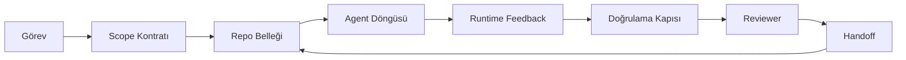

# Agent Workbench Mühendisliği: Yetenekli Modeller Neden Hâlâ Başarısız Olur

> Yetenekli bir model yeterli değil. Güvenilir agent'lar bir workbench gerektirir: talimatlar, state, scope, feedback, doğrulama, inceleme ve handoff. Bunları çıkar, frontier bir model bile yayınlanması güvensiz iş üretir.

**Tür:** Öğrenim + Yapım
**Diller:** Python (stdlib)
**Ön koşullar:** Faz 14 · 01 (Agent Döngüsü), Faz 14 · 26 (Başarısızlık Modları)
**Süre:** ~45 dakika

## Öğrenme Hedefleri

- Model yeteneğini yürütme güvenilirliğinden ayır.
- Bir agent'ın yayınlanıp yayınlanmayacağını belirleyen yedi workbench yüzeyini adlandır.
- Küçük bir repo görevinde prompt-only koşusunu workbench-rehberli koşuya karşı karşılaştır.
- Her kaçırılan yüzeyi neden olduğu semptoma eşleyen bir başarısızlık-modu raporu üret.

## Sorun

Frontier bir modeli gerçek bir repo'ya bırakıyor ve input validation eklemesini istiyorsun. Dört dosya açıyor, makul kod yazıyor, başarı ilan ediyor ve duruyor. Testleri çalıştırıyorsun. İkisi başarısız. Validation ile alakası olmayan üçüncü bir dosya dokunulmuş. Agent'ın ne varsaydığı, önce ne denediği ya da ne kaldığına dair bir kayıt yok.

Model Python hakkında yanılmadı. İş hakkında yanıldı. "Bitmiş" olarak neyin sayıldığını, nereye yazma izninin olduğunu, hangi testlerin yetkili olduğunu ya da sonraki oturumun nasıl devam etmesi gerektiğine dair hiçbir fikri yoktu.

Bu bir model bug'ı değil. Bir workbench bug'ı. Agent'ın etrafındaki yüzeyde tek-seferlik bir generation'ı güvenilir, devam ettirilebilir mühendisliğe çeviren parçalar eksik.

## Kavram

Bir workbench, bir görev sırasında modeli saran çalışma ortamı. Yedi yüzeyi var:

| Yüzey | Ne taşır | Eksik olduğunda başarısızlık |
|---------|-----------------|----------------------|
| Talimatlar | Başlangıç kuralları, yasak aksiyonlar, definition of done | Agent yayınlamanın ne anlama geldiğini tahmin eder |
| State | Mevcut görev, dokunulan dosyalar, blocker'lar, sonraki aksiyon | Her oturum sıfırdan başlar |
| Scope | İzinli dosyalar, yasak dosyalar, kabul kriterleri | Düzenlemeler alakasız koda sızar |
| Feedback | Gerçek komut çıktısı döngüye yakalanır | Agent 400'de başarı ilan eder |
| Doğrulama | Testler, lint, smoke run, scope check | "İyi görünüyor" main'e ulaşır |
| İnceleme | Farklı rolde ikinci bir geçiş | Kuran kendi ödevini işaretler |
| Handoff | Ne değişti, neden, ne kaldı | Sonraki oturum her şeyi yeniden keşfeder |

Workbench modelden bağımsız. Modeli değiştirebilir ve yüzeyleri tutabilirsin. Yüzeyleri değiştirip güvenilirliği tutamazsın.



Döngü chat geçmişinde değil, state dosyasında kapanır. Chat geçici. Repo system of record.

### Workbench vs prompt engineering

Prompting modele bu turda ne istediğini söyler. Bir workbench modele turlar arası ve oturumlar arası işi nasıl yapacağını söyler. Çoğu agent başarısızlık hikayesi prompt-engineering kılığındaki workbench başarısızlıklarıdır.

### Workbench vs framework

Bir framework sana bir runtime verir (LangGraph, AutoGen, Agents SDK). Bir workbench agent'a o runtime içinde çalışmak için bir yer verir. İkisine de ihtiyacın var. Bu mini-track ikincisiyle ilgili.

### Vendor taksonomilerinden değil, primitif'lerden akıl yürütmek

Şu an "harness engineering" üzerine çokça yazı var. Addy Osmani, OpenAI, Anthropic, LangChain, Martin Fowler, MongoDB, HumanLayer, Augment Code, Thoughtworks, walkinglabs awesome list ve Medium ile Hacker News parçalarının istikrarlı bir nabzı hepsi taşıyor. Bir harness'ın sınırı, scope'ta neyin olduğu ve hangi vocabulary'nin kullanılacağı konusunda anlaşamıyorlar. Taraf seçmemiz gerekmiyor. Yedi yüzey bir UX katmanı; her workbench'in altında güvenilir herhangi bir backend'i ayakta tutan aynı distributed-systems primitif'leri var.

Bir an için agent etiketini çıkar. Bir agent koşusu zaman, süreç ve makineler arası bilişim. Bunu güvenilir yapmak için herhangi bir üretim sisteminin ihtiyaç duyduğu aynı primitif'lere ihtiyacın var.

| Primitif | Nedir | Bir agent için ne taşır |
|-----------|------------|------------------------------|
| Fonksiyon | Tipli handler. Mümkün olduğunda saf. Input ve output'larını sahiplenir. | Bir tool çağrısı, bir kural kontrolü, bir doğrulama adımı, bir model invocation |
| Worker | Bir ya da daha fazla fonksiyonu ve lifecycle'ı sahiplenen uzun-yaşamlı süreç | Builder, reviewer, verifier, bir MCP server |
| Trigger | Bir fonksiyonu invoke eden event source | Agent loop tick, HTTP request, queue message, cron, file change, hook |
| Runtime | Neyin nerede, hangi timeout ve kaynakla çalışacağına karar veren sınır | Claude Code'un süreci, LangGraph'ın runtime'ı, bir worker container'ı |
| HTTP / RPC | Çağıran ve worker arasındaki tel | Tool-call protocol, MCP request, model API |
| Queue | Trigger ve worker arası dayanıklı buffer; back-pressure, retry, idempotency | Task board, feedback log, review inbox |
| Session persistence | Crash, restart, model swap'tan hayatta kalan state | `agent_state.json`, checkpoint'ler, KV store'lar, repo'nun kendisi |
| Authorization policy | Kim hangi scope'la hangi fonksiyonu çağırabilir | İzinli/yasak dosyalar, onay sınırları, MCP capability listeleri |

Şimdi yedi workbench yüzeyini o primitif'lere eşle.

- **Talimatlar** — policy + fonksiyon metadata'sı. Kurallar kontrollerdir (fonksiyonlar). Router (`AGENTS.md`) runtime'ın başlangıcına iliştirilmiş policy.
- **State** — session persistence. Runtime'ın her adımda okuduğu key'li bir store. Dosya, KV ya da DB; persistence semantiği önemli, storage backend değil.
- **Scope** — görev başına authorization policy. İzinli/yasak glob'lar bir ACL. Onay gereklilikler bir permission lattice.
- **Feedback** — bir queue'ya yazılmış invocation log. Her shell çağrısı bir kayıt, dayanıklı, replay edilebilir.
- **Doğrulama** — bir fonksiyon. Input'lar üzerinde deterministik. Görev kapanışında tetiklenir. Fail closed.
- **İnceleme** — builder artefakt'larında read-only authz ve review raporlarında write-only authz'lu ayrı bir worker.
- **Handoff** — bir session-end trigger tarafından yayılan dayanıklı bir kayıt. Sonraki oturumun startup trigger'ı bunu okur.

Agent döngüsünün kendisi event'leri (kullanıcı mesajı, tool sonucu, timer tick) tüketen, fonksiyonlar (model, sonra modelin seçtiği tool'lar) çağıran, kayıtlar (state, feedback) yazan ve trigger'lar (verify, review, handoff) yayan bir worker. Gizem yok; aynı şekil bir job processor gibi.

### Dolaşımdaki desenler, primitif'lere çevrilmiş

Her popüler harness deseni sekiz primitif'e indirgenir. Çeviri tablosu.

| Vendor ya da community deseni | Aslında ne |
|------------------------------|--------------------|
| Ralph Loop (Claude Code, Codex, agentic_harness kitabı) — agent erken durmaya çalıştığında orijinal niyeti taze bir context window'a yeniden enjekte et | Bir trigger ki temiz context'li bir görevi yeniden enqueue eder; session persistence hedefi ileri taşır |
| Plan / Execute / Verify (PEV) | Rol başına bir worker olmak üzere üç worker, fazlar arası state ve bir queue üzerinden iletişim |
| Harness-compute ayrımı (OpenAI Agents SDK, Nisan 2026) — control plane'i execution plane'den ayır | Control-plane / data-plane'i yeniden ifade etme. Agent etiketinden onlarca yıl önce var |
| Open Agent Passport (OAP, Mart 2026) — yürütmeden önce her tool çağrısını deklaratif policy'ye karşı imzala ve audit et | Bir pre-action worker tarafından zorlanan authorization policy, imzalı audit queue ile |
| Guides and Sensors (Birgitta Böckeler / Thoughtworks) — feedforward kurallar + feedback observability | Authorization policy + doğrulama fonksiyonları + observability trace'leri |
| Progressive compaction, 5-stage (Claude Code reverse engineering, Nisan 2026) | Session persistence üzerinde cron-benzeri çalışan bir state-management worker'ı, onu bütçe içinde tutmak için |
| Hook'lar / middleware (LangChain, Claude Code) — model ve tool çağrılarını intercept et | Runtime'ın invocation yoluna sarılı trigger'lar + fonksiyonlar |
| Progressive disclosure ile Markdown olarak Skill'ler (Anthropic, Flue) | Fonksiyon metadata'sının context'e just-in-time yüklendiği bir fonksiyon registry |
| Sandbox agent'lar (Codex, Sandcastle, Vercel Sandbox) | Compute plane: izole filesystem, network ve lifecycle'lı bir runtime |
| MCP server'lar | Stabil RPC üzerinden fonksiyonlar açığa çıkaran worker'lar, authorization olarak capability list'leriyle |

O tablodaki her giriş, agent topluluğunun distributed systems'ta zaten bir adı olan bir primitif'e ulaşması ve ona yeni bir ad vermesi. Pazarlama için faydalı etiketler; mühendislik vocabulary olarak faydalı değil.

### Faturalar gerçekte ne söylüyor

Harness-over-model iddiasının arkasında artık sayılar var. Bilmeye değer çünkü "sadece daha akıllı bir model bekle"ye karşı tek dürüst argüman da bunlar.

- Terminal Bench 2.0 — aynı model, harness değişikliği bir kodlama agent'ını top 30 dışından beşinci sıraya taşıdı (LangChain, *Anatomy of an Agent Harness*).
- Vercel — agent'ının tool'larının %80'ini sildi; başarı oranı %80'den %100'e zıpladı (MongoDB).
- Harvey — yalnızca harness optimizasyonu ile yasal agent'lar doğruluğunu iki katından fazlasına çıkardı (MongoDB).
- Enterprise AI agent projelerinin %88'i üretime ulaşamıyor. Başarısızlıklar runtime etrafında cluster'lanıyor, reasoning değil (preprints.org, *Harness Engineering for Language Agents*, Mart 2026).
- Üç popüler açık-kaynak framework'te 2025 bir benchmark çalışması ~%50 görev tamamlama raporladı; long-context WebAgent uzun-context koşullarında %40-50'den %10'un altına çöktü, çoğunlukla infinite loop ve goal loss'tan (2026 başında geniş kapsanan yazılarda).

Çıkarım "harness sonsuza dek kazanır" değil. Modeller harness hilelerini zaman içinde absorb eder. Çıkarım bugün taşıyıcı mühendisliğin modelin etrafında olduğu, içinde olmadığı ve o yükü taşıyan primitif'lerin her üretim sisteminin her zaman ihtiyaç duyduğu primitif'ler olduğu.

### Vendor yazıları nerede yetersiz kalır

Bu konuda kibar olman gerekmeyen kısım.

- LangChain'in *Anatomy of an Agent Harness*'i on bir bileşeni sıralıyor — prompt'lar, tool'lar, hook'lar, sandbox'lar, orchestration, memory, skill'ler, alt-agent'lar ve bir runtime "dumb loop". Queue'ları, deployment birimi olarak worker'ları, trigger semantiğini, ayrı bir endişe olarak session persistence'ı ya da authorization policy'yi adlandırmıyor. Harness'ı deploy ettiğin bir sistem olarak değil, yapılandırdığın bir obje olarak ele alıyor.
- Addy Osmani'nin *Agent Harness Engineering*'i `Agent = Model + Harness` çerçevelemesini ve ratchet desenini koyuyor ama bir harness'ın neyden inşa edildiğini söylemiyor. Spec değil, bir duruş gibi okunuyor.
- Anthropic ve OpenAI yüzeylerde en derine gidiyor ama kendi runtime'ları içinde kalıyor. Nisan 2026 Agents SDK'da "harness-compute ayrımı" duyurusu, control-plane / data-plane ayrımını açıkça onaylayan ilk vendor parçası. Bu yeni bir fikir değil, primitif bir fikir.
- agentic_harness kitabı harness'ı bir config obje olarak ele alıyor (Jaymin West'in *Agentic Engineering*, bölüm 6) ve içindeki en güçlü satır "harness agentic bir sistemde birincil güvenlik sınırı." Bu yalnızca authorization policy, yeniden ifade edilmiş.
- Hacker News thread'leri sürekli aynı yere varıyor. Nisan 2026 thread'i *The agent harness belongs outside the sandbox* harness'ın "her şeyin dışında oturan ve context ve kullanıcıya göre erişimi yetkilendiren bir hipervizör gibi" oturması gerektiğini savunuyor. Bu, yine, ayrı bir plane olarak authorization policy.

Bu parçaların hiçbirine katılmamana gerek yok ki boşluğu fark edesin. Zaten var olan bir sistemin UX açıklamalarını yazıyorlar. Biz sistemi yazıyoruz. Sistem doğru kurulduğunda, yedi yüzey primitif'lerden düşer. Yanlış kurulduğunda, hiçbir `AGENTS.md` cila eksik queue'yu düzeltmez.

Yani başka yerde "harness engineering" duyduğunda, primitif'lere çevir. Prompt'lar ve kurallar policy ve fonksiyonlar. Scaffolding runtime. Guardrail'ler authorization + doğrulama. Hook'lar trigger'lar. Memory session persistence. Ralph Loop requeue. Alt-agent'lar worker'lar. Sandbox'lar compute plane'leri. Vocabulary değişir; mühendislik değişmez. Workbench agent-odaklı UX; harness, sonraki vendor yeniden çerçevelemesinden hayatta kalan anlamda, doğru kablolanmış fonksiyonlar, worker'lar, trigger'lar, runtime'lar, queue'lar, persistence ve policy.

## İnşa Et

`code/main.py` minik bir repo görevini iki kere çalıştırıyor. Önce yalnızca prompt olarak, sonra yedi yüzey kablolanmış halde. Aynı model, aynı görev. Script başarısız koşuda hangi yüzeylerin eksik olduğunu sayar ve bir başarısızlık-modu raporu yazdırır.

Repo görevi kasten küçük: tek-dosyalı FastAPI-tarzı bir handler'a input validation ekle ve geçen bir test yaz.

Çalıştır:

```
python3 code/main.py
```

Çıktı: iki koşunun yan yana log'u, prompt-only koşusunu özetleyen bir `failure_modes.json` ve workbench koşusu için bir-satırlık bir verdict.

Agent küçük kural-tabanlı bir stub; mesele yüzeyler, model değil. Bu mini-track'in geri kalanında her yüzeyi gerçek, yeniden kullanılabilir bir artefakt olarak yeniden inşa edeceksin.

## Kullan

Hiç kimse onlara böyle demese de workbench yüzeylerinin doğada zaten var olduğu üç yer:

- **Claude Code, Codex, Cursor.** `AGENTS.md` ve `CLAUDE.md` talimatlar yüzeyi. Slash komutlar scope. Hook'lar doğrulama.
- **LangGraph, OpenAI Agents SDK.** Checkpoint'ler ve session store'lar state yüzeyi. Handoff'lar handoff yüzeyi.
- **Gerçek bir repo'da CI.** Testler, lint ve type-check doğrulama. PR template handoff. CODEOWNERS inceleme.

Workbench mühendisliği o yüzeyleri her ekibin yeniden keşfetmesine bırakmak yerine açık ve yeniden kullanılabilir yapma disiplini.

## Yayınla

`outputs/skill-workbench-audit.md` mevcut bir repo'yu yedi workbench yüzeyi için audit eden ve hangilerinin eksik, hangilerinin kısmi, hangilerinin sağlıklı olduğunu raporlayan taşınabilir bir skill. Herhangi bir agent kurulumunun yanına bırak; sana önce neyi düzelteceğini söyler.

## Alıştırmalar

1. Zaten bir agent çalıştırdığın bir repo seç. Yedi yüzeyi 0 (eksik)'dan 2 (sağlıklı)'a kadar puanla. En zayıf yüzeyin ne?
2. `main.py`'ı prompt-only koşusu da sahte bir "success" iddiası üretecek şekilde genişlet. Doğrulama kapısının onu yakalayacağını doğrula.
3. Kendi ürünün için sekizinci bir yüzey ekle. Mevcut yedi yüzeyden birine çökmediğini gerekçelendir.
4. Script'i bir ekstra dosya yazısı halüsine eden farklı bir stub agent ile yeniden çalıştır. Onu önce hangi yüzey yakalıyor?
5. Faz 14 · 26'dan beş endüstri-yinelenen başarısızlık modunu yedi yüzeye eşle. Her yüzey hangi modu absorb etmek için tasarlandı?

## Anahtar Terimler

| Terim | İnsanlar ne diyor | Gerçekte ne anlama geliyor |
|------|----------------|------------------------|
| Workbench | "Kurulum" | İşi güvenilir yapan modelin etrafındaki mühendislik yüzeyleri |
| Yüzey | "Bir doc" ya da "bir script" | Agent'ın her turda okuduğu ya da yazdığı adlandırılmış, makine-okunabilir input |
| System of record | "Notlar" | Chat geçmişi gittiğinde agent'ın gerçek olarak ele aldığı dosya |
| Definition of done | "Kabul" | Agent'ın taklit edemediği objektif, dosya-destekli checklist |
| Workbench audit | "Repo hazırlık check'i" | İş başlamadan önce eksik parçaları işaretleyen yedi yüzey üzerinde bir geçiş |

## İleri Okuma

Bunları otorite olarak değil, veri noktaları olarak oku. Her biri kısmi bir taksonomi. Benimsemeye karar vermeden önce her kavramı bir primitif'e (fonksiyon, worker, trigger, runtime, HTTP/RPC, queue, persistence, policy) geri çevir.

Vendor çerçeveleri:

- [Addy Osmani, Agent Harness Engineering](https://addyosmani.com/blog/agent-harness-engineering/) — `Agent = Model + Harness` ve ratchet deseni; altyapıda ince
- [LangChain, The Anatomy of an Agent Harness](https://blog.langchain.com/the-anatomy-of-an-agent-harness/) — on bir bileşen: prompt'lar, tool'lar, hook'lar, orchestration, sandbox'lar, memory, skill'ler, alt-agent'lar, runtime; queue'ları, deployment'ı, authz'yi atlıyor
- [OpenAI, Harness engineering: leveraging Codex in an agent-first world](https://openai.com/index/harness-engineering/) — Codex ekibinin runtime'ları etrafındaki yüzeyler üzerine görüşü
- [OpenAI, Unrolling the Codex agent loop](https://openai.com/index/unrolling-the-codex-agent-loop/) — agent döngüsü fonksiyon çağrıları üzerinde `while`'a indirgenmiş
- [Anthropic, Effective harnesses for long-running agents](https://www.anthropic.com/engineering/effective-harnesses-for-long-running-agents) — spesifik bir runtime içinde uzun-ufuk yüzeyleri
- [Anthropic, Harness design for long-running application development](https://www.anthropic.com/engineering/harness-design-long-running-apps) — uygulanmış tasarım notları
- [LangChain Deep Agents harness capabilities](https://docs.langchain.com/oss/python/deepagents/harness) — runtime config yüzeyi

Kullanılabilir detayla pratisyen parçaları:

- [Martin Fowler / Birgitta Böckeler, Harness engineering for coding agent users](https://martinfowler.com/articles/harness-engineering.html) — guide'lar (feedforward) + sensor'lar (feedback); en temiz control-theory çerçevelemesi
- [HumanLayer, Skill Issue: Harness Engineering for Coding Agents](https://www.humanlayer.dev/blog/skill-issue-harness-engineering-for-coding-agents) — "bu bir model problemi değil, bir configuration problemi"
- [MongoDB, The Agent Harness: Why the LLM Is the Smallest Part of Your Agent System](https://www.mongodb.com/company/blog/technical/agent-harness-why-llm-is-smallest-part-of-your-agent-system) — faturalar: Vercel %80'den %100'e, Harvey 2x doğruluk, Terminal Bench Top 30'dan Top 5'e
- [Augment Code, Harness Engineering for AI Coding Agents](https://www.augmentcode.com/guides/harness-engineering-ai-coding-agents) — constraint-first walkthrough
- [Sequoia podcast, Harrison Chase on Context Engineering Long-Horizon Agents](https://sequoiacap.com/podcast/context-engineering-our-way-to-long-horizon-agents-langchains-harrison-chase/) — model endişeleri üzerinde runtime endişeleri

Kitaplar, makaleler ve referans uygulamalar:

- [Jaymin West, Agentic Engineering — Bölüm 6: Harnesses](https://www.jayminwest.com/agentic-engineering-book/6-harnesses) — kitap-uzunluğu ele alma, harness'ı birincil güvenlik sınırı olarak ele alır
- [preprints.org, Harness Engineering for Language Agents (Mart 2026)](https://www.preprints.org/manuscript/202603.1756) — kontrol / agency / runtime olarak akademik çerçeveleme
- [walkinglabs/awesome-harness-engineering](https://github.com/walkinglabs/awesome-harness-engineering) — context, evaluation, observability, orchestration üzerine küratörlü okuma listesi
- [ai-boost/awesome-harness-engineering](https://github.com/ai-boost/awesome-harness-engineering) — alternatif küratörlü liste (tool'lar, eval'ler, memory, MCP, permission'lar)
- [andrewgarst/agentic_harness](https://github.com/andrewgarst/agentic_harness) — Redis-destekli memory ve eval suite ile üretim-hazır referans uygulama
- [HKUDS/OpenHarness](https://github.com/HKUDS/OpenHarness) — built-in personal agent'lı açık agent harness

Konsensus için değil, anlaşmazlıklar için okunmaya değer Hacker News thread'leri:

- [HN: Effective harnesses for long-running agents](https://news.ycombinator.com/item?id=46081704)
- [HN: Improving 15 LLMs at Coding in One Afternoon. Only the Harness Changed](https://news.ycombinator.com/item?id=46988596)
- [HN: The agent harness belongs outside the sandbox](https://news.ycombinator.com/item?id=47990675) — ayrı bir plane olarak authorization savunması

Bu müfredat içindeki cross-reference'lar:

- Faz 14 · 23 — OpenTelemetry GenAI konvansiyonları: sensors literatürünün işaret ettiği observability katmanı
- Faz 14 · 26 — Yedi yüzeyin absorb etmek için tasarlandığı başarısızlık modlarını kataloglar
- Faz 14 · 27 — Authorization-policy primitif'inde oturan prompt injection savunmaları
- Faz 14 · 29 — Üretim runtime'ları (queue, event, cron): bu derste primitif'lerin deployment'ta yaşadığı yer
