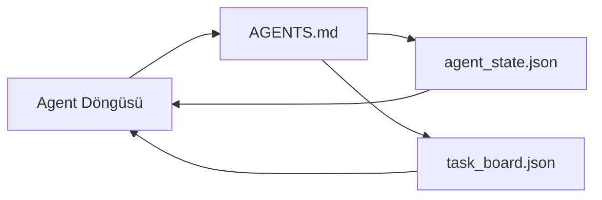

# Minimal Agent Workbench

> Faydalı en küçük workbench üç dosya: bir root talimatlar router'ı, bir state dosyası ve bir task board. Diğer her şey üstüne katmanlanır. Bir repo bu üçünü taşıyamıyorsa, hiçbir model onu kurtarmaz.

**Tür:** Yapım
**Diller:** Python (stdlib)
**Ön koşullar:** Faz 14 · 31 (Yetenekli Modeller Neden Hâlâ Başarısız Olur)
**Süre:** ~45 dakika

## Öğrenme Hedefleri

- Minimum viable workbench'i oluşturan üç dosyayı tanımla.
- Kısa bir root router'ının neden uzun monolitik bir `AGENTS.md`'yi yendiğini açıkla.
- Agent'ın her turda okuyabileceği ve sonunda yazabileceği bir state dosyası kur.
- Chat geçmişi olmadan multi-session işten hayatta kalan bir task board kur.

## Sorun

Çoğu ekip 3000-satırlık bir `AGENTS.md` yazıp bunu bitti diye iddia ederek bir workbench'e uzanır. Model bunu yükler, özetleyemediği kısımları yoksayar ve her zaman başarısız olduğu aynı yüzeylerde hâlâ başarısız olur.

Tam tersine ihtiyacın var. Agent'ı yalnızca alakalı olduğunda daha derin dosyalara yönlendiren minik bir root dosyası. Agent'ın aksiyondan önce okuyup sonra yazdığı dayanıklı state. Uçuşta neyin, neyin bloke olduğunu ve sonraki neyin olduğunu söyleyen bir task board.

Üç dosya. Her birinin bir işi. Her biri sonradan gerçek bir sisteme evrilecek kadar makine-okunabilir.

## Kavram



### AGENTS.md bir router, manual değil

İyi bir `AGENTS.md` kısa. Agent'ı şuna yönlendirir:

- State dosyası (neredesin).
- Task board (ne kaldı).
- Daha derin kurallar (`docs/agent-rules.md` altında).
- Doğrulama komutu (işe yaradığını nasıl bilirsin).

Daha uzun her şey daha derin doc'lara gider, yalnızca gerektiğinde yüklenir. Uzun manual'ler yoksayılır. Kısa router'lar takip edilir.

### agent_state.json system of record

State şunları taşır: aktif task id, dokunulan dosyalar, yapılan varsayımlar, blocker'lar ve sonraki aksiyon. Agent bunu her turda okur. Sonraki oturum chat'i replay etmek yerine bunu okur.

State bir dosyada yaşar çünkü chat geçmişi güvenilmez. Oturumlar ölür. Konuşmalar trim edilir. Dosya öyle değil.

### task_board.json queue

Task board `todo | in_progress | done | blocked` statulu her görevi taşır. State boş olduğunda agent'ın çektiği queue ve agent'ın yolunda olup olmadığını öğrenmek istediğinde okuduğun queue.

Board'daki bir task'ın id'si, hedefi, owner'ı (`builder`, `reviewer` ya da `human`) ve kabul kriterleri var. Board kasten küçük: bir ekranın ötesine büyüdüğünde, board sorunu değil, planlama sorunun var.

### Üç dosya taban, tavan değil

Sonraki dersler scope kontratları, feedback runner'ları, doğrulama kapıları, reviewer checklist'leri ve handoff paketleri ekler. Burada üç dosya hepsinin varsaydığı şey.

## İnşa Et

`code/main.py` boş bir repo'ya minimal workbench'i yazar ve şunu yapan tek bir agent turu gösterir:

1. `agent_state.json`'u okur.
2. State boşsa `task_board.json`'dan sonraki task'ı çeker.
3. Scope içinde tek bir dosyaya dokunur.
4. Güncellenmiş state'i geri yazar.

Çalıştır:

```
python3 code/main.py
```

Script kendi yanına `workdir/` oluşturur, üç dosyayı yerleştirir, bir tur çalıştırır ve diff'i yazdırır. Yeniden çalıştır ve ikinci turun ilkinin kaldığı yerden devam ettiğini gör.

## Kullan

Üretim agent ürünleri içinde, aynı üç dosya farklı adlar altında görünür:

- **Claude Code:** router için `AGENTS.md` ya da `CLAUDE.md`, state için `.claude/state.json`-tarzı store'lar, board için hook'lar.
- **Codex / Cursor:** router için workspace kuralları, state için session memory, board için chat sidebar'ında queued task'lar.
- **Custom Python agent:** az önce yazdığın aynı dosyalar.

Adlar değişir. Şekil değişmez.

## Doğada üretim desenleri

Üç desen üstüne katmanlandığında minimum workbench gerçek monorepo'larla teması atlatır. Bağımsızlar; repo'nun gerçekten ihtiyaç duyduğu olanları seç.

**Nested `AGENTS.md` ile en-yakın-kazanır precedence.** OpenAI ana repo'sunda 88 `AGENTS.md` dosyası yayınlıyor, alt-bileşen başına bir tane. Codex, Cursor, Claude Code ve Copilot hepsi çalışılan dosyadan repo root'una doğru yürüyor ve yolda buldukları her `AGENTS.md`'yi concat ediyor. Alt-dizin dosyaları root dosyayı genişletir. Codex genişletmek yerine değiştirmek için `AGENTS.override.md` ekliyor; override mekanizması Codex'e özgü ve cross-tool iş için ondan kaçın. Augment Code'un ölçümü önemli olan satır: en iyi `AGENTS.md` dosyaları Haiku'dan Opus'a yükseltmeye eşdeğer bir kalite sıçraması veriyor; en kötüsü çıktıyı dosyasız olmaktan daha kötü yapıyor.

**Kapsama gibi görünseler bile reddedilecek anti-pattern'ler.** Çelişen talimatlar agent'ı interactive'den greedy mode'a sessizce düşürür (ICLR 2026 AMBIG-SWE: %48.8 → %28 çözüm oranı); öncelikleri düz stack'lemek yerine numarala. Enforcement komutu olmayan doğrulanamaz stil kuralları ("Google Python Style Guide'ı takip et") agent'ın uyum icat etmesine izin verir; her stil kuralını tam lint komutuyla eşleştir. Komutlar yerine stille başlamak doğrulama yolunu gömer; önce komutlar, sonra stil. Agent'lar için değil insanlar için yazmak context bütçesini ziyan eder; kısalık bir özellik.

**Cross-tool symlink'ler.** Symlink'lerle tek bir root dosya (`ln -s AGENTS.md CLAUDE.md`, `ln -s AGENTS.md .github/copilot-instructions.md`, `ln -s AGENTS.md .cursorrules`) her kodlama agent'ını aynı doğru kaynağına tutar. Nx'in `nx ai-setup`'ı tek bir config'ten Claude Code, Cursor, Copilot, Gemini, Codex ve OpenCode arasında bunu otomatize eder.

## Yayınla

`outputs/skill-minimal-workbench.md` herhangi bir yeni repo için üç-dosyalı workbench'i üretir: projeye ayarlanmış bir `AGENTS.md` router'ı, doğru anahtarlarla bir `agent_state.json` ve mevcut backlog ile seed'lenmiş bir `task_board.json`.

## Alıştırmalar

1. `agent_state.json`'a bir `last_run` timestamp'ı ekle. Bir operatör doğrulamadıkça dosya 24 saatten eskiyse çalışmayı reddet.
2. Task board'a bir `priority` alanı ekle ve puller'ı her zaman en yüksek priority `todo`'yu seçecek şekilde değiştir.
3. `task_board.json`'u JSON Lines'a migrate et, böylece her task bir satır ve diff'ler version control'de temiz.
4. `AGENTS.md` 80 satırın üzerindeyse ya da var olmayan bir dosyaya referans veriyorsa başarısız olan bir `lint_workbench.py` yaz.
5. Üç dosyadan hangisini kaybetmenin en çok acıtacağına karar ver. Savun.

## Anahtar Terimler

| Terim | İnsanlar ne diyor | Gerçekte ne anlama geliyor |
|------|----------------|------------------------|
| Router | `AGENTS.md` | Agent'ı daha derin doc'lara ve dosyalara yönlendiren kısa root dosyası |
| State dosyası | "Notlar" | Agent'ın nerede olduğunun makine-okunabilir kaydı, her turda yazılır |
| Task board | "Backlog" | Status, owner, kabul ile iş JSON queue |
| System of record | "Doğru kaynağı" | Chat gittiğinde workbench'in yetkili olarak ele aldığı dosya |

## İleri Okuma

- [agents.md — açık spec](https://agents.md/) — Cursor, Codex, Claude Code, Copilot, Gemini, OpenCode tarafından benimsenmiş
- [Augment Code, A good AGENTS.md is a model upgrade. A bad one is worse than no docs at all](https://www.augmentcode.com/blog/how-to-write-good-agents-dot-md-files) — ölçülen kalite sıçramaları
- [Blake Crosley, AGENTS.md Patterns: What Actually Changes Agent Behavior](https://blakecrosley.com/blog/agents-md-patterns) — ampirik olarak ne çalışır, ne çalışmaz
- [Datadog Frontend, Steering AI Agents in Monorepos with AGENTS.md](https://dev.to/datadog-frontend-dev/steering-ai-agents-in-monorepos-with-agentsmd-13g0) — pratikte nested precedence
- [Nx Blog, Teach Your AI Agent How to Work in a Monorepo](https://nx.dev/blog/nx-ai-agent-skills) — altı tool arası tek-kaynak generation
- [The Prompt Shelf, AGENTS.md Best Practices: Structure, Scope, and Real Examples](https://thepromptshelf.dev/blog/agents-md-best-practices/) — review'dan hayatta kalan bölüm sıralaması
- [Anthropic, Claude Code subagents and session store](https://docs.anthropic.com/en/docs/agents-and-tools/claude-code/sub-agents)
- Faz 14 · 31 — bu minimumun absorb ettiği başarısızlık modları
- Faz 14 · 34 — bu dersin önizlediği dayanıklı state şeması
