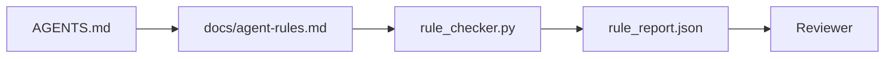

# Yürütülebilir Kısıtlamalar Olarak Agent Talimatları

> Düz yazı yazılmış talimatlar dilekler. Kısıtlama olarak yazılmış talimatlar testler. Workbench her kuralı bir agent'ın runtime'da kontrol edebileceği ve bir reviewer'ın sonradan doğrulayabileceği bir şeye çevirir.

**Tür:** Yapım
**Diller:** Python (stdlib)
**Ön koşullar:** Faz 14 · 32 (Minimal Workbench)
**Süre:** ~50 dakika

## Öğrenme Hedefleri

- Routing düz yazısını operasyonel kurallardan ayır.
- Başlangıç kurallarını, yasak aksiyonları, definition of done'ı, belirsizlik ele almayı ve onay sınırlarını makine-kontrol edilebilir kısıtlamalar olarak ifade et.
- Bir koşuyu kural setine karşı puanlayan bir rule checker uygula.
- Kural setini diff-dostu yap, böylece inceleme neyin değiştiğini görebilsin.

## Sorun

Tipik bir `AGENTS.md` onboarding dokümantasyonu gibi okunur. Agent'a "dikkatli ol" ve "iyice test et" ve "emin değilsen sor" der. Üç gün sonra, agent test'siz bir değişiklik yayınlar, yasak bir dizine yazar ve sınırın nerede olduğunu hiçbir zaman bilmediği için hiçbir zaman sormaz.

Talimatlar operasyonel olduğunda güçlü, aspirational olduğunda zayıf. Düzeltme workbench'in yorumlayabileceği ve reviewer'ın puanlayabileceği kurallar yazmak.

## Kavram

Kurallar `docs/agent-rules.md`'ye aittir, kısa root router'dan uzakta. Her kuralın bir adı, bir kategorisi ve bir kontrolü var.



### Çoğu kuralı kapsayan beş kategori

| Kategori | Kuralın yanıtladığı soru | Örnek |
|----------|---------------------------|---------|
| Başlangıç | İş başlamadan önce ne doğru olmalı? | "state dosyası var ve taze" |
| Yasak | Asla ne olmamalı? | "`scripts/release.sh`'i düzenleme" |
| Definition of done | Görevin tamamlandığını ne kanıtlar? | "pytest 0 ile çıkar ve kabul satırı geçer" |
| Belirsizlik | Agent emin değilken ne yapar? | "tahmin etmek yerine bir soru notu aç" |
| Onay | Ne insan onayı gerektirir? | "herhangi bir yeni dependency, herhangi bir prod yazısı" |

Bu beşine uymayan bir kural genellikle iki kural olmak ister. Ayrımı zorla.

### Kurallar makine-okunabilir

Her kuralın bir slug'ı, bir kategorisi, bir tek-satırlık açıklaması ve `rule_checker.py`'da bir fonksiyon adlandıran bir `check` alanı var. Bir kural eklemek bir check eklemek anlamına gelir; checker workbench ile büyür.

### Kurallar diff-dostu

Kurallar tek bir markdown dosyasında başlık başına bir yaşar. Rename'ler diff'lerde görünür. Yeni kurallar kategorilerinin en üstüne oturur. Bayat kurallar yorum'lanmaz, silinir, çünkü workbench doğru kaynağı, ekibin geçen çeyrek nasıl hissettiğinin chat log'u değil.

### Kurallar vs framework guardrail'leri

Framework guardrail'leri (OpenAI Agents SDK guardrails, LangGraph interrupt'ları) kuralları runtime seviyesinde zorlar. Bu derste kural seti o guardrail'lerin uyguladığı insan-okunabilir, incelenebilir kontrat. İkisine de ihtiyacın var: runtime ihlalleri tur sırasında yakalar, kural seti runtime'ın doğru şeyi yaptığını kanıtlar.

## İnşa Et

`code/main.py` şunları yayınlıyor:

- Kuralları bir dataclass'a yükleyen `agent-rules.md` parser'ı.
- `check` referansı başına bir tane stil-checker fonksiyonlu `rule_checker.py`.
- İki kuralı ihlal eden bir demo agent koşusu ve onları yakalayan bir check geçişi.

Çalıştır:

```
python3 code/main.py
```

Çıktı: parse edilmiş kural seti, koşu trace'i, kural başına pass/fail ve script'in yanına kaydedilmiş bir `rule_report.json`.

## Doğada üretim desenleri

Üç desen bir çeyrek dayanan bir kural setini bir haftada çürüyen birinden ayırır.

**Yazma zamanında severity etiketleme.** Her kural `severity` taşır: `block`, `warn` ya da `info`. Checker üçünü de raporlar; runtime yalnızca `block`'ta reddeder. Çoğu ekip severity'yi erken abartır sonra son tarih baskısı altında sessizce zayıflatır; yazma zamanında etiketleme kalibrasyonu önden zorlar. Doğrulama kapısı (Faz 14 · 38) ile eşleştir; o, bir `block` kuralının herhangi bir override'ını bir `overrides.jsonl` audit log'una imzalar.

**Zorlayıcı fonksiyon olarak rule expiry.** Her kural bir `expires_at` tarihi taşır (yazımdan 90 gün sonra varsayılan). Süresi dolmamış bir kural 60 ardışık gün sıfır ihlale sahip olduğunda checker bir uyarı yayar; sonraki üç aylık inceleme ya tutmayı haklı çıkarır, `info`'ya zayıflatır ya da siler. Cloudflare'in üretim AI Code Review verisi (Nisan 2026, 30 günde 5,169 repo'da 131,246 inceleme koşusu) açık expiry'li kural setlerinin repo başına 30 kuralın altında kaldığını gösterdi; expiry'siz setler 80+'a büyüdü ve çoğu hiç tetiklenmedi.

**Source olarak Markdown, cache olarak JSON.** `agent-rules.md` yazılan dosya; `agent-rules.lock.json` checker'ın sıcak yolda okuduğu bir cache. Lock pre-commit hook tarafından yeniden üretilir. Markdown diff'leri incelenebilir; JSON parsing her turdan dışarıda kalır. `package.json` / `package-lock.json` ve `Cargo.toml` / `Cargo.lock` ile aynı şekil.

## Kullan

Üretimde:

- Claude Code, Codex, Cursor kuralları session başlangıcında okur ve aksiyonları reddederken alıntılar. Checker sessiz drift'i yakalamak için onları CI'da yeniden çalıştırır.
- OpenAI Agents SDK guardrail'leri aynı check'leri input ve output guardrail'leri olarak kayıt eder. Markdown doc yüzeyi; SDK runtime yüzeyi.
- LangGraph interrupt'ları uçuştaki bir node bir kuralı ihlal ettiğinde tetiklenir. Interrupt handler kuralı okur, insana sorar ve devam eder.

Kural seti üçü arasında taşınabilir çünkü yalnızca markdown artı fonksiyon adları.

## Yayınla

`outputs/skill-rule-set-builder.md` bir proje sahibiyle görüşür, mevcut düz yazı talimatlarını beş kategoriye sınıflandırır ve versiyonlu bir `agent-rules.md` artı bir checker stub yayar.

## Alıştırmalar

1. Ürünün gerçekten ihtiyaç duyuyorsa altıncı bir kategori ekle. Beşten birine çökmediğini savun.
2. Checker'ı bir kural bir severity (`block`, `warn`, `info`) taşıyabilecek ve rapor buna göre toplayacak şekilde genişlet.
3. Checker'ı CI'a kablola: block-severity bir kural son agent koşusunda başarısız olursa build'i başarısız et.
4. Kural başına bir "expiry" alanı ekle. Bir check fail'siz 90 gün sonra, kural review'a açılır.
5. Gerçek bir `AGENTS.md` bul ve onu beş-kategorili kural olarak yeniden yaz. Satırlarının kaçı operasyoneldi? Kaçı aspirational'dı?

## Anahtar Terimler

| Terim | İnsanlar ne diyor | Gerçekte ne anlama geliyor |
|------|----------------|------------------------|
| Operasyonel kural | "Gerçek talimat" | Workbench'in runtime'da kontrol edebileceği bir kural |
| Aspirational kural | "Dikkatli ol" | Check'siz bir kural; ya sil ya yükselt |
| Definition of done | "Kabul" | Görevin tamamlandığının objektif, dosya-destekli kanıtı |
| Block severity | "Sert kural" | İhlal koşuyu durdurur; bir operatör olmadan susturulamaz |
| Rule expiry | "Bayat kural taraması" | N günde fail'siz bir kural emekliliğe aday |

## İleri Okuma

- [OpenAI Agents SDK guardrails](https://platform.openai.com/docs/guides/agents-sdk/guardrails)
- [LangGraph interrupts](https://langchain-ai.github.io/langgraph/how-tos/human_in_the_loop/breakpoints/)
- [Anthropic, Building Effective Agents](https://www.anthropic.com/research/building-effective-agents)
- [Rick Hightower, Agent RuleZ: A Deterministic Policy Engine](https://medium.com/@richardhightower/agent-rulez-a-deterministic-policy-engine-for-ai-coding-agents-9489e0561edf) — üretimde block/warn/info severity
- [Cloudflare, Orchestrating AI Code Review at Scale](https://blog.cloudflare.com/ai-code-review/) — 131k inceleme koşusu, kural kompozisyon dersleri
- [microservices.io, GenAI development platform — part 1: guardrails](https://microservices.io/post/architecture/2026/03/09/genai-development-platform-part-1-development-guardrails.html) — kurallar ve CI arası defense in depth
- [Type-Checked Compliance: Deterministic Guardrails (arXiv 2604.01483)](https://arxiv.org/pdf/2604.01483) — rule-as-check üzerinde üst sınır olarak Lean 4
- [logi-cmd/agent-guardrails](https://github.com/logi-cmd/agent-guardrails) — merge-gate uygulaması: scope, mutation testing, ihlal bütçeleri
- Faz 14 · 32 — bu kural setinin düştüğü minimal workbench
- Faz 14 · 38 — kural raporunu tüketen doğrulama kapısı
- Faz 14 · 39 — kural uyumluluğunu puanlayan reviewer agent
