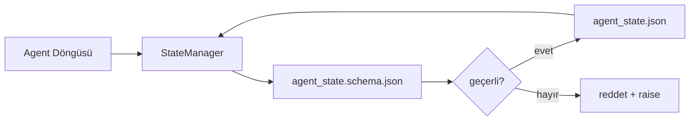

# Repo Belleği ve Dayanıklı State

> Chat geçmişi geçici. Repo dayanıklı. Workbench agent state'ini versiyonlu dosyalarda saklar, böylece sonraki oturum, sonraki agent ve sonraki reviewer hepsi aynı doğru kaynağından okur.

**Tür:** Yapım
**Diller:** Python (stdlib + opsiyonel `jsonschema`)
**Ön koşullar:** Faz 14 · 32 (Minimal Workbench)
**Süre:** ~60 dakika

## Öğrenme Hedefleri

- Repo belleğine neyin ait olduğunu ve chat geçmişine neyin ait olduğunu tanımla.
- `agent_state.json` ve `task_board.json` için JSON Schema'lar yaz.
- State'i atomik olarak yükleyen, doğrulayan, mutate eden ve persist eden bir state manager kur.
- Kötü yazıları workbench'i bozmadan önce reddetmek için şemayı kullan.

## Sorun

Agent bir oturumu bitirir. Chat kapanır. Sonraki oturum açılır ve nereden başlayacağını sorar. Model "dosyaları kontrol edeyim" der, bayat notları okur ve zaten tamamlanmış işi yeniden yapar. Ya da daha kötüsü, dosyanın bitmiş olduğunu kimse söylemediği için bitmiş bir dosyayı yeniden yazar.

Workbench düzeltmesi repo belleği: state repo'daki JSON dosyalarında yaşar, bir şema altında yazılır, atomik olarak persist edilir, kod incelemesinde diff-dostu. Chat geçici bir feed; repo system of record.

## Kavram



### Repo belleğine ne ait

| Ait | Ait değil |
|---------|-----------------|
| Aktif task id | Ham chat transkriptleri |
| Bu oturumda dokunulan dosyalar | Token-seviyesi reasoning trace'leri |
| Agent'ın yaptığı varsayımlar | "Kullanıcı sinirlenmiş görünüyordu" |
| Açık blocker'lar | Sample'lanmış completion'lar |
| Sonraki aksiyon | Vendor-spesifik model id'leri |

Test dayanıklılık: bu üç ay sonra bir CI yeniden koşusunda faydalı olur muydu? Evetse, repo. Hayırsa, telemetri.

### Schema-first state

JSON Schema kontrat. O olmadan, her agent yeni alanlar icat eder, her reviewer yeni bir şekil öğrenir ve her CI script'i geçmiş versiyonları özel-case'lemek zorunda. Onunla, kötü bir yazı reddedilen bir yazı.

Şema şunları kapsar:

- Zorunlu anahtarlar.
- İzinli `status` değerleri.
- Yasak değerler (örn. array'ler için `null`).
- Pattern kısıtlamaları (task id'leri `T-\d{3,}` ile eşleşir).
- Migration'lar için version alanı.

### Atomik yazılar

State yazılarının kısmi başarısızlıklardan hayatta kalması gerekir: bir tempfile'a yaz, fsync, hedefin üzerine rename. State dosyası doğru kaynağı; yarım yazılmış bir tane hiç dosya olmamasından kötüdür.

### Migration'lar

Şema değiştiğinde, şema bump'ının yanında bir migration script'i yayınla. State dosyası bir `schema_version` alanı taşır; manager taşıyamayacağı bir versiyondan bir dosyayı yüklemeyi reddeder.

## İnşa Et

`code/main.py` şunları uyguluyor:

- `agent_state.schema.json` ve `task_board.schema.json`.
- Stdlib-only validator (JSON Schema alt kümesi: required, type, enum, pattern, items).
- Atomik temp-and-rename yazılarıyla `StateManager.load`, `StateManager.update`, `StateManager.commit`.
- State'i mutate eden, persist eden, yeniden yükleyen ve round-trip'i kanıtlayan bir demo.

Çalıştır:

```
python3 code/main.py
```

Script `workdir/agent_state.json` ve `workdir/task_board.json` yazar, iki tur boyunca onları mutate eder ve her adımda doğrulanmış state'i yazdırır.

## Doğada üretim desenleri

Dört desen dersin minimumunu çoklu-agent monorepo'nun hayatta kalabileceği bir şeye dönüştürür.

**Atomik temp-and-rename opsiyonel değil.** Mart 2026 Hive proje bug raporu başarısızlık modunu temiz dokümante ediyor: `state.json` `write_text()` üzerinden yazıldı ve exception'lar yakalandı ve susturuldu. Kısmi yazılar oturumları sinyal olmadan bozuk state'e karşı resume ediyordu. Düzeltme her zaman: hedefle aynı dizinde `tempfile.mkstemp`, yaz, `fsync`, `os.replace` (POSIX ve Windows'ta atomik rename). Bu dersin `atomic_write`'ı tam olarak bunu yapar.

**Her non-idempotent tool çağrısında idempotency anahtarları.** Bir agent bir tool çağırdıktan sonra sonucu checkpoint'lemeden çökerse, recovery tool çağrısını yeniden dener. Okumalar için güvenli; e-postalar, DB insert'leri, dosya upload'ları için tehlikeli. Desen: yürütmeden önce her tool çağrısı ID'sini bir `pending_calls.jsonl`'a logla. Retry'da, ID'yi kontrol et; varsa, çağrıyı atla ve cache'lenmiş sonucu kullan. Anthropic ve LangChain 2026 rehberinde ikisi de bunu vurguluyor; LangGraph'ın checkpointer'ı aynı nedenle pending writes persist eder.

**Büyük artefakt'ları state'ten ayır.** CSV'leri, uzun transkriptleri ya da üretilmiş dosyaları `agent_state.json`'da saklama. Artefakt'ı ayrı bir dosya olarak kaydet (ya da object storage'a yükle) ve state'te yalnızca path'i tut. Checkpoint'ler küçük ve hızlı kalır; artefakt'lar bağımsız büyür.

**Audit için event sourcing, resume için snapshot.** Her mutation'da bir event log'a (`state.events.jsonl`) append et; periyodik olarak `state.json`'a snapshot. Resume snapshot'ı okur, sonra snapshot'ın timestamp'inden sonraki event'leri replay eder. Bu daha fazla disk maliyetlidir ama agent kararlarını kelimesi kelimesine replay etmene izin verir — uzun-ufuk koşuları debug ederken zorunlu. Postgres'in WAL için içeride kullandığı aynı şekil.

**Schema migration'ları ya da yüklemeyi reddet.** `schema_version` integer'ı kontrat. Manager bilinmeyen bir versiyondaki bir dosyayı yüklediğinde, okumayı reddeder. Schema bump'ın yanına bir migration script'i yayınla; `tools/migrate_state.py` her startup'ta idempotent çalışır.

## Kullan

Üretimde:

- **LangGraph checkpointer'lar.** Aynı fikir, farklı storage. Checkpointer graph state'ini SQLite, Postgres ya da custom backend'e persist eder. Bu dersin öğrettiği şema, checkpointer öldüğünde ve state'i elle okumana ihtiyacın olduğunda uzandığın şey.
- **Letta memory block'lar.** Yapılandırılmış şemalı kalıcı block'lar (Faz 14 · 08). Uzun-süren persona'lara scope'lanmış aynı disiplin.
- **OpenAI Agents SDK session store.** Plug'lanabilir backend'ler, schema-aware. Bu dersin state dosyası local-file backend'i.

## Yayınla

`outputs/skill-state-schema.md` proje-spesifik bir JSON Schema çifti (state + board), atomik yazılara kablolanmış bir Python `StateManager` ve sonraki şema bump'ının workbench'i bozmaması için bir migration iskelesi üretir.

## Alıştırmalar

1. Bir `last_human_touch` timestamp'ı ekle. Bir insan düzenlemesinin beş saniyesi içinde herhangi bir agent yazısını reddet.
2. Validator'ı `oneOf` desteklemek için genişlet, böylece bir task ya build task'ı ya farklı zorunlu alanlarla bir review task'ı olabilir.
3. Bir `schema_version` alanı ekle ve v1'den v2'ye migration'ı yaz (`blockers`'ı `risks`'e rename et).
4. Storage backend'i local dosyadan SQLite'a taşı. `StateManager` API'sini tutarlı tut.
5. Aynı state dosyasına karşı 50 ms yazma race ile iki agent çalıştır. Ne ters gider ve atomik rename seni nasıl kurtarır?

## Anahtar Terimler

| Terim | İnsanlar ne diyor | Gerçekte ne anlama geliyor |
|------|----------------|------------------------|
| Repo belleği | "Not dosyası" | Repo'daki track edilen dosyalarda saklanan, şema altında state |
| Schema-first | "Input'ları doğrula" | Yazıcıdan önce kontratı tanımla, drift'i reddet |
| Atomik yazı | "Sadece rename" | Temp'e yaz, fsync, rename, böylece kısmi başarısızlıklar bozulamaz |
| Migration | "Schema bump" | vN state'i v(N+1) state'e çeviren script |
| System of record | "Doğru kaynağı" | Workbench'in yetkili olarak ele aldığı artefakt |

## İleri Okuma

- [JSON Schema specification](https://json-schema.org/specification.html)
- [LangGraph checkpointers](https://langchain-ai.github.io/langgraph/concepts/persistence/)
- [Letta memory blocks](https://docs.letta.com/concepts/memory)
- [Fast.io, AI Agent State Checkpointing: A Practical Guide](https://fast.io/resources/ai-agent-state-checkpointing/) — idempotency ile schema-first checkpointing
- [Fast.io, AI Agent Workflow State Persistence: Best Practices 2026](https://fast.io/resources/ai-agent-workflow-state-persistence/) — concurrency kontrolü, TTL, event sourcing
- [Hive Issue #6263 — non-atomic state.json writes silently ignored](https://github.com/aden-hive/hive/issues/6263) — gerçek bir projede başarısızlık modu
- [eunomia, Checkpoint/Restore Systems: Evolution, Techniques, Applications](https://eunomia.dev/blog/2025/05/11/checkpointrestore-systems-evolution-techniques-and-applications-in-ai-agents/) — OS geçmişinden agent'lara uygulanmış CR primitif'leri
- [Indium, 7 State Persistence Strategies for Long-Running AI Agents in 2026](https://www.indium.tech/blog/7-state-persistence-strategies-ai-agents-2026/)
- [Microsoft Agent Framework, Compaction](https://learn.microsoft.com/en-us/agent-framework/agents/conversations/compaction) — vendor checkpoint manager'ı
- Faz 14 · 08 — memory block'lar ve sleep-time compute
- Faz 14 · 32 — bu dersin şematize ettiği üç-dosyalı minimum
- Faz 14 · 40 — aynı şemadan okunan handoff paketleri
