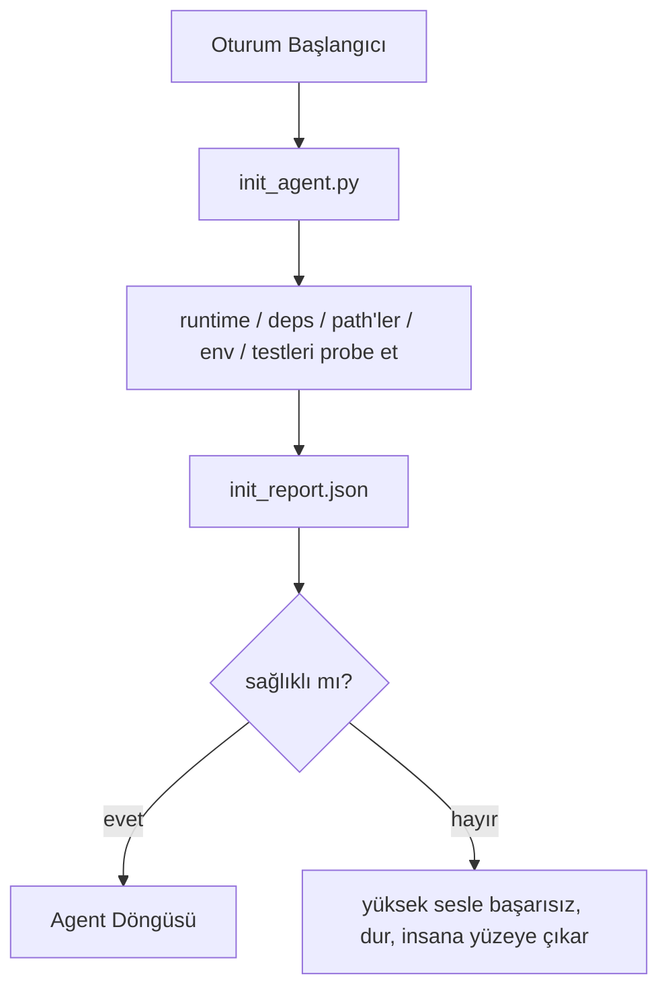

# Agent'lar için Initialization Script'leri

> Soğuk başlayan her oturum bir vergi öder. Agent aynı dosyaları okur, aynı probe'ları tekrar dener ve aynı path'leri yeniden keşfeder. Bir init script vergiyi bir kere öder ve yanıtları state'e yazar.

**Tür:** Yapım
**Diller:** Python (stdlib)
**Ön koşullar:** Faz 14 · 32 (Minimal Workbench), Faz 14 · 34 (Repo Belleği)
**Süre:** ~45 dakika

## Öğrenme Hedefleri

- Agent'ın oturum başına asla yeniden yapması gereken işi tanı.
- Runtime, dependency'ler ve repo sağlığını probe eden deterministik bir init script kur.
- Probe sonucunu persist et, böylece agent check'leri yeniden çalıştırmak yerine onu okur.
- Initialization başarısız olduğunda yüksek sesle, hızlı ve bakılacak tek bir yer ile başarısız ol.

## Sorun

Bir oturum aç. Agent Python versiyonunu tahmin eder. Test komutunu tahmin eder. Entry point'i bulmak için repo root'unu beş kez listeler. Kurulu olmayan bir paketi import etmeye çalışır. Kullanıcıya config dosyasının nerede yaşadığını sorar. Gerçek bir düzenleme yapana kadar, on bin token tek bir script olması gereken kurulum işine gider.

Düzeltme agent başka bir şey yapmadan önce çalışan ve agent'ın startup'ta okuduğu bir `init_report.json` yazan bir initialization script.

## Kavram



### Init script'in probe ettiği şeyler

| Probe | Neden önemli |
|-------|----------------|
| Runtime versiyonları | Yanlış Python ya da Node versiyonu sessiz yanlış-versiyon bug'ları demektir |
| Dependency varlığı | Sonradan eksik paket şimdi yakalamanın maliyetinin on katına mal olur |
| Test komutu | Agent doğrulamayı bilmek zorunda; komut eksikse workbench bozuk |
| Repo path'leri | Hard-coded path'ler drift eder; bir kere çöz ve sabitle |
| Environment variable'ları | Eksik `OPENAI_API_KEY` bir başarısızlık yüzeyi, runtime gizemi değil |
| State + board tazeliği | Çökmüş bir oturumdan bayat state bir footgun |
| Last-known-good commit | Oturumun sonunda handoff diff'i için anchor |

### Yüksek sesle başarısız ol, hızlı başarısız ol, tek yerde başarısız ol

Bir probe başarısızlığı dur ve insana yüzeye çıkar demektir. "Agent çözer" yok. Init'in tüm noktası workbench bozuk olduğunda başlamayı reddetmek.

### Idempotent

Üst üste iki kere çalıştır. İkinci koşu taze bir timestamp dışında no-op olmalı. Idempotency script'i CI'a, hook'lara ya da bir pre-task slash komutuna kablolamana izin veren şey.

### Init vs startup kuralları

Kurallar (Faz 14 · 33) aksiyon almak için ne doğru olması gerektiğini tanımlar. Init bu kuralların kontrol edilebileceğini kuran script. Init'siz kurallar "dikkatli ol" olur. Kuralsız init cilalı bir başarısızlık olur.

## İnşa Et

`code/main.py` `init_agent.py`'ı uyguluyor:

- Beş probe: Python versiyonu, `importlib.util.find_spec` üzerinden listelenmiş dependency'ler, test komutu çözümlenebilirliği, gerekli env var'lar, state dosya tazeliği.
- Her probe `(name, status, detail)` döndürür.
- Script tüm probe seti ile `init_report.json` yazar ve herhangi bir block-severity probe başarısız olursa non-zero çıkar.

Çalıştır:

```
python3 code/main.py
```

Script probe tablosunu yazdırır, `init_report.json` yazar ve mutlu yolda sıfır ya da başarısız probe listesi ile non-zero çıkar.

## Doğada üretim desenleri

Üç desen faydalı bir init script'i bir tören'den ayırır.

**Last-known-good commit anchor'lama.** Son başarılı merge'de yazılan bir `LKG` dosyasına karşı mevcut commit'i probe et. Diff bir bütçeyi aşıyorsa (varsayılan 50 dosya), başlamayı reddet ve yeni baseline'ı ratify etmek için insan gerektir. Cloudflare'in AI Code Review'ı reviewer agent'ları scope'lamak için bunu kullanır: her review oturumu aynı last-known-good'a anchor olur ve drift'i oturumlar arası asla compound etmez.

**TTL ile lock dosyaları.** İlk başarılı probe geçişinden sonra bir `prereqs.lock` yaz. Sonraki koşular lock'a N saat boyunca güvenir (varsayılan 24sa) ve pahalı probe'ları atlar. Init script önce lock'u okur; tazeyse ve dependency manifest hash'i eşleşiyorsa, short-circuit eder. Bu Docker'ın layer cache için kullandığı aynı desen: idempotent probe + content hash = atla.

**Network yok, LLM yok, sıcak yolda sürpriz yok.** Init probe'ları deterministik tesisat. Bir başarısızlığı sınıflandırmak için bir LLM çağıran ya da lisans kontrol etmek için bir dış servise vuran bir probe bir probe değildir; bir workflow'dur. Bir probe bir kuru koşuda üç saniyeden uzun sürerse, onu workbench kokusu olarak ele al ve onu ya init'ten çıkar ya sonucunu cache'le.

## Kullan

Üretimde:

- **Claude Code hook'ları.** `pre-task` hook init script'i çağırır ve başarısız olursa agent'ı başlatmayı reddeder.
- **GitHub Actions.** Bir `setup-agent` job init script'i çalıştırır; agent job ona bağımlı.
- **Docker entrypoint.** Agent container agent runtime'ını exec etmeden önce init script'i çalıştırır; başarısızlıkta log'lar yüzeye çıkar.

Init script taşınabilir çünkü spesifik bir framework'e çağrı yapmaz. Bash, Make ya da bir task dosyası hepsi onu sarabilir.

## Yayınla

`outputs/skill-init-script.md` projeyle görüşür, kurulum işini probe'lara sınıflandırır ve herhangi bir agent adımından önce çalıştıran bir CI workflow artı proje-spesifik bir `init_agent.py` yayar.

## Alıştırmalar

1. Mevcut commit'i last-known-good commit'e karşı diff alan ve 50'den fazla dosya değiştiyse başlamayı reddeden bir probe ekle.
2. Script'i bir `prereqs.lock` dosyası yazacak şekilde kablola ve lock yedi günden eskiyse başlamayı reddet.
3. Eksik dev dependency'leri otomatik yükleyen ama onay olmadan runtime dependency'leri asla değiştirmeyen bir `--fix` flag ekle.
4. Probe'ları hardcoded fonksiyonlardan bir YAML registry'e taşı. Trade-off'u savun.
5. Probe başına bir timing bütçesi ekle. Üç saniyeden uzun süren bir probe bir workbench kokusu.

## Anahtar Terimler

| Terim | İnsanlar ne diyor | Gerçekte ne anlama geliyor |
|------|----------------|------------------------|
| Probe | "Check" | `(name, status, detail)` döndüren deterministik bir fonksiyon |
| Init report | "Kurulum çıktısı" | Probe sonuçlarıyla state'in yanına yazılan JSON |
| Idempotent | "Yeniden çalıştırmak güvenli" | Üst üste iki koşu modulo timestamp özdeş rapor üretir |
| Yüksek sesle başarısız | "Yutma" | Dur ve insana yüzeye çıkar; sessiz fallback yok |
| Setup vergi | "Bootstrap maliyeti" | Agent'ın oturum başına bariz olanı yeniden keşfetmek için harcadığı token'lar |

## İleri Okuma

- [Anthropic, Effective harnesses for long-running agents](https://www.anthropic.com/engineering/effective-harnesses-for-long-running-agents)
- [GitHub Actions, composite actions for setup](https://docs.github.com/en/actions/sharing-automations/creating-actions/creating-a-composite-action)
- [microservices.io, GenAI dev platform: guardrails](https://microservices.io/post/architecture/2026/03/09/genai-development-platform-part-1-development-guardrails.html) — init olarak pre-commit + CI check'leri
- [Augment Code, How to Build Your AGENTS.md (2026)](https://www.augmentcode.com/guides/how-to-build-agents-md) — init beklentileri
- [Codex Blog, Codex CLI Context Compaction](https://codex.danielvaughan.com/2026/03/31/codex-cli-context-compaction-architecture/) — compaction-aware init olarak oturum başlangıcı
- Faz 14 · 33 — bu script'in mümkün kıldığı kural seti
- Faz 14 · 34 — bu script'in seed'lediği state dosyası
- Faz 14 · 38 — init script'in beslediği doğrulama kapısı
- Faz 14 · 40 — init raporunun last-known-good'unu tüketen handoff
