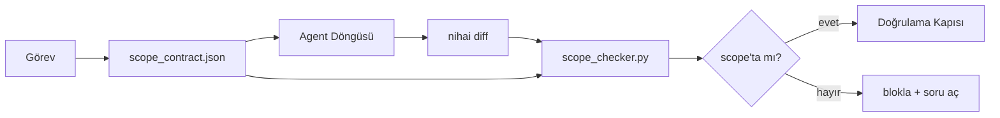

# Scope Kontratları ve Görev Sınırları

> Model işin nerede bittiğini bilmez. Scope kontratı işin nerede başladığını, nerede bittiğini ve sızması durumunda nasıl geri alınacağını söyleyen task başına bir dosya. Kontrat "scope'ta kal"ı bir dilekten bir check'e çevirir.

**Tür:** Yapım
**Diller:** Python (stdlib)
**Ön koşullar:** Faz 14 · 32 (Minimal Workbench), Faz 14 · 33 (Kısıtlama Olarak Kurallar)
**Süre:** ~50 dakika

## Öğrenme Hedefleri

- Agent'ın task başlangıcında okuduğu ve verifier'ın task sonunda okuduğu bir scope kontrat yaz.
- İzinli dosyaları, yasak dosyaları, kabul kriterlerini, rollback planını ve onay sınırlarını belirt.
- Bir diff'i kontrat'a karşı karşılaştıran ve ihlalleri işaretleyen bir scope checker uygula.
- Scope creep'i görünür, otomatik ve incelenebilir yap.

## Sorun

Agent'lar sızar. Görev "login bug'ını düzelt." Diff login route'una, e-posta helper'ına, database driver'a, README'ye ve release script'ine dokunuyor. Her dokunuş anın içinde makul bir nedene sahipti. Birlikte incelenenden farklı bir değişiklikler.

Scope creep agent işindeki en az izlenen başarısızlık modu çünkü agent her adımı iyi niyetle anlatır. Düzeltme daha sıkı bir prompt değil. Düzeltme diskte söz verileni söyleyen bir kontrat ve sonucu söze karşı karşılaştıran bir check.

## Kavram



### Bir scope kontrata ne girer

| Alan | Amaç |
|-------|---------|
| `task_id` | Board'daki task'a bağlar |
| `goal` | Reviewer'ın doğrulayabileceği bir cümle |
| `allowed_files` | Agent'ın yazabileceği glob'lar |
| `forbidden_files` | Agent'ın yanlışlıkla bile dokunmaması gereken glob'lar |
| `acceptance_criteria` | Done kanıtlayan test komutları ya da assertion satırları |
| `rollback_plan` | Halt gerekirse operatörün yürütebileceği bir paragraf |
| `approvals_required` | Açık insan onayı gerektiren scope-dışı aksiyonlar |

`forbidden_files`'sız bir kontrat eksik. Negatif alan kontratın yarısı.

### Ham path'ler değil, glob'lar

Gerçek repo'lar dosyaları taşır. Kontratları glob'lara (`app/**/*.py`, `tests/test_signup*.py`) sabitle, böylece oturumlar arası bir refactor kontratı invalid kılmaz.

### Rollback scope'un parçası

Nasıl geri alınacağını listelemek kontrat yazarını neyin yanlış gidebileceğini düşünmeye zorlar. Geri alamayacağın bir kontrat onaylanmaması gereken bir kontrat.

### Scope check bir diff check'i

Agent bir diff yazar. Checker diff'i, izinli glob'ları, yasak glob'ları ve çalıştırılan herhangi bir kabul komutu listesini okur. Her ihlal doğrulama kapısının reddedebileceği etiketli bir bulgu.

## İnşa Et

`code/main.py` şunları uyguluyor:

- `scope_contract.json` şema (JSON Schema alt kümesi, glob array'ler).
- Dokunulan dosyalar listesi artı çalıştırılan komutlar listesini bir `RunSummary`'e çeviren diff parser.
- Kontrat'a karşı `(violations, in_scope, off_scope)` döndüren bir `scope_check`.
- İki demo koşusu: biri scope'ta kalır, biri sızar. Checker creep'i tam dosya ve neden ile işaretler.

Çalıştır:

```
python3 code/main.py
```

Çıktı: kontrat, iki koşu, koşu başına verdict'ler ve kaydedilmiş bir `scope_report.json`.

## Doğada üretim desenleri

"Specsmaxxing" çalıştıran (agent invoke etmeden önce YAML'da scope kontratları) bir pratisyen ajansı değiştirmeden üç haftada rabbit-hole oranının %52'den %21'e düştüğünü raporluyor. Kontrat işi yaptı, model değil. Üç desen kazancı kalıcı yapar.

**İhlal bütçeleri, ikili başarısızlıklar değil.** `agent-guardrails` (MCP üzerinden Claude Code, Cursor, Windsurf, Codex tarafından kullanılan OSS merge gate) task başına bir `violationBudget` yayar: bütçe içinde minor scope kaymaları uyarı olarak yüzeye çıkar; yalnızca bütçe aşıldığında merge gate reddeder. `violationSeverity: "error" | "warning"` ile eşleştir. Bütçe yayınlayan bir gate ile onu nefret eden ekip tarafından devre dışı bırakılan bir gate arasındaki fark.

**Path ailesine göre severity asimetrisi.** `docs/**`'a scope-dışı yazılar genellikle `warn`; `scripts/**`, `migrations/**`, `config/prod/**`'a scope-dışı yazılar her zaman `block`. Bu asimetri kontrat'ta yaşamak zorunda, runtime'da değil, çünkü proje-spesifik ve task başına değişir.

**Dosya bütçeleri yanında zaman ve network bütçeleri.** Bir `time_budget_minutes` alanı wall clock'u sınırlar; runtime onu aşmadan re-approval olmadan devam etmeyi reddeder. Hostname'lerde bir `network_egress` allowlist'i agent'ın task'ın parçası olmayan bir dış API'ye sessizce vurmasını önler. Bunlar da scope boyutları; dosya glob'ları zorunlu, yeterli değil.

**Multi-contract merge semantiği (least privilege).** İki scope kontratı uygulandığında (örn. proje-genelinde bir kontrat artı bir task-spesifik), merge: `allowed_files`'ı **intersect** et (her iki kontrat path'i izin vermeli), `forbidden_files`'ı **union** et (her ikisi de yasaklayabilir), `time_budget_minutes` en kısıtlayıcı (min), `approvals_required` birikir. `network_egress` enforcement yok için `None`, deny-all için `[]`, allowlist olarak `[...]`; merge altında, `None` diğer tarafa ertelenir, iki liste intersect olur ve deny-all deny-all kalır. Bunu kontrat şemasında belirt, böylece merge mekanik ve incelenebilir olur.

## Kullan

Üretim desenleri:

- **Claude Code slash komutları.** Bir `/scope` komutu kontratı yazar ve onu oturum context'i olarak sabitler. Alt-agent'lar aksiyondan önce kontratı okur.
- **GitHub PR'lar.** Kontratı PR body'sinde bir JSON dosyası olarak ya da check'in artefakt olarak push et. CI merge diff'e karşı scope checker'ı çalıştırır.
- **LangGraph interrupt'ları.** Bir scope ihlali bir interrupt tetikler; handler insana kontratın büyümesi gerekip gerekmediğini ya da agent'ın geri çekilmesi gerekip gerekmediğini sorar.

Kontrat task ile seyahat eder. Task kapandığında, kontrat `outputs/scope/closed/`'da arşivlenir.

## Yayınla

`outputs/skill-scope-contract.md` bir görev açıklaması için bir scope kontrat ve her agent diff'inde CI'da çalışan glob-aware bir checker üretir.

## Alıştırmalar

1. İzinli dış host'ları listeleyen bir `network_egress` alanı ekle. Diğer host'lara dokunan koşuları reddet.
2. Checker'ı `docs/**`'da soft, `scripts/**`'da sert başarısız olacak şekilde genişlet. Asimetriyi gerekçelendir.
3. Kontratı statik bir kural setinden (LLM yok) bir `goal` alanından `allowed_files`'ı türetir hale getir. İlk edge case'de ne ters gider?
4. Bir `time_budget_minutes` ekle ve wall clock'u aşınca devam etmeyi reddet.
5. Aynı diff'e karşı iki kontrat çalıştır. İkisi de uygulandığında doğru merge semantiği nedir?

## Anahtar Terimler

| Terim | İnsanlar ne diyor | Gerçekte ne anlama geliyor |
|------|----------------|------------------------|
| Scope kontrat | "Task brief'i" | İzinli/yasak dosyaları, kabul, rollback listeleyen task başına JSON |
| Scope creep | "Ayrıca dokundu..." | Aynı task'ta kontrat dışındaki dosyalar değişti |
| Rollback planı | "Geri alabiliriz" | Halt için bir-paragraflık operatör runbook'u |
| Approval boundary | "Sign-off gerekir" | Kontrat'ta açık insan onayı gerektirdiği listelenen bir aksiyon |
| Diff check | "Path audit'i" | Dokunulan dosyaları kontrat glob'larına karşı karşılaştırma |

## İleri Okuma

- [LangGraph human-in-the-loop interrupts](https://langchain-ai.github.io/langgraph/concepts/human_in_the_loop/)
- [OpenAI Agents SDK tool approval policies](https://platform.openai.com/docs/guides/agents-sdk)
- [logi-cmd/agent-guardrails — merge gates and scope validation](https://github.com/logi-cmd/agent-guardrails) — ihlal bütçeleri, severity tier'lar
- [Dev|Journal, Preventing AI Agent Configuration Drift with Agent Contract Testing](https://earezki.com/ai-news/2026-05-05-i-built-a-tiny-ci-tool-to-keep-ai-agent-configs-from-drifting-in-my-repo/) — dış dep'siz `--strict` mode
- [Agentic Coding Is Not a Trap (production logs)](https://dev.to/jtorchia/agentic-coding-is-not-a-trap-i-answered-the-viral-hn-post-with-my-own-production-logs-33d9) — specsmaxxing faturalar: %52 → %21
- [OpenCode permission globs](https://opencode.ai/docs/agents/) — fine-grained per-permission scope
- [Knostic, AI Coding Agent Security: Threat Models and Protection Strategies](https://www.knostic.ai/blog/ai-coding-agent-security) — least privilege parçası olarak scope
- [Augment Code, AI Spec Template](https://www.augmentcode.com/guides/ai-spec-template) — üç-tier sınır sistemi (must/ask/never)
- Faz 14 · 27 — scope lock'larıyla eşleşen prompt injection savunmaları
- Faz 14 · 33 — bu kontratın task başına uzmanlaştırdığı kural seti
- Faz 14 · 38 — checker'ın raporladığı doğrulama kapısı
