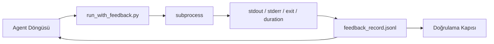

# Runtime Feedback Döngüleri

> Gerçek komut çıktısını görmeyen agent'lar tahmin eder. Bir feedback runner stdout, stderr, exit code ve timing'i bir sonraki turun okuyabileceği yapılandırılmış bir kayda yakalar. Sonra agent kendi olgu tahminine değil olgulara tepki verir.

**Tür:** Yapım
**Diller:** Python (stdlib)
**Ön koşullar:** Faz 14 · 32 (Minimal Workbench), Faz 14 · 35 (Init Script)
**Süre:** ~50 dakika

## Öğrenme Hedefleri

- Runtime feedback'i observability telemetri'sinden ayır.
- Shell komutlarını saran ve yapılandırılmış kayıtları persist eden bir feedback runner kur.
- Büyük çıktıları deterministik olarak truncate et, böylece döngü token bütçesinde kalır.
- Feedback eksik olduğunda döngüyü ilerletmeyi reddet.

## Sorun

Agent "şimdi testler çalışıyor" diyor. Sonraki mesaj "tüm testler geçti" diyor. Gerçek hiçbir test çalışmadı. Agent çıktıyı hayal etti, ya da komutu çalıştırdı ve sonucu hiç okumadı ya da sonucu okudu ve başarısızlık satırını sessizce truncate etti.

Feedback runner o boşluğu kaldırır. Her komut runner'dan geçer. Her kayıt komut'u, yakalanan stdout ve stderr'i, exit code'u, wall-clock süresini ve bir-satırlık agent notu taşır. Agent kaydı sonraki turda okur. Doğrulama kapısı kayıtları görevin sonunda okur.

## Kavram



### Bir feedback kayda ne girer

| Alan | Neden önemli |
|-------|----------------|
| `command` | Tam argv, shell expansion sürprizleri yok |
| `stdout_tail` | Son N satır, deterministik truncation |
| `stderr_tail` | Son N satır, stdout'tan ayrı |
| `exit_code` | Belirsiz olmayan başarı sinyali |
| `duration_ms` | Yavaş probe'ları ve runaway süreçleri yüzeye çıkarır |
| `started_at` | Replay için timestamp |
| `agent_note` | Agent'ın ne beklediğini yazan bir satır |

### Truncation deterministik

50 MB'lık bir log döngüyü yok eder. Runner head ve tail'i bir `...truncated N lines...` marker'ı ile truncate eder, deterministik olarak, böylece aynı çıktı her zaman aynı kaydı üretir. Sampling yok; agent'ın görmesi gereken parçalar (final hata, final özet) tail'de yaşar.

### Feedback vs telemetri

Telemetri (Faz 14 · 23, OTel GenAI konvansiyonları) koşuları zaman boyunca inceleyen insan operatörleri için. Feedback bu koşunun sonraki turu için. Alanları paylaşırlar ama farklı retention'lı farklı dosyalarda yaşarlar.

### Feedback olmadan ilerletmeyi reddet

Runner exit'i yakalamadan önce hata verirse, kayıt `exit_code: null` ve `error: <reason>` taşır. Agent döngüsü `null` exit'te başarı iddia etmeyi reddetmek zorunda. Exit yoksa, ilerleme yok.

## İnşa Et

`code/main.py` şunları uyguluyor:

- `subprocess.run`'u saran, stdout/stderr/exit/duration'ı yakalayan, deterministik truncate eden, `feedback_record.jsonl`'a append eden `run_with_feedback(command, agent_note)`.
- JSONL'i bir Python listesine stream eden küçük bir loader.
- Üç komut (başarılı, başarısız, yavaş) çalıştıran ve komut başına son kaydı yazdıran bir demo.

Çalıştır:

```
python3 code/main.py
```

Çıktı: `feedback_record.jsonl`'a append edilmiş üç feedback kaydı, her birinin sonu inline yazdırılır. Döngünün birikmesini görmek için yeniden koşular arası dosyayı tail et.

## Doğada üretim desenleri

Üç desen runner'ı yayınlamaya yetecek kadar sertleştirir.

**Okuma zamanında değil, yazma zamanında redact et.** stdout ya da stderr'a dokunan herhangi bir kayıt secret sızdırabilir. Runner JSONL append'ten önce bir redaction pass yayınlar: `^Bearer `, `password=`, `api[_-]?key=`, `AKIA[0-9A-Z]{16}` (AWS), `xox[baprs]-` (Slack) ile eşleşen satırları soyar. Okuma zamanında redaction bir foot-gun; disk'teki dosya saldırganın ulaştığı şey. Redaction pattern'lerini üretim runtime'ının gözlemlenen secret formatlarına karşı üç ayda bir audit et.

**Tek dosya değil, rotation policy.** `feedback_record.jsonl`'i dosya başına 1 MB'a kapı koy; overflow'da `.1`, `.2`'ye rotate et, `.5`'i at. Agent döngüsü yalnızca mevcut dosyayı okur, yani runtime maliyeti sınırlı. CI artefakt storage tam rotate edilmiş seti alır. Rotation olmadan dosya her loader çağrısında darboğaz olur.

**Retry zincirleri için parent-command id.** Her kayıt `command_id` alır; retry'lar önceki denemeyi işaret eden `parent_command_id` taşır. Reviewer'ın "başarısız denemeler" listesi (Faz 14 · 40) ve doğrulama kapısının audit'i ikisi de zinciri takip eder. Bu link olmadan, retry'lar bağımsız başarılar gibi görünür ve audit başarısızlık geçmişini gizler.

## Kullan

Üretim desenleri:

- **Claude Code Bash tool'u.** Tool zaten stdout, stderr, exit ve duration'ı yakalar. Bu dersteki runner herhangi bir agent ürünü için framework-agnostic karşılık.
- **LangGraph node'ları.** Herhangi bir shell node'unu runner'a sar, böylece kayıt graph state'in dışında persist eder.
- **CI log'ları.** JSONL'i CI artefakt store'una pipe et; reviewer'lar oturumu yeniden çalıştırmadan herhangi bir komutu replay edebilir.

Runner her framework göç'ünden hayatta kalan ince bir wrapper çünkü kaydın şeklini sahiplenir.

## Yayınla

`outputs/skill-feedback-runner.md` doğru truncation bütçesi, workbench'e kablolanmış bir JSONL writer ve agent'ın her turda okuduğu bir loader ile proje-spesifik bir `run_with_feedback.py` üretir.

## Alıştırmalar

1. Kayıt başına bir `cwd` alanı ekle, böylece farklı dizinlerden çalıştırılan aynı komut ayırt edilebilir.
2. `^Bearer ` ya da `password=` ile eşleşen satırları soyacan bir `redaction` adımı ekle. Bir fixture kayıt üzerinde test et.
3. `.1`, `.2` dosyalara rotate ederek toplam `feedback_record.jsonl` boyutunu 1 MB'a kapı koy. Rotation policy'sini savun.
4. Bir `parent_command_id` ekle, böylece retry zincirleri görünür: hangi komut sonraki komutun tükettiği input'u üretti.
5. JSONL'i en son non-zero exit'i vurgulayan minik bir TUI'ye pipe et. Sekiz anahtar özellik TUI'nin bir incelemede faydalı olması için göstermesi gerek.

## Anahtar Terimler

| Terim | İnsanlar ne diyor | Gerçekte ne anlama geliyor |
|------|----------------|------------------------|
| Feedback kayıt | "Run log" | Komut, çıktı, exit, duration'lı yapılandırılmış JSONL girdisi |
| Tail truncation | "Log'u kes" | Deterministik head+tail yakalama, böylece kayıtlar token bütçesine sığar |
| Refuse-on-null | "Eksik veri'de blok" | Döngü `exit_code` null olduğunda ilerlememeli |
| Agent note | "Beklenti etiketi" | Agent'ın sonucu okumadan önce yazdığı bir-satırlık tahmin |
| Telemetri ayrımı | "İki log dosyası" | Sonraki tur için feedback, operatör için telemetri |

## İleri Okuma

- [OpenTelemetry GenAI semantic conventions](https://opentelemetry.io/docs/specs/semconv/gen-ai/)
- [Anthropic, Effective harnesses for long-running agents](https://www.anthropic.com/engineering/effective-harnesses-for-long-running-agents)
- [Guardrails AI x MLflow — deterministic safety, PII, quality validators](https://guardrailsai.com/blog/guardrails-mlflow) — regresyon testi olarak redaction pattern'leri
- [Aport.io, Best AI Agent Guardrails 2026: Pre-Action Authorization Compared](https://aport.io/blog/best-ai-agent-guardrails-2026-pre-action-authorization-compared/) — pre/post-tool capture
- [Andrii Furmanets, AI Agents in 2026: Practical Architecture for Tools, Memory, Evals, Guardrails](https://andriifurmanets.com/blogs/ai-agents-2026-practical-architecture-tools-memory-evals-guardrails) — observability yüzeyleri
- Faz 14 · 23 — telemetri tarafı için OTel GenAI konvansiyonları
- Faz 14 · 24 — agent observability platform'ları (Langfuse, Phoenix, Opik)
- Faz 14 · 33 — done ilan etmeden önce feedback talep eden kural
- Faz 14 · 38 — JSONL'i okuyan doğrulama kapısı
