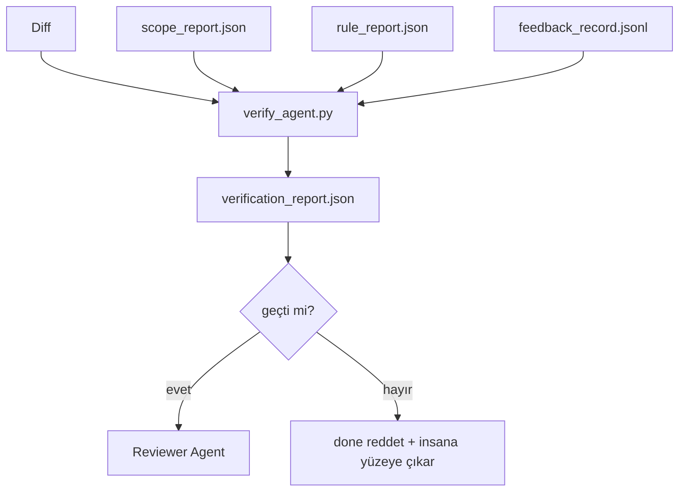

# Doğrulama Kapıları

> Agent kendi işini done olarak işaretleme yetkisi yok. Bir doğrulama kapısı scope kontratını, feedback log'unu, kural raporunu ve diff'i okur ve tek bir soruya yanıt verir: bu görev gerçekten tamamlandı mı? Kapı hayır derse, chat ne derse desin görev done değil.

**Tür:** Yapım
**Diller:** Python (stdlib)
**Ön koşullar:** Faz 14 · 33 (Kurallar), Faz 14 · 36 (Scope), Faz 14 · 37 (Feedback)
**Süre:** ~55 dakika

## Öğrenme Hedefleri

- Workbench artefakt'ları üzerinde deterministik bir fonksiyon olarak doğrulama kapısını tanımla.
- Kural raporu, scope raporu, feedback kayıtları ve diff'i tek bir verdict'te birleştir.
- Reviewer agent ve CI'ın okuyabileceği bir `verification_report.json` yayar.
- Herhangi bir block-severity başarısızlığında istisnasız görevi ilerletmeyi reddet.

## Sorun

Agent'lar başarıyı çok kolay ilan eder. Üç başarısızlık şekli baskın:

- "İyi görünüyor." Model kendi diff'ini okudu ve doğru olduğuna karar verdi.
- "Testler geçti." Güvenle söyleniyor. Test'in aslında çalıştığına dair kayıt yok.
- "Kabul karşılandı." Kabul kriterleri "done'a benzeyen herhangi bir şey" anlamına gelecek kadar gevşek yorumlandı.

Workbench düzeltmesi agent'ın zaten ürettiği artefakt'ları okuyan ve kararı veren tek bir doğrulama kapısı. Kapı deterministik. Kapı version control'de. Kapı CI'a kablolanmış. Agent ona rüşvet veremez.

## Kavram



### Kapının kontrol ettiği şeyler

| Kontrol | Kaynak artefakt | Severity |
|-------|-----------------|----------|
| Tüm kabul komutları çalıştı | `feedback_record.jsonl` | block |
| Tüm kabul komutları sıfır çıktı | `feedback_record.jsonl` | block |
| Scope check'in yasak yazısı yok | `scope_report.json` | block |
| Scope check'in scope-dışı yazısı yok | `scope_report.json` | block ya da warn |
| Tüm block-severity kurallar geçer | `rule_report.json` | block |
| Feedback'te `null` exit code yok | `feedback_record.jsonl` | block |
| Dokunulan dosyalar `scope.allowed_files` ile eşleşir | her ikisi | warn |

Bir `warn` bulgu verdict'i annotate eder; bir `block` bulgu `passed: true`'yu önler.

### Deterministik, olasılıksal değil

Kapı aynı artefakt seti için her zaman aynı verdict'i üretmeli. LLM judge'ları yok. LLM judge'ları reviewer tarafına (Faz 14 · 39) aittir, hedef status değil, qualitative değerlendirme olduğunda.

### Bir rapor, bir path

Kapı task close-out başına bir `verification_report.json` yayar, `outputs/verification/<task_id>.json` altına yazılır. CI aynı path'i tüketir. Farklı path'li birden çok kapı doğru kaynağını forklar.

### İstisnasız reddet

Block-severity bulgular agent tarafından override edilemez. Yalnızca bir insan tarafından, kayıtlı bir `override_reason` ve `overridden_by` user id ile override edilebilir. Override imzalı bir değişiklik, agent kararı değil.

## İnşa Et

`code/main.py` şunları uyguluyor:

- Her input artefakt için bir loader, hepsi yerel olarak stub'lanmış, böylece ders kendi içinde tam.
- `verify(task_id, artifacts) -> VerdictReport` saf fonksiyonu.
- Check-başına sonuçları ve final pass/fail'i gösteren bir printer.
- Üç task senaryosuyla bir demo: temiz geçiş, scope creep, eksik kabul.

Çalıştır:

```
python3 code/main.py
```

Çıktı: her biri script'in yanına kaydedilmiş üç verdict raporu.

## Doğada üretim desenleri

Dört desen kapıyı "başka bir lint job"tan "karar veren kenar"a yükseltir.

**Defense-in-depth, tek kapı değil.** Pre-commit hook → CI status check → pre-tool authz hook → pre-merge gate. Her katman deterministik, böylece bir katmandaki başarısızlık sonraki tarafından yakalanır. microservices.io'nun Mart 2026 playbook'u açık: pre-commit hook bypass edilemez çünkü, bir model-side skill'in aksine, agent'ın talimatları takip etmesine bağlı değil. Doğrulama kapısı CI / pre-merge katmanında oturur.

**Deterministik check ile savunma, nüans için yalnızca model-judge.** Anthropic'in 2026 Hybrid Norm eşleşmesi: doğrulanabilir ödüller (unit testler, schema check'leri, exit code'ları) "kod problemi çözdü mü?" yanıtlar — LLM rubric'leri "kod okunabilir, güvenli, stilde mi?" yanıtlar. Kapı ilk sınıfı çalıştırır; reviewer (Faz 14 · 39) ikincisini çalıştırır. Onları karıştırmak sinyali çökertir.

**İmzalı override log, Slack thread'leri değil.** Her override `outputs/verification/overrides.jsonl`'da: timestamp, finding code, reason, signing user, current HEAD commit ile bir satır yayar. Runtime imzasız herhangi bir override'ı reddeder; audit trail git-tracked. Bu bir override policy'si ile bir override tiyatrosu arasındaki çizgi.

**Birinci-sınıf check olarak coverage floor.** Bir `coverage_report.json` bir `coverage_floor` (varsayılan %80) check'ini besler. Ölçülen coverage floor'un altına düşerse ya da önceki merge'in floor'unun %1 puandan fazla altına düşerse kapı başarısız olur. Bu check olmadan, agent'lar başarısız olan testleri sessizce siler ve doğrulama raporları yeşil kalır.

**`--strict` mode warn'ları block'a yükseltir.** Release branch'ler, ship-blocking PR'lar ya da post-incident triage için, `--strict` her uyarıyı sert bir başarısızlık yapar. Flag branch ile opt-in; global default değil çünkü her şeyde strict günden güne akışı bozar.

## Kullan

Üretim desenleri:

- **CI adımı.** Bir `verify_agent` job agent'ın final artefakt'larına karşı kapıyı çalıştırır. Merge protection `passed: true` olmadan reddeder.
- **Pre-handoff hook.** Agent runtime handoff doc üretmeden önce kapıyı çağırır. Yeşil verdict yoksa, handoff yok.
- **Manual triage.** Bir agent başarı iddia ettiğinde ve bir insan şüphelendiğinde operatörler raporu okur.

Kapı workbench akışındaki karar veren kenar. Diğer her yüzey ondan upstream.

## Yayınla

`outputs/skill-verification-gate.md` kapıyı spesifik bir projeye kablolar: hangi kabul komutları onu besler, hangi kurallar block-severity, hangi scope-dışı yazılar tolere edilir, override audit log'u nasıl saklanır.

## Alıştırmalar

1. Bir `coverage_floor` check'i ekle: test komutu en az %80 ile bir coverage raporu üretmeli. Floor'u hangi artefakt taşır karar ver.
2. Her `warn`'ı `block`'a yükselten bir `--strict` mode destekle. Strict mode'un doğru default olduğu durumları dokümante et.
3. Kapıyı JSON'a ek olarak bir Markdown özet üretmesini sağla. Hangi alanların özette yer aldığını savun.
4. Bir `time_since_last_human_touch` check'i ekle: bir insan keystroke'unun 60 saniyesi içinde düzenlenmiş herhangi bir dosya scope-dışı flag'lerden muaf.
5. Kapıyı ürününden gerçek bir agent diff'i üzerinde çalıştır. Bulguların kaçı gerçek, kaçı gürültü? Kapı nerede büyümeli?

## Anahtar Terimler

| Terim | İnsanlar ne diyor | Gerçekte ne anlama geliyor |
|------|----------------|------------------------|
| Doğrulama kapısı | "İşleri durduran check" | Pass/fail verdict üreten workbench artefakt'ları üzerinde deterministik fonksiyon |
| Block severity | "Sert fail" | `passed: true`'yu önleyen ve imzalı override gerektiren bulgu |
| Override log | "Neden geçirdik" | İncelemeyle audit edilen reason ve user id'li imzalı girdiler |
| Kabul komutu | "Kanıt" | Sıfır çıkışı `done`'ın anlamı olan shell komutu |
| Bir rapor path | "Doğru kaynağı" | `outputs/verification/<task_id>.json`, CI ve insanlar tarafından eşit tüketilir |

## İleri Okuma

- [Anthropic, Harness design for long-running application development](https://www.anthropic.com/engineering/harness-design-long-running-apps)
- [OpenAI Agents SDK guardrails](https://platform.openai.com/docs/guides/agents-sdk/guardrails)
- [microservices.io, GenAI dev platform: guardrails](https://microservices.io/post/architecture/2026/03/09/genai-development-platform-part-1-development-guardrails.html) — pre-commit ve CI arası defense in depth
- [ICMD, The 2026 Playbook for Agentic AI Ops](https://icmd.app/article/the-2026-playbook-for-agentic-ai-ops-guardrails-costs-and-reliability-at-scale-1776661990431) — onay-kapısı merdiveni (draft → onay → eşiklerin altında auto)
- [Type-Checked Compliance: Deterministic Guardrails (arXiv 2604.01483)](https://arxiv.org/pdf/2604.01483) — deterministik gating'in üst sınırı olarak Lean 4
- [logi-cmd/agent-guardrails — merge gate spec](https://github.com/logi-cmd/agent-guardrails) — scope + mutation-testing kapıları
- [Guardrails AI x MLflow](https://guardrailsai.com/blog/guardrails-mlflow) — CI scorer olarak deterministik validator'lar
- [Akira, Real-Time Guardrails for Agentic Systems](https://www.akira.ai/blog/real-time-guardrails-agentic-systems) — pre/post-tool kapıları
- Faz 14 · 27 — prompt injection savunmaları (kapının adversarial eşi)
- Faz 14 · 36 — bu kapının zorladığı scope kontrat
- Faz 14 · 37 — bu kapının puanladığı feedback log
- Faz 14 · 39 — kapının handoff yaptığı reviewer agent
