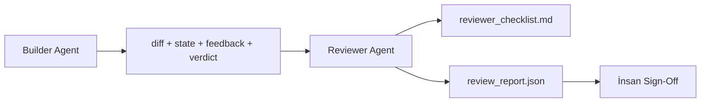

# Reviewer Agent: Kuran'ı Notlandırandan Ayır

> Kodu yazan agent ona not veremez. Reviewer farklı bir system prompt, farklı bir hedef ve builder'ın ürettiği her şeye read-only erişimle ikinci bir döngü. Builder ile reviewer arasındaki boşluk çoğu güvenilirliğin yaşadığı yer.

**Tür:** Yapım
**Diller:** Python (stdlib)
**Ön koşullar:** Faz 14 · 38 (Doğrulama Kapısı)
**Süre:** ~55 dakika

## Öğrenme Hedefleri

- Aynı agent'ın kendi işini neden güvenilir şekilde inceleyemediğini belirt.
- Builder artefakt'larını tüketen ve yapılandırılmış bir review raporu yayan bir reviewer agent döngüsü kur.
- Vibe'lar değil, spesifik boyutları puanlayan bir reviewer rubric'i yaz.
- Reviewer'ı workbench'e kabloala, böylece insan inceleme adımı gerçek bir artefakt'tan başlar.

## Sorun

Agent'tan bir bug düzeltmesini istiyorsun. Dört dosyayı düzenliyor, testleri çalıştırıyor ve done raporluyor. Doğrulama kapısı (Faz 14 · 38) kabulün çalıştığını ve scope'un tutulduğunu onaylıyor. Kapı `passed: true` diyor. Merge ediyorsun. İki gün sonra fix'in bug'ın yanlış yarısını çözdüğünü buluyorsun.

Kabul gerekli, yeterli değil. Reviewer kabulün soramayacağı soruları sorar: bu doğru problemi çözdü mü? Onu işaretlemeden scope'u genişletti mi? Sorgulanması gereken varsayımları dokümante etti mi? Workbench'i sonraki oturumun devralabileceği bir state'te bıraktı mı?

## Kavram



### Reviewer rubric'i

Beş boyut, her biri 0'dan 2'ye puanlanır.

| Boyut | Soru |
|-----------|----------|
| Problem fit | Değişiklik belirtilen task'ı çözdü mü, yakındaki bir task'ı değil mi? |
| Scope disiplini | Düzenlemeler kontrat'a sıkılaştırıldı mı yoksa kontrat kasten genişletildi mi? |
| Varsayımlar | Tüm gizli varsayımlar incelenebilir bir yerde yazıldı mı? |
| Doğrulama kalitesi | Kabul komutu hedefi gerçekten kanıtlıyor mu yoksa daha zayıf bir versiyonu mu kanıtladı? |
| Handoff hazırlığı | Sonraki oturum mevcut state'ten temiz devralabilir mi? |

10 üzerinden toplam. 7'nin altı bir soft fail; 5'in altı sert bir fail.

### Reviewer ayrı bir rol, ayrı bir model değil

Reviewer'ı builder ile aynı modelle çalıştırabilirsin. Disiplin rol ayrımı: farklı system prompt, farklı input'lar, diff'e yazma erişimi yok. Pozisyondaki değişiklik sinyaldeki değişiklik.

### Reviewer diff'i düzenleyemez

Reviewer diff'i, state'i, feedback'i, verdict'i okur. Bir rapor yazar. Diff'i patch'lemez. Rapor "bunu düzelt" derse, sonraki builder turu düzeltmeyi yapar; reviewer incelemeye geri döner. Rolleri karıştırmak boşluğu yener.

### Reviewer rubric vs doğrulama kapısı

Kapı (Faz 14 · 38) deterministik olguları kontrol eder: kabul çalıştı mı, kurallar geçti mi, scope tuttu mu. Reviewer qualitative kararlar verir: bu doğru iş miydi, dokümante edildi mi, handoff kullanılabilir mi. Her ikisi de gerekli.

## İnşa Et

`code/main.py` şunları uyguluyor:

- Reviewer'ın okuduğu artefakt'ları paketleyen bir `ReviewerInputs` dataclass.
- Boyut başına bir fonksiyonlu rubric scorer. Her fonksiyon deterministik ve ders için stub-derece; gerçek uygulamalar bir LLM çağırır.
- Beş skor, toplam ve verdict (`pass`, `soft_fail`, `hard_fail`) ile `review_report.json` writer.
- İki demo case: temiz bir değişiklik ve "doğru testler, yanlış problem" değişikliği.

Çalıştır:

```
python3 code/main.py
```

Çıktı: diske yazılan iki review raporu ve boyutsal skorların console tablosu.

## Doğada üretim desenleri

Faturalar: Cloudflare'in Nisan 2026 AI Code Review sistemi 30 günde 5,169 repo'da 48,095 merge request boyunca 131,246 review koşusu çalıştırdı. Medyan review 3 dakika 39 saniyede tamamlandı. Yedi uzman reviewer'a kadar (security, performance, code quality, docs, release management, compliance, Engineering Codex) bulguları deduplicate eden ve severity'yi yargılayan bir Review Coordinator altında paralel çalıştı. Top-tier model yalnızca coordinator için ayrıldı; uzmanlar daha ucuz tier'larda çalıştı.

Dört desen bunu ölçekte çalıştırır.

**Tek büyük reviewer değil, uzman havuzu.** 5-boyutlu rubric'li bir reviewer solo repo'lar için çalışır. Codebase'in security-critical, performance-critical ve docs yüzeyleri olunca, daha küçük prompt'lı uzmanlara ayır. Coordinator deduplication yapar; uzmanlar tam rubric'i asla çalıştırmaz. Model-tier ayrımı düşer: ucuz uzmanlar, pahalı coordinator.

**Optimizasyon değil, tasarım gereksinimi olarak bias mitigation.** LLM judge'ları dört güvenilir bias gösteriyor (Adnan Masood, Nisan 2026): position bias (GPT-4 ~%40 (A,B) vs (B,A) sıralamasında tutarsız), verbosity bias (~%15 skor enflasyonu daha uzun çıktılara), self-preference (judge'lar aynı model ailesinden çıktıları tercih eder), authority (judge'lar bilinen yazarlara referansları aşırı puanlar). Hafifletmeler: her iki sıralamayı değerlendir ve yalnızca tutarlı kazançları say; conciseness'ı açıkça ödüllendiren 1-4 ölçek kullan; judge'ları model aileleri arasında rotate et; puanlamadan önce yazar adlarını soy.

**Vibe'lar değil, kalibrasyon seti.** Bilinen doğru verdict'li 10-20 task'lık tarihsel set. Her prompt değişikliğinde reviewer'ı onun üzerinde çalıştır. Tarihsel kayda anlaşma %80'in altına düşerse, reviewer yayınlamadan önce rubric'in revize edilmesi gerek. Her ekibin er ya da geç yeniden keşfettiği şey bu; baştan ona başlamak daha iyi.

**Kapı ile hybrid norm.** Doğrulama kapısı (Faz 14 · 38) deterministik check'leri (kabul çalıştı mı, testler geçti mi, scope tuttu mu) halleder. Reviewer semantik check'leri (bu doğru iş miydi, varsayımlar dokümante edildi mi, handoff kullanılabilir mi) halleder. Anthropic'in 2026 rehberi bu ayrım hakkında açık: reviewer'a kapının zaten kanıtladığı şeyi yeniden yapmasını isteme.

## Kullan

Üretim desenleri:

- **Claude Code alt-agent'ları.** Builder bir task'ı kapadıktan sonra bir reviewer alt-agent çalışır. PR'a rubric skorlarıyla bir yorum gönderir.
- **OpenAI Agents SDK handoff'ları.** Builder task tamamlandığında Reviewer'a handoff yapar. Reviewer bulgular listesiyle ya da bir insana geri devredebilir.
- **İki-model eşleştirmesi.** Builder daha hızlı ucuz bir modelde çalışır. Reviewer judgment'a odaklanmış daha küçük context'li daha güçlü bir modelde çalışır.

Reviewer insanlar her incelemeyi kendileri yapamadığında workbench'in büyüttüğü ikinci göz çifti.

## Yayınla

`outputs/skill-reviewer-agent.md` proje-spesifik bir reviewer rubric, builder'ın artefakt'larına kablolanmış bir reviewer agent stub ve human review'un boş bir sayfa yerine yazılı bir rapordan başlaması için doğrulama kapısıyla bir entegrasyon üretir.

## Alıştırmalar

1. Ürün domain'ine spesifik altıncı bir boyut ekle. Mevcut beş tarafından absorbe edilmediğini savun.
2. Reviewer'ı iki farklı system prompt (terse, verbose) ile çalıştır. Hangisi bir insanın okuma olasılığı daha yüksek bir rapor üretir?
3. Boyut başına bir `confidence` alanı ekle. En düşük boyutta confidence 0.6'nın altındaysa raporu yayınlamayı reddet.
4. Bir kalibrasyon seti kur: bilinen doğru verdict'li 10 tarihsel task close-out. Reviewer'ı onların üzerinde çalıştır. Tarihsel kayıttan nerede uyuşmuyor?
5. Bir "daha fazla evidence iste" affordance ekle: reviewer puanlamadan önce builder'dan spesifik bir test koşusu isteyebilir. Bunun loop yapmaması için doğru geri-çekilme nedir?

## Anahtar Terimler

| Terim | İnsanlar ne diyor | Gerçekte ne anlama geliyor |
|------|----------------|------------------------|
| Reviewer rubric | "Checklist" | Boyut başına yazılı bir soru ile beş-boyutlu 0-2 puanlama |
| Soft fail | "Revizyon gerekir" | Toplam 7'nin altı; builder ele alacak bulgular alır |
| Hard fail | "Reddet" | Toplam 5'in altı ya da herhangi bir boyut 0'da; dur ve insana yüzeye çıkar |
| Rol ayrımı | "Farklı prompt" | Aynı model her iki rolde olabilir; disiplin input'lar ve pozisyon |
| Confidence floor | "Düşük sinyal raporları yayınlama" | Rubric belirsiz olduğunda bir verdict yayınlamayı reddet |

## İleri Okuma

- [OpenAI Agents SDK handoffs](https://platform.openai.com/docs/guides/agents-sdk/handoffs)
- [Anthropic Claude Code subagents](https://docs.anthropic.com/en/docs/agents-and-tools/claude-code/sub-agents)
- [Cloudflare, Orchestrating AI Code Review at Scale](https://blog.cloudflare.com/ai-code-review/) — 7-uzman + coordinator mimari, 30 günde 131k koşu
- [Agent-as-a-Judge: Evaluating Agents with Agents (OpenReview / ICLR)](https://openreview.net/forum?id=DeVm3YUnpj) — DevAI benchmark'ı, 366 hiyerarşik çözüm gereksinimi
- [Adnan Masood, Rubric-Based Evaluations and LLM-as-a-Judge: Methodologies, Biases, Empirical Validation](https://medium.com/@adnanmasood/rubric-based-evals-llm-as-a-judge-methodologies-and-empirical-validation-in-domain-context-71936b989e80) — 4 bias ve hafifletmeleri
- [MLflow, LLM-as-a-Judge Evaluation](https://mlflow.org/llm-as-a-judge) — ayrılmış builder/evaluator için üretim tooling
- [LangChain, How to Calibrate LLM-as-a-Judge with Human Corrections](https://www.langchain.com/articles/llm-as-a-judge) — kalibrasyon-seti workflow'u
- [Evidently AI, LLM-as-a-judge: a complete guide](https://www.evidentlyai.com/llm-guide/llm-as-a-judge)
- [Arize, LLM as a Judge — Primer and Pre-Built Evaluators](https://arize.com/llm-as-a-judge/)
- Faz 14 · 05 — Self-Refine ve CRITIC (tek-agent self-review baseline)
- Faz 14 · 30 — Eval-driven agent geliştirme (kalibrasyon seti üreticisi)
- Faz 14 · 38 — reviewer'ın okuduğu doğrulama kapısı
- Faz 14 · 40 — reviewer raporunun beslediği handoff paketi
