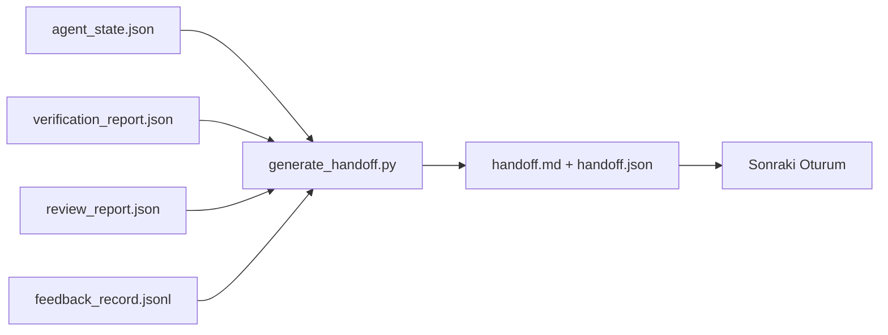

# Multi-Session Handoff

> Oturum bitecek. İş bitmeyecek. Handoff paketi "agent bir saat çalıştı"yı "sonraki oturum ilk dakikada üretken" yapan artefakt. Onu sonradan akla gelen değil, kasten kur.

**Tür:** Yapım
**Diller:** Python (stdlib)
**Ön koşullar:** Faz 14 · 34 (Repo Belleği), Faz 14 · 38 (Doğrulama), Faz 14 · 39 (Reviewer)
**Süre:** ~50 dakika

## Öğrenme Hedefleri

- Her handoff paketinin ihtiyaç duyduğu yedi alanı tanı.
- Workbench artefakt'larından bir handoff'u düz yazı yazmadan üret.
- Büyük feedback log'larını handoff-boyutunda bir özete trim et.
- Sonraki oturumun ilk aksiyonunu deterministik yap.

## Sorun

Oturum biter. Agent "harika, ilerleme kaydettik" der. Sonraki oturum açılır. Sonraki agent "nerede kaldık?" diye sorar. İlk agent'ın yanıtı gitmiş. Sonraki agent yeniden keşfeder, aynı komutları yeniden çalıştırır, aynı soruları insana yeniden sorar ve önceki oturumun son otuz saniyesini kurtarmak için otuz dakika yakar.

Kötü bir handoff'un maliyeti task'ın yaşamı boyunca her oturumda ödenir. Düzeltme oturum sonunda otomatik üretilen bir paket: ne değişti, neden, ne denendi, ne başarısız oldu, ne kaldı, bir dahaki sefere ilk ne yapılacak.

## Kavram



### Her handoff'un taşıdığı yedi alan

| Alan | Yanıtladığı soru |
|-------|---------------------|
| `summary` | Yapılanın bir paragrafı |
| `changed_files` | Bir bakışta diff |
| `commands_run` | Aslında yürütülen şey |
| `failed_attempts` | Ne denendi ve neden işe yaramadı |
| `open_risks` | Sonraki oturumu ne ısırabilir, severity ile |
| `next_action` | Sonraki oturumun atacağı ilk somut adım |
| `verdict_pointer` | Doğrulama + review raporlarına path |

`next_action` alanı taşıyıcı. `next_action` dışında her şeyi olan bir handoff bir status raporu, bir handoff değil.

### Handoff'lar üretilir, yazılmaz

Elle yazılmış bir handoff zor bir günde atlanan bir handoff'tur. Generator workbench artefakt'larını okur ve paketi yayar. Agent'ın işi özeti yazmak değil, workbench'i generator'ın özetleyebileceği bir state'te bırakmak.

### İki form: insan-okunabilir ve makine-okunabilir

`handoff.md` insanın okuduğu. `handoff.json` sonraki agent'ın yüklediği. Her ikisi de aynı kaynak artefakt'lardan geliyor. Ayrışırlarsa, JSON kazanır.

### Feedback log trimming

Tam `feedback_record.jsonl` yüzlerce girdi olabilir. Handoff yalnızca son K artı non-zero exit ile her girdiyi taşır. Sonraki oturum ihtiyaç duyarsa tam log'u yükler ama paket küçük kalır.

## İnşa Et

`code/main.py` şunları uyguluyor:

- State, verdict, review ve feedback'i tek bir `WorkbenchSnapshot`'a toplayan bir loader.
- Bir `generate_handoff(snapshot) -> (markdown, payload)` fonksiyonu.
- Son K feedback girdisini artı tüm non-zero exit'leri seçen bir filter.
- `handoff.md` ve `handoff.json`'ı script'in yanına yazan bir demo koşusu.

Çalıştır:

```
python3 code/main.py
```

Çıktı: yazdırılmış bir handoff body, artı diskte her iki dosya.

## Doğada üretim desenleri

Codex CLI, Claude Code ve OpenCode hepsi farklı bir compaction hikayesi yayınlıyor; yapılandırılmış handoff paketi üçünün de üstünde oturuyor.

**Compaction stratejileri değişir; paket şeması değişmez.** Codex CLI'nin POST /v1/responses/compact'ı server-side opak bir AES blob (OpenAI modelleri için fast path); fallback bir `_summary` user-role mesajı olarak append edilen local "handoff summary." Claude Code context'in %95'inde beş-aşamalı progressive compaction çalıştırır. OpenCode timestamp-tabanlı mesaj gizleme artı 5-başlıklı LLM özetini yapar. Üç farklı mekanizma, aynı ihtiyaç: sıkıştırmadan hayatta kalanı taşınabilir bir artefakt'a serialize et. Paket o artefakt.

**Fresh-session handoff compaction değil.** Compaction bir oturumu uzatır; handoff birini temiz kapatır ve sonrakini başlatır. Hermes Issue #20372 çerçevelemesi (Nisan 2026) doğru: in-place sıkıştırma degrade etmeye başladığında, agent kompakt bir handoff yazmalı, oturumu sonlandırmalı ve taze context'te devam etmeli. Paket o geçişi ucuz yapan şey. Hata kalite çökene kadar sıkıştırmaya devam etmek; düzeltme erken, temiz bir handoff için bütçelemek.

**Branch ve topic başına bir aktif handoff.** Multi-agent koordinasyonu kötü model çıktısından çok bayat handoff'larda bozulur. Her zaman `branch`, `last_known_good_commit` ve `active | superseded | archived` bir `status` dahil et. Bayat handoff'lar arşivlenir; yalnızca aktif olan sonraki oturumu sürer. Bu handoff-as-notes ile handoff-as-state arasındaki fark.

**%50-75 context'ten önce wrap up, duvarda değil.** Hand-written-pattern playbook (CLAUDE.md + HANDOVER.md) oturum %95 yerine %50-75 context bütçesinde bittiğinde en iyi sonuçları rapor ediyor. Paket generator'ı sıkıştırma artefakt'ları kaynak state'i kirletmeden temiz çalışır. Context bütünken yazması ucuz; model zaten yerini kaybetmişken pahalı.

## Kullan

Üretim desenleri:

- **Session-end hook.** Runtime kullanıcı chat'i kapattığında generator'ı tetikler. Paket `outputs/handoff/<session_id>/`'ye gider.
- **PR template'i.** Generator'ın markdown'ı bir PR body de. Reviewer'lar beş başka dosya açmadan onu okur.
- **Cross-agent handoff.** Bir ürünle (Claude Code) kur, başka bir ürünle (Codex) devam et. Paket lingua franca.

Paket küçük, düzenli ve üretmesi ucuz. Maliyet tasarrufu her oturumla compound olur.

## Yayınla

`outputs/skill-handoff-generator.md` bir projenin artefakt path'lerine ayarlanmış bir generator, onu çalıştıran bir end-of-session hook ve sonraki agent'ın startup'ta okuduğu bir `handoff.json` şeması üretir.

## Alıştırmalar

1. Builder'ın logladığı ama reviewer'ın 1'in üzerinde puanlamadığı her varsayımı yüzeye çıkaran bir `assumptions_to_validate` alanı ekle.
2. Feedback özetini başarısız koşular için geçen olanlardan farklı trim et. Asimetriyi savun.
3. Bir "insan için sorular" listesi dahil et. Bir sorunun paket yerine bir chat mesajına girmesi için eşik nedir?
4. Generator'ı idempotent yap: iki kere çalıştırmak aynı paketi üretir. Bunun tutması için neyin stable olması gerek?
5. Sonraki oturumun aksiyondan önce yüklemesi gereken tam artefakt'ları listeleyen bir "next session prereqs" bölümü ekle.

## Anahtar Terimler

| Terim | İnsanlar ne diyor | Gerçekte ne anlama geliyor |
|------|----------------|------------------------|
| Handoff paketi | "Session özeti" | Yedi alanı taşıyan üretilmiş artefakt, hem markdown hem JSON |
| Sonraki aksiyon | "Önce ne yapılacak" | Sonraki oturumu başlatan bir somut adım |
| Feedback trim | "Log özeti" | Son K kayıt artı her non-zero exit |
| Status raporu | "Ne yaptık" | `next_action` eksik bir dokuman; faydalı ama handoff değil |
| Verdict pointer | "Receipt" | İzlenebilirlik için doğrulama + review raporlarına path |

## İleri Okuma

- [Anthropic, Effective harnesses for long-running agents](https://www.anthropic.com/engineering/effective-harnesses-for-long-running-agents)
- [OpenAI Agents SDK handoffs](https://platform.openai.com/docs/guides/agents-sdk/handoffs)
- [Codex Blog, Codex CLI Context Compaction: Architecture, Configuration, Managing Long Sessions](https://codex.danielvaughan.com/2026/03/31/codex-cli-context-compaction-architecture/) — POST /v1/responses/compact ve local fallback
- [Justin3go, Shedding Heavy Memories: Context Compaction in Codex, Claude Code, OpenCode](https://justin3go.com/en/posts/2026/04/09-context-compaction-in-codex-claude-code-and-opencode) — üç-vendor compaction karşılaştırması
- [JD Hodges, Claude Handoff Prompt: How to Keep Context Across Sessions (2026)](https://www.jdhodges.com/blog/ai-session-handoffs-keep-context-across-conversations/) — CLAUDE.md + HANDOVER.md, %50-75 context bütçesi
- [Mervin Praison, Managing Handoffs in Multi-Agent Coding Sessions: Fresh Context Without Losing Continuity](https://mer.vin/2026/04/managing-handoffs-in-multi-agent-coding-sessions-fresh-context-without-losing-continuity/) — distributed-systems çerçeveleme
- [Hermes Issue #20372 — automatic fresh-session handoff when compression becomes risky](https://github.com/NousResearch/hermes-agent/issues/20372)
- [Hermes Issue #499 — Context Compaction Quality Overhaul](https://github.com/NousResearch/hermes-agent/issues/499) — Codex CLI'da handoff-odaklı prompt'lar
- [Microsoft Agent Framework, Compaction](https://learn.microsoft.com/en-us/agent-framework/agents/conversations/compaction)
- [OpenCode, Context Management and Compaction](https://deepwiki.com/sst/opencode/2.4-context-management-and-compaction)
- [LangChain, Context Engineering for Agents](https://www.langchain.com/blog/context-engineering-for-agents)
- Faz 14 · 34 — generator'ın okuduğu state dosyası
- Faz 14 · 38 — paketin işaret ettiği doğrulama verdict'i
- Faz 14 · 39 — pakete dahil edilen reviewer raporu
