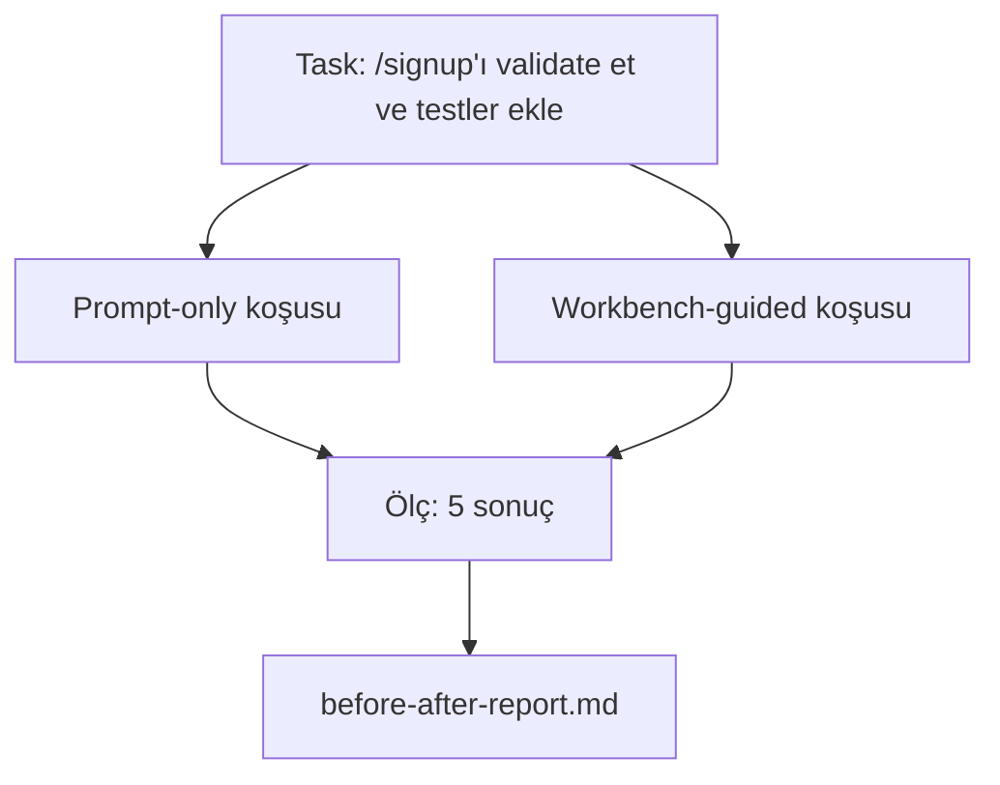

# Gerçek Bir Repo'da Workbench

> Yüzeyler üzerine on bir ders, gerçek bir codebase'le temas atlamazsa hiçbir değer taşımaz. Bu ders aynı task'ı küçük bir sample app üzerinde iki kere çalıştırıyor: prompt-only vs workbench-guided. Sayılar argümanı yapıyor.

**Tür:** Yapım
**Diller:** Python (stdlib)
**Ön koşullar:** Faz'lar 14 · 32 - 14 · 40
**Süre:** ~60 dakika

## Öğrenme Hedefleri

- Yedi workbench yüzeyini küçük bir uygulamada bir araya getir.
- Aynı task'ı iki kere çalıştır (prompt-only ve workbench-guided) ve beş sonucu ölç.
- Önce/sonra raporunu oku ve hangi yüzeylerin en çok kaldıracı verdiğine karar ver.
- Workbench'i "ama modelim yeterince iyi" itirazına karşı savun.

## Sorun

Oyuncak bir task'ta bir demo kimseyi ikna etmez. Workbench için durum gerçek-hisseden bir task gerçek-hisseden bir repo'da daha az başarısızlık, daha az revert ve sonraki oturumun kullanabileceği bir paketle üretime düştüğünde yapılır.

Bu ders o gerçek-hisseden repo'yu yayınlıyor ve aynı task'ı her iki pipeline'da çalıştırıyor. Sonuç şüpheciye verebileceğin bir önce/sonra raporu.

## Kavram



### Sample app

`sample_app/` içinde minimal FastAPI-tarzı bir handler:

- `/signup` ile `app.py` (henüz validation yok).
- Bir happy-path testli `test_app.py`.
- Forbidden-zone yemi olarak `README.md` ve `scripts/release.sh`.

### Task

> `/signup`'a input validation ekle: 8 karakterden kısa şifreleri reddet, tipli bir hata zarfı ile 422 döndür. Yeni davranışı kanıtlayan bir test ekle.

### İki pipeline

Prompt-only:

1. README'yi oku.
2. `app.py`'ı oku.
3. Dosyaları düzenle.
4. Done iddia et.

Workbench-guided:

1. Init script'i çalıştır (Ders 35).
2. Scope kontrat'ı oku (Ders 36).
3. State'i oku (Ders 34).
4. Yalnızca izinli dosyaları düzenle.
5. Kabul komutunu feedback runner üzerinden çalıştır (Ders 37).
6. Doğrulama kapısını çalıştır (Ders 38).
7. Reviewer'ı çalıştır (Ders 39).
8. Handoff üret (Ders 40).

### Ölçülen beş sonuç

| Sonuç | Neden önemli |
|---------|----------------|
| `tests_actually_run` | Çoğu "testler geçti" iddiası doğrulanamaz |
| `acceptance_met` | Hedefi kanıtlayan test çalıştırılan test olmalı |
| `files_outside_scope` | Scope creep baskın sessiz başarısızlık |
| `handoff_quality` | Sonraki oturum bunu öder ya da yararlanır |
| `reviewer_total` | Kapının üstünde qualitative judgment |

## İnşa Et

`code/main.py` aynı sample app fixture'a karşı iki pipeline'ı orkestre eder. Her iki pipeline scripted (döngüde LLM yok), böylece ölçüm yeniden üretilebilir. Script karşılaştırmayı `before-after-report.md` ve `comparison.json`'a yazar.

Çalıştır:

```
python3 code/main.py
```

Çıktı: pipeline başına sonuçların console tablosu, script'in yanına kaydedilen markdown raporu ve onu grafik etmek isteyen için JSON.

## Doğada üretim desenleri

Şüphecinin sorusu "workbench gerçekte ne kadar yardım ediyor?" 2026 sayıları açıklamadan çok daha fazla söylüyor.

**Aynı model'de Terminal Bench Top-30'dan Top-5'e.** LangChain'in *Anatomy of an Agent Harness* (Nisan 2026): bir kodlama agent'ı yalnızca harness'ı değiştirerek Terminal Bench 2.0'da top 30'un dışından beşinci sıraya zıpladı. Aynı model. Farklı yüzeyler. Yirmi-beş-sıra delta.

**Tool silerek Vercel %80'den %100'e.** Vercel agent'ının tool'larının %80'ini silmenin başarı oranını %80'den %100'e taşıdığını rapor etti. Daha küçük tool yüzeyi, daha keskin scope, başarısız olmanın daha az yolu. Negatif alan kazanır.

**Yalnızca harness ile Harvey 2x doğruluk.** Legal agent'lar yalnızca harness optimizasyonu ile doğruluklarını iki katından fazlasına çıkardı, model değişikliği yok.

**Enterprise AI agent projelerinin %88'i üretime ulaşamıyor.** preprints.org *Harness Engineering for Language Agents* makalesi (Mart 2026) başarısızlıkları reasoning'e değil runtime'a izliyor: bayat state, kırılgan retry'lar, aşırı büyümüş context, ara hatalardan kötü kurtarma.

**Long-context çöküşü.** WebAgent baseline %40-50 başarı uzun-context koşullarında %10'un altına düşer, çoğunlukla infinite loop ve goal loss'tan. Ralph Loop ve handoff paketi onu absorbe etmek için var.

**False negative'ler hâlâ var.** Tek-adım factual task'lar, bir-satırlık lint'ler, formatter koşuları, modelin kelimesi kelimesine ezberlediği herhangi bir şey — bunlar prompt-only daha hızlı koşar. Benchmark workbench overkill olarak çerçevelenmemesi için bunları dürüstçe sıralamalı.

Çıkarım "harness sonsuza dek kazanır" değil. Modeller harness hilelerini zaman içinde absorbe eder. Çıkarım bugün mühendislik yükünün yedi yüzeyde oturduğu ve sayıların bunu kanıtladığı.

## Kullan

Bu ders şunu cite ettiğin case file:

- Birisi her PR'ın neden bir `agent-rules.md` ve bir scope kontratı taşıdığını sorduğunda.
- Bir ekip "sadece bu sprint için" doğrulama kapısını düşürmek istediğinde.
- Yeni bir agent ürünü yayınlandığında ve gerçekten zaman kazandırıp kazandırmadığı için taşınabilir bir benchmark gerektiğinde.

Sayılar açıklamadan daha uzağa gider.

## Yayınla

`outputs/skill-workbench-benchmark.md` herhangi bir agent ürününü bir projenin kendi sample app'ine karşı her iki pipeline boyunca çalıştıran ve beş sonucu raporlayan taşınabilir bir evaluation harness'ı.

## Alıştırmalar

1. Altıncı bir sonuç ekle: time-to-first-meaningful-edit. Onu temiz nasıl ölçersin?
2. Karşılaştırmayı codebase'inde gerçek bir ikinci-gün task'ı üzerinde çalıştır. Workbench sayıları nerede kayıyor?
3. Bir "false negative" geçişi ekle: prompt-only'nin daha hızlı olacağı ve workbench overhead'inin gerçek maliyet olduğu task'lar. Yine de workbench'i tutmayı savun.
4. Scripted "agent"ı gerçek bir LLM çağrısıyla değiştir. Hangi sonuçlar daha gürültülü olur?
5. Mühendis olmayan birine yönelik tek-sayfalık bir özet yaz. Kesimden ne hayatta kalır?

## Anahtar Terimler

| Terim | İnsanlar ne diyor | Gerçekte ne anlama geliyor |
|------|----------------|------------------------|
| Sample app | "Toy repo" | Küçük ama yedi yüzeyi de exercise edecek kadar gerçekçi |
| Pipeline | "Workflow" | Agent'ın takip ettiği sıralı yüzey okuma/yazma dizisi |
| Önce/sonra raporu | "Faturalar" | Şüpheciye verdiğin artefakt |
| False negative | "Workbench overkill" | Prompt-only daha hızlı olan task'lar; dürüstçe sıralamak faydalı |
| Workbench benchmark | "Güvenilirlik skoru" | Codebase'inde karşılaştırmayı çalıştıran taşınabilir harness |

## İleri Okuma

- [LangChain, The Anatomy of an Agent Harness](https://blog.langchain.com/the-anatomy-of-an-agent-harness/) — Terminal Bench Top-30'dan Top-5'e fatura
- [MongoDB, The Agent Harness: Why the LLM Is the Smallest Part of Your Agent System](https://www.mongodb.com/company/blog/technical/agent-harness-why-llm-is-smallest-part-of-your-agent-system) — Vercel + Harvey sayıları
- [preprints.org, Harness Engineering for Language Agents](https://www.preprints.org/manuscript/202603.1756) — %88 enterprise başarısızlık oranı, runtime kök nedenleri
- [HN: Improving 15 LLMs at Coding in One Afternoon. Only the Harness Changed](https://news.ycombinator.com/item?id=46988596) — 15 model boyunca replikalı
- [Cloudflare, Orchestrating AI Code Review at Scale](https://blog.cloudflare.com/ai-code-review/) — üretimde 30 günde 131k review koşusu
- [Anthropic, Building Effective Agents](https://www.anthropic.com/research/building-effective-agents)
- Faz'lar 14 · 32 - 14 · 40 — bu dersin uçtan-uca exercise ettiği yüzeyler
- Faz 14 · 19 — bu dersin tamamladığı makro benchmark'lar olarak SWE-bench, GAIA, AgentBench
- Faz 14 · 30 — aynı harness'in plug'landığı eval-driven agent geliştirme
