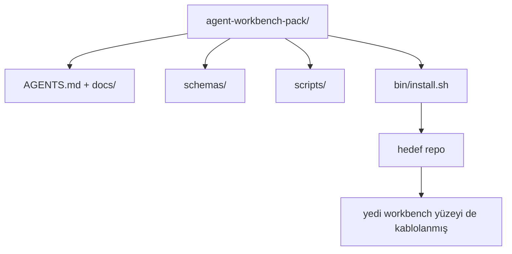

# Bitirme: Yeniden Kullanılabilir Agent Workbench Pack Yayınla

> Mini-track herhangi bir repo'ya bırakacağın bir pack ile bitiyor. On bir ders yüzey `cp -r` yapabileceğin ve agent'ın ertesi sabah güvenilir şekilde çalıştığı bir dizine sıkıştırılmış. Bitirme bu müfredatın trade ettiği artefakt.

**Tür:** Yapım
**Diller:** Python (stdlib)
**Ön koşullar:** Faz'lar 14 · 31 - 14 · 41
**Süre:** ~75 dakika

## Öğrenme Hedefleri

- Yedi workbench yüzeyini tek bir drop-in dizine paketle.
- Şemaları, script'leri ve şablonları sabitle, böylece yeni bir repo bilinen-iyi bir baseline alır.
- Pack'i idempotent yatıran tek bir installer script ekle.
- Pack'te neyin kaldığına ve neyin kalmadığına karar ver, her biri için kesimi savun.

## Sorun

Bir Google Doc'ta, bir chat geçmişinde ve üç yarı-hatırlanan script'te yaşayan bir workbench her çeyrekte yeniden inşa edilen bir workbench. Tedavi versiyonlu bir pack: yüzeyler, şemalar, script'ler ve tek-komutluk bir installer'lı bir repo ya da dizin.

Bu dersi diskte yayınlanmış bir `outputs/agent-workbench-pack/` ve onu herhangi bir hedef repo'ya bırakan bir `bin/install.sh` ile bitireceksin.

## Kavram



### Pack düzeni

```
outputs/agent-workbench-pack/
├── AGENTS.md
├── docs/
│   ├── agent-rules.md
│   ├── reliability-policy.md
│   ├── handoff-protocol.md
│   └── reviewer-rubric.md
├── schemas/
│   ├── agent_state.schema.json
│   ├── task_board.schema.json
│   └── scope_contract.schema.json
├── scripts/
│   ├── init_agent.py
│   ├── run_with_feedback.py
│   ├── verify_agent.py
│   └── generate_handoff.py
├── bin/
│   └── install.sh
└── README.md
```

### Ne içeride kalır, ne dışarıda kalır

İçeride:

- Yüzey şemaları. Onlar kontrat.
- Yukarıdaki dört script. Onlar runtime.
- Dört doc. Onlar kurallar ve rubric.

Dışarıda:

- Proje-spesifik task'lar. Task'lar pack'te değil, hedef repo'nun board'una aittir.
- Vendor SDK çağrıları. Pack framework-agnostic.
- Onboarding düz yazısı. Pack ekibin mevcut onboarding'inin yanında yaşar, içinde değil.

### Installer

Kısa bir `bin/install.sh` (ya da `bin/install.py`):

1. `--force` olmadan mevcut bir pack üzerine kurmayı reddeder.
2. Pack'i hedef repo'ya kopyalar.
3. `.github/workflows/` varsa CI'ı kablolar.
4. Sonraki adımları yazdırır: board'u doldur, kabul komutlarını ayarla, init script'i çalıştır.

### Versiyonlama

Pack bir `VERSION` dosyası taşır. Migration gerektiren şema bump'ları ve script değişiklikleri major'u bump'lar. Yalnızca-doc değişiklikleri patch'i bump'lar. Hedef repo'nun `agent_state.json`'u hangi pack versiyonuna karşı initialize edildiğini kaydeder.

## İnşa Et

`code/main.py` pack'i dersin yanındaki `outputs/agent-workbench-pack/`'e monte eder, bu mini-track'teki önceki derslerin şemaları ve script'leri ile zaten yazdığın doc'larla seed'lenmiş.

Çalıştır:

```
python3 code/main.py
```

Script yüzeyleri kopyalar ve sabitler, README yazar, pack ağacını yazdırır ve sıfır çıkar. Yeniden çalıştırmak idempotent.

## Doğada üretim desenleri

Bir pack yalnızca fork'lardan, güncellemelerden ve dostane olmayan bir upstream'den hayatta kalırsa değerlidir. Dört desen bunu çalıştırır.

**`VERSION` kontrat, pazarlama değil.** Major bump'lar bir state migration'ı gerektirir. Minor bump'lar bir checker yeniden çalıştırması gerektirir. Patch bump'lar yalnızca-doc. Installer her install'da hedef repo'ya `.workbench-version` yazar; `lint_pack.py` hedefin kilidi pack'in `VERSION`'ı ile anlaşmıyorsa yayınlamayı reddeder. `npm`, `Cargo` ve `pyproject.toml`'ın 10 yıllık churn'den hayatta kalma yolu bu; agent'lar hakkında hiçbir şey kuralları değiştirmiyor.

**Cross-tool dağıtım için tek kaynak.** Nx tek bir `nx ai-setup` yayınlıyor, tek bir config'ten `AGENTS.md`, `CLAUDE.md`, `.cursor/rules/`, `.github/copilot-instructions.md` ve bir MCP server yatırıyor. Pack de aynısını yapmalı; installer symlink'leri (`ln -s AGENTS.md CLAUDE.md`) yayar, böylece tek doğru kaynağı her kodlama agent'ına fan eder. Bir tool'u diğerine destek için pack'i fork etmek bir başarısızlık modu.

**Önemsiz olmayan state'te reddeden `uninstall.sh`.** Pack'i uninstall etmek kullanıcının `agent_state.json`, `task_board.json` ya da `outputs/`'unu silmemeli. Uninstaller şemaları, script'leri, doc'ları ve `AGENTS.md`'yi (`--keep-agents-md` opt-out ile) kaldırır ve state dosyalarının herhangi bir uncommitted değişikliği varsa devam etmeyi reddeder. State kullanıcıya ait; pack onu sahiplenmez.

**Skill-as-publishable. SkillKit-tarzı dağıtım.** Pack bir SkillKit skill olarak yayınlanır: `skillkit install agent-workbench-pack` onu tek bir kaynaktan 32 AI agent'ında yatırır. Pack repo doğru kaynağı; SkillKit dağıtım kanalı. Vendor lock-in çöker; yedi yüzey aynı kalır.

## Kullan

Pack'in yayınlandığı üç yer:

- **Repo'ya bıraktığın bir dizin olarak.** `cp -r outputs/agent-workbench-pack /path/to/repo`.
- **Public bir template repo olarak.** `VERSION` drift'i kontrol ederek fork-and-customize.
- **SkillKit skill olarak.** Agent ürününe kablolanır, böylece tek bir komut onu yatırır.

Pack tarif. Her install bir porsiyon.

## Yayınla

`outputs/skill-workbench-pack.md` proje-ayarlı bir pack üretir: ekip geçmişine keskinleştirilmiş kurallar, repo'ya eşleştirilmiş scope glob'ları, bir domain-spesifik girdi ile genişletilmiş rubric boyutları.

## Alıştırmalar

1. Kanonik pack'e promosyonu hak eden opsiyonel beşinci doc'a karar ver. Kesimi savun.
2. Installer'ı `--dry-run` flag'i ile Python olarak yeniden yaz. Bash'e karşı ergonomiyi karşılaştır.
3. Pack'i güvenli şekilde kaldıran ve state dosyaları önemsiz olmayan geçmişe sahipse reddeden bir `bin/uninstall.sh` ekle. Önemsiz olmayan ne olarak sayılır?
4. Pack `VERSION`'dan drift ettiğinde başarısız olan bir `lint_pack.py` ekle. Pack'in kendi repo'sunun CI'ına kablola.
5. El-yapımı bir workbench'ten bu pack'e migration runbook'unu yaz. Downtime'ı minimize eden işlem sırası ne?

## Anahtar Terimler

| Terim | İnsanlar ne diyor | Gerçekte ne anlama geliyor |
|------|----------------|------------------------|
| Workbench pack | "Starter kit" | Yedi yüzeyi de taşıyan versiyonlu dizin |
| Installer | "Kurulum script'i" | Pack'i idempotent yatıran `bin/install.sh` |
| Pack version | "VERSION" | Şema/script değişiklikleri için major bump, yalnızca-doc için patch |
| Drop-in pack | "cp -r ve git" | Pack ilk günde repo-başına özelleştirme olmadan çalışır |
| Forkable template | "GitHub template" | GitHub'ın "Use this template"'ın clone'layabileceği public repo |

## İleri Okuma

- Faz'lar 14 · 31 - 14 · 41 — bu pack'in bundle ettiği her yüzey
- [SkillKit](https://github.com/rohitg00/skillkit) — bu skill'i 32 AI agent'ında yatır
- [Nx Blog, Teach Your AI Agent How to Work in a Monorepo](https://nx.dev/blog/nx-ai-agent-skills) — altı tool arası tek-kaynak generator
- [agents.md — açık spec](https://agents.md/) — pack'inin router'ının uygulaması gereken
- [HKUDS/OpenHarness](https://github.com/HKUDS/OpenHarness) — pack-eşdeğeri bir referans uygulama
- [andrewgarst/agentic_harness](https://github.com/andrewgarst/agentic_harness) — eval suite'lı Redis-destekli referans
- [Augment Code, A good AGENTS.md is a model upgrade](https://www.augmentcode.com/blog/how-to-write-good-agents-dot-md-files) — pack docs kalite çıtası
- [Anthropic, Effective harnesses for long-running agents](https://www.anthropic.com/engineering/effective-harnesses-for-long-running-agents)
- [Anthropic, Harness design for long-running application development](https://www.anthropic.com/engineering/harness-design-long-running-apps)
- Faz 14 · 30 — pack'in doğrulama kapısını tüketen eval-driven agent geliştirme
- Faz 14 · 41 — bu pack'in iyileştirdiği önce/sonra benchmark'ı
