# İletişim Protokolleri

> Aynı dili konuşamayan agent'lar bir takım değildir. Boşluğa bağıran yabancılardır.

**Tür:** Yapım
**Diller:** TypeScript
**Ön koşullar:** Faz 14 (Agent Engineering), Ders 16.01 (Neden Çoklu-Agent)
**Süre:** ~120 dakika

## Öğrenme Hedefleri

- Agent'ların dış sunucular tarafından sunulan tool'ları kullanabilmesi için MCP tool keşfi ve çağırımı uygula
- Bir agent'ın HTTP üzerinden başka bir agent'a iş delege etmesini sağlayan A2A agent card ve task endpoint inşa et
- MCP (tool erişimi), A2A (agent-to-agent), ACP (kurumsal denetim) ve ANP (merkeziyetsiz güven)'i karşılaştır ve hangi protokolün hangi sorunu çözdüğünü açıkla
- Agent'ların MCP üzerinden tool keşfettiği ve A2A üzerinden görev delege ettiği tek bir sistemde birden çok protokolü birbirine bağla

## Sorun

Sistemini birden çok agent'a böldün. Bir araştırmacı, bir kodcu, bir inceleyici. Bireysel işlerinde harikalar. Ama şimdi gerçekten birbirleriyle konuşmalarını istiyorsun.

İlk denemen apaçık: string'ler iletmek. Araştırmacı bir metin bloğu döndürür, kodcu onu nasıl olursa parse eder. Kodcu bir araştırma özetini yanlış yorumlayana, ya da iki agent birbirini beklerken kilitlenene, ya da farklı takımların inşa ettiği agent'ların iş birliği yapmasına ihtiyaç duyana kadar çalışır. Birden "sadece string ilet" dağılır.

İşte iletişim protokolü problemi. Agent'ların bilgi alışverişi için paylaşılan bir kontrat olmadan, çoklu-agent sistemleri kırılgan, denetlenemez ve kişisel olarak yazdığın bir avuç agent'ın ötesine ölçeklenemez.

AI ekosistemi her biri sorunun farklı bir dilimini çözen dört protokolle yanıt verdi:

- Tool erişimi için **MCP**
- Agent-to-agent iş birliği için **A2A**
- Kurumsal denetlenebilirlik için **ACP**
- Merkeziyetsiz kimlik ve güven için **ANP**

Bu ders derine iner. Her spec'in gerçek wire formatlarını okuyacak, çalışan implementasyonlar inşa edecek ve dördünü birleşik bir sisteme bağlayacaksın.

## Kavram

### Protokol Manzarası

Bu dört protokolü her biri farklı bir soruyu ele alan katmanlar olarak düşün:

```mermaid
block-beta
  columns 1
  block:ANP["ANP — Agent'lar yabancılara nasıl güvenir?\nMerkeziyetsiz kimlik (DID), E2EE, meta-protokol"]
  end
  block:A2A["A2A — Agent'lar hedefler üzerinde nasıl iş birliği yapar?\nAgent Card'lar, görev yaşam döngüsü, streaming, müzakere"]
  end
  block:ACP["ACP — Agent'lar denetlenebilir sistemlerde nasıl konuşur?\nRun'lar, trajectory metadata, oturum sürekliliği"]
  end
  block:MCP["MCP — Bir agent bir tool'u nasıl kullanır?\nTool keşfi, yürütme, context paylaşımı"]
  end

  style ANP fill:#f3e8ff,stroke:#7c3aed
  style A2A fill:#dbeafe,stroke:#2563eb
  style ACP fill:#fef3c7,stroke:#d97706
  style MCP fill:#d1fae5,stroke:#059669
```

Rakip değiller. Farklı seviyelerde farklı sorunları çözüyorlar.

### MCP (Özet)

MCP, Faz 13'te derinlemesine işleniyor. Hızlı özet: MCP, bir LLM'in dış tool'lara ve veri kaynaklarına nasıl bağlandığını standartlaştırır. Agent'ın (istemci) bir sunucu tarafından sunulan tool'ları keşfettiği ve çağırdığı bir **istemci-sunucu** protokolüdür.

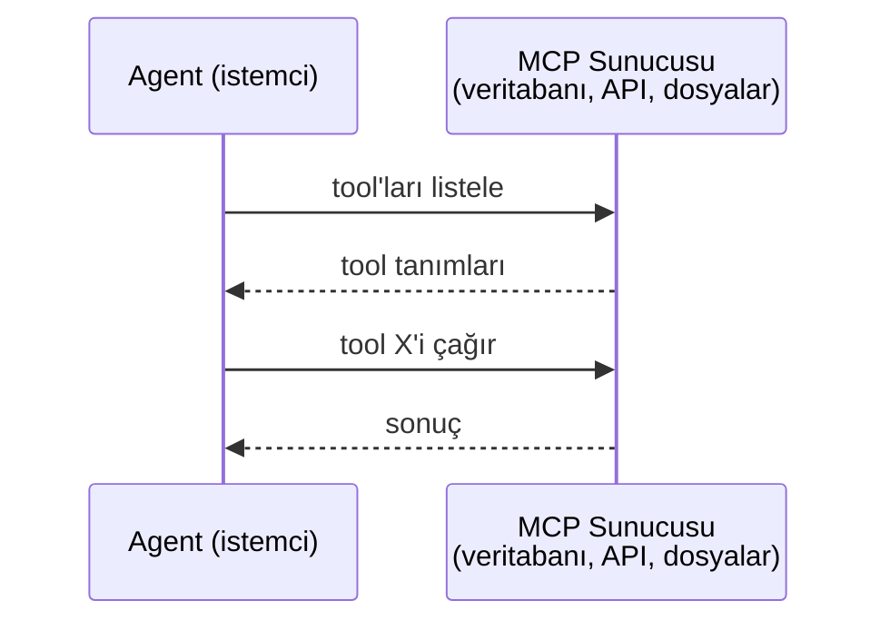

MCP **agent-to-tool** iletişimidir. Agent'ların birbiriyle konuşmasına yardım etmez.

### A2A (Agent2Agent Protokolü)

**Yaratan:** Google (şimdi Linux Foundation altında `lf.a2a.v1` olarak)
**Spec sürümü:** 1.0.0
**Sorun:** Otonom agent'lar birbirleriyle nasıl iş birliği yapar, müzakere eder ve görev delege eder?

A2A, **peer-to-peer agent iş birliği** protokolüdür. MCP bir agent'ı tool'lara bağlarken, A2A bir agent'ı diğer agent'lara bağlar. Her agent bilinen bir URL'de bir **Agent Card** yayınlar ve diğer agent'lar onu keşfeder, müzakere eder ve görev delege eder.

#### A2A Nasıl Çalışır

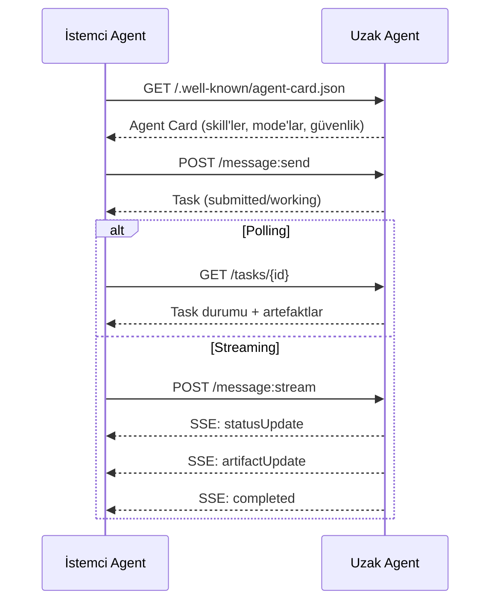

#### Gerçek Agent Card

Bir A2A Agent Card'ın doğada gerçekte nasıl göründüğü. `GET /.well-known/agent-card.json`'da sunulur:

```json
{
  "name": "Research Agent",
  "description": "Searches documentation and summarizes findings",
  "version": "1.0.0",
  "supportedInterfaces": [
    {
      "url": "https://research-agent.example.com/a2a/v1",
      "protocolBinding": "JSONRPC",
      "protocolVersion": "1.0"
    },
    {
      "url": "https://research-agent.example.com/a2a/rest",
      "protocolBinding": "HTTP+JSON",
      "protocolVersion": "1.0"
    }
  ],
  "provider": {
    "organization": "Your Company",
    "url": "https://example.com"
  },
  "capabilities": {
    "streaming": true,
    "pushNotifications": false
  },
  "defaultInputModes": ["text/plain", "application/json"],
  "defaultOutputModes": ["text/plain", "application/json"],
  "skills": [
    {
      "id": "web-research",
      "name": "Web Research",
      "description": "Searches the web and synthesizes findings",
      "tags": ["research", "search", "summarization"],
      "examples": ["Research the latest changes in React 19"]
    },
    {
      "id": "doc-analysis",
      "name": "Documentation Analysis",
      "description": "Reads and analyzes technical documentation",
      "tags": ["docs", "analysis"],
      "inputModes": ["text/plain", "application/pdf"],
      "outputModes": ["application/json"]
    }
  ],
  "securitySchemes": {
    "bearer": {
      "httpAuthSecurityScheme": {
        "scheme": "Bearer",
        "bearerFormat": "JWT"
      }
    }
  },
  "security": [{ "bearer": [] }]
}
```

Dikkat edilecek temel şeyler:
- **Skills** agent'ın yapabileceği şeylerdir. Her birinin bir ID'si, etiketleri ve desteklenen input/output MIME tipleri vardır. İstemci agent'ın bu uzak agent'ın isteğini ele alıp alamayacağına karar vermesi böyle olur.
- **supportedInterfaces** birden çok protokol bağlamı listeler. Tek bir agent aynı anda JSON-RPC, REST ve gRPC konuşabilir.
- **Security** card'a yerleşiktir. İstemci tek bir istek yapmadan önce hangi auth'a ihtiyaç duyduğunu bilir.

#### Task Yaşam Döngüsü

Task'lar A2A'da temel iş birimidir. Tanımlanmış durumlardan geçerler:

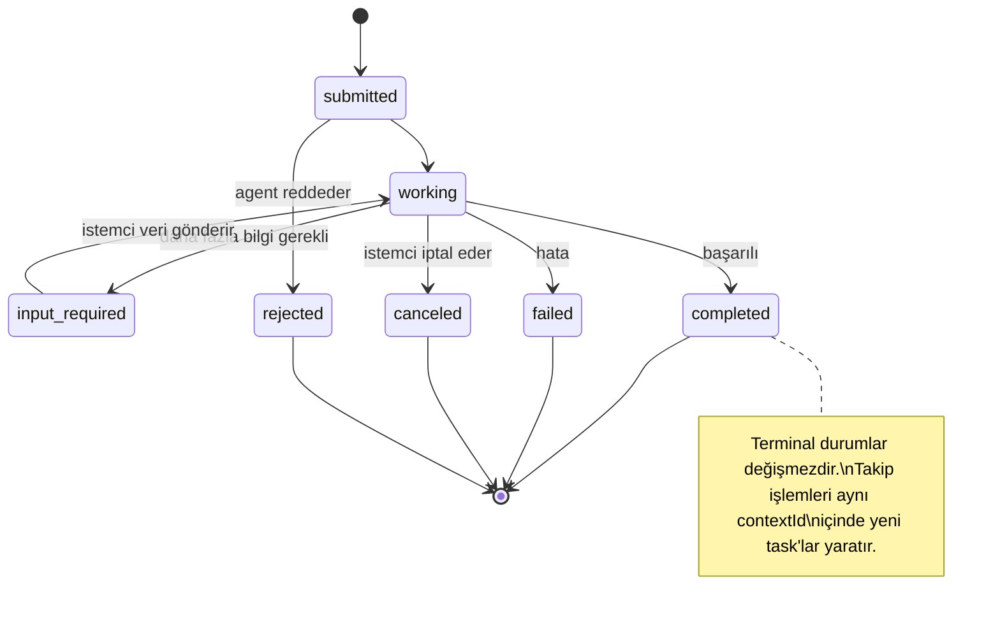

Tüm 8 durum (spec ayrıca `UNSPECIFIED`'i bir sentinel olarak tanımlar, burada atlandı):

| Durum | Terminal mi? | Anlamı |
|---|---|---|
| `TASK_STATE_SUBMITTED` | Hayır | Kabul edildi, henüz işlenmiyor |
| `TASK_STATE_WORKING` | Hayır | Aktif olarak işleniyor |
| `TASK_STATE_INPUT_REQUIRED` | Hayır | Agent istemciden daha fazla bilgi istiyor |
| `TASK_STATE_AUTH_REQUIRED` | Hayır | Kimlik doğrulama gerekli |
| `TASK_STATE_COMPLETED` | Evet | Başarıyla tamamlandı |
| `TASK_STATE_FAILED` | Evet | Hatayla tamamlandı |
| `TASK_STATE_CANCELED` | Evet | Tamamlanmadan iptal edildi |
| `TASK_STATE_REJECTED` | Evet | Agent görevi reddetti |

Bir task terminal duruma ulaştığında değişmezdir. Başka mesaj yok. Takip işlemleri aynı `contextId` içinde yeni bir task yaratır.

#### Wire Formatı

A2A JSON-RPC 2.0 kullanır. İşte gerçek bir mesaj alışverişi:

**İstemci bir task gönderir:**
```json
{
  "jsonrpc": "2.0",
  "id": 1,
  "method": "SendMessage",
  "params": {
    "message": {
      "messageId": "msg-001",
      "role": "ROLE_USER",
      "parts": [{ "text": "Research React 19 compiler features" }]
    },
    "configuration": {
      "acceptedOutputModes": ["text/plain", "application/json"],
      "historyLength": 10
    }
  }
}
```

**Agent bir task ile yanıt verir:**
```json
{
  "jsonrpc": "2.0",
  "id": 1,
  "result": {
    "task": {
      "id": "task-abc-123",
      "contextId": "ctx-xyz-789",
      "status": {
        "state": "TASK_STATE_COMPLETED",
        "timestamp": "2026-03-27T10:30:00Z"
      },
      "artifacts": [
        {
          "artifactId": "art-001",
          "name": "research-results",
          "parts": [{
            "data": {
              "findings": [
                "React 19 compiler auto-memoizes components",
                "No more manual useMemo/useCallback needed",
                "Compiler runs at build time, not runtime"
              ]
            },
            "mediaType": "application/json"
          }]
        }
      ]
    }
  }
}
```

**SSE üzerinden streaming:**
```text
POST /message:stream HTTP/1.1
Content-Type: application/json
A2A-Version: 1.0

data: {"task":{"id":"task-123","status":{"state":"TASK_STATE_WORKING"}}}

data: {"statusUpdate":{"taskId":"task-123","status":{"state":"TASK_STATE_WORKING","message":{"role":"ROLE_AGENT","parts":[{"text":"Searching documentation..."}]}}}}

data: {"artifactUpdate":{"taskId":"task-123","artifact":{"artifactId":"art-1","parts":[{"text":"partial findings..."}]},"append":true,"lastChunk":false}}

data: {"statusUpdate":{"taskId":"task-123","status":{"state":"TASK_STATE_COMPLETED"}}}
```

### ACP (Agent Communication Protocol)

**Yaratan:** IBM / BeeAI
**Spec sürümü:** 0.2.0 (OpenAPI 3.1.1)
**Durum:** Linux Foundation altında A2A'ya birleşiyor
**Sorun:** Agent'lar tam denetlenebilirlik, oturum sürekliliği ve trajectory takibi ile nasıl iletişim kurar?

ACP **kurumsal protokoldür**. Pek çok özet'in iddia ettiği gibi ACP JSON-LD kullan**maz**. OpenAPI üzerinden tanımlanmış basit bir REST/JSON API'sidir. Onu özel kılan **TrajectoryMetadata**'dır: her agent yanıtı, onu üreten akıl yürütme adımları ve tool çağrılarının detaylı bir log'unu taşıyabilir.

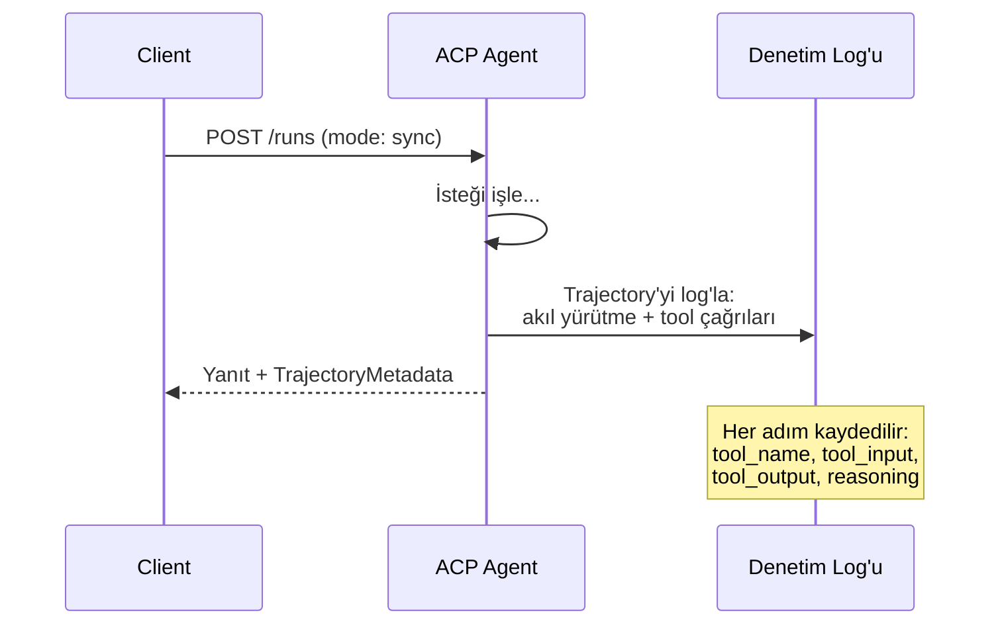

#### ACP'de Agent Keşfi

ACP dört keşif yöntemi tanımlar:

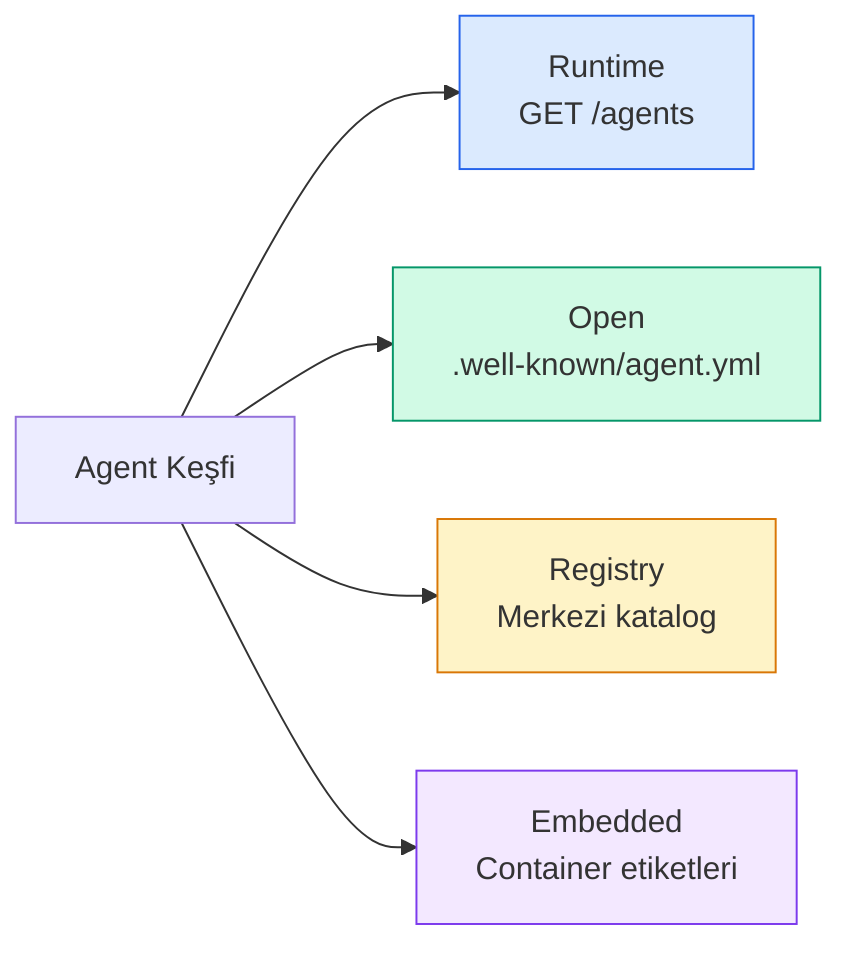

**AgentManifest** A2A'nın Agent Card'ından daha basittir:

```json
{
  "name": "summarizer",
  "description": "Summarizes documents with source citations",
  "input_content_types": ["text/plain", "application/pdf"],
  "output_content_types": ["text/plain", "application/json"],
  "metadata": {
    "tags": ["summarization", "RAG"],
    "framework": "BeeAI",
    "capabilities": [
      {
        "name": "Document Summarization",
        "description": "Condenses long documents into key points"
      }
    ],
    "recommended_models": ["llama3.3:70b-instruct-fp16"],
    "license": "Apache-2.0",
    "programming_language": "Python"
  }
}
```

#### Run Yaşam Döngüsü

ACP "Task" yerine "Run" kullanır. Bir Run, üç mode'lu bir agent yürütmesidir:

| Mode | Davranış |
|---|---|
| `sync` | Bloklayan. Yanıt tam sonucu içerir. |
| `async` | Hemen 202 döner. Durum için `GET /runs/{id}` poll'la. |
| `stream` | SSE stream. Agent çalışırken event'ler tetiklenir. |

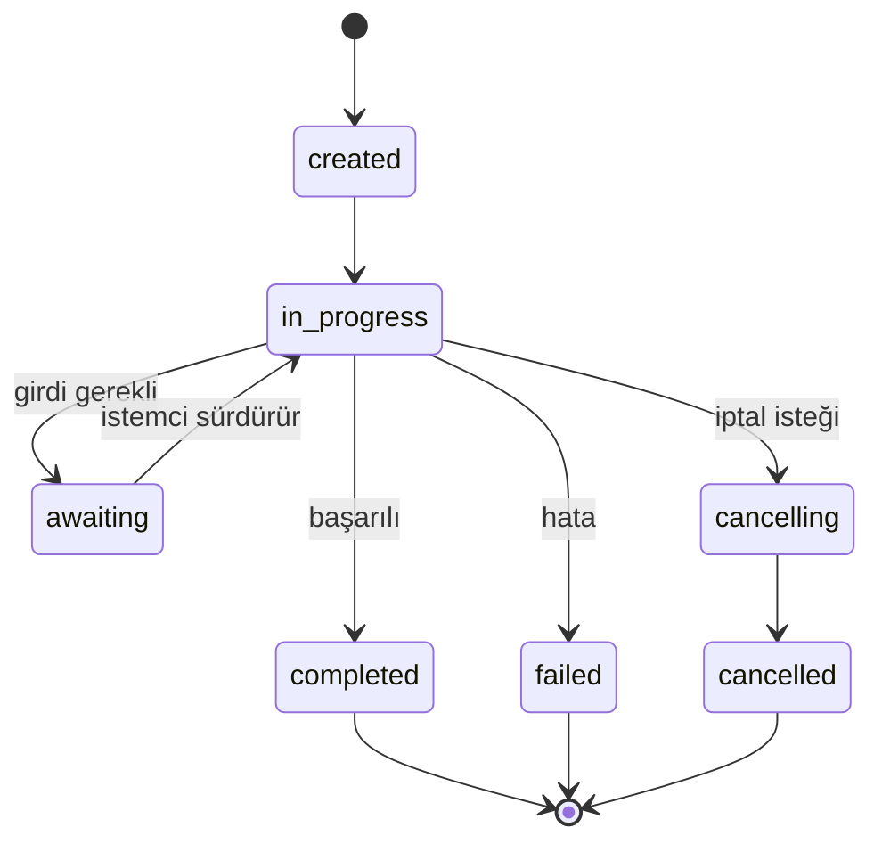

#### TrajectoryMetadata (Denetim İzi)

Bu ACP'nin temel farklılaştırıcısıdır. Her mesaj parçası agent'ın tam olarak ne yaptığını gösteren metadata içerebilir:

```json
{
  "role": "agent/researcher",
  "parts": [
    {
      "content_type": "text/plain",
      "content": "The weather in San Francisco is 72F and sunny.",
      "metadata": {
        "kind": "trajectory",
        "message": "I need to check the weather for this location",
        "tool_name": "weather_api",
        "tool_input": { "location": "San Francisco, CA" },
        "tool_output": { "temperature": 72, "condition": "sunny" }
      }
    }
  ]
}
```

Düzenlenmiş endüstriler için bu altın değerinde. Her yanıt kanıtlanabilir bir akıl yürütme zinciriyle gelir: hangi tool'lar çağrıldı, hangi girdiler kullanıldı, hangi çıktılar alındı. Kara kutu yok.

ACP ayrıca kaynak atfı için **CitationMetadata** destekler:

```json
{
  "kind": "citation",
  "start_index": 0,
  "end_index": 47,
  "url": "https://weather.gov/sf",
  "title": "NWS San Francisco Forecast"
}
```

### ANP (Agent Network Protocol)

**Yaratan:** Açık kaynak topluluk (GaoWei Chang tarafından kuruldu)
**Repo:** [github.com/agent-network-protocol/AgentNetworkProtocol](https://github.com/agent-network-protocol/AgentNetworkProtocol)
**Sorun:** Farklı organizasyonlardan agent'lar merkezi otorite olmadan birbirine nasıl güvenir?

ANP **merkeziyetsiz kimlik protokolüdür**. W3C Decentralized Identifiers (DID) ve uçtan uca şifreleme kullanarak güven inşa eder. Bilinen endpoint'ler üzerinden agent keşfettiğin A2A'nın aksine, ANP agent'ların kimliklerini kriptografik olarak kanıtlamalarına izin verir.

ANP'nin üç katmanı vardır:

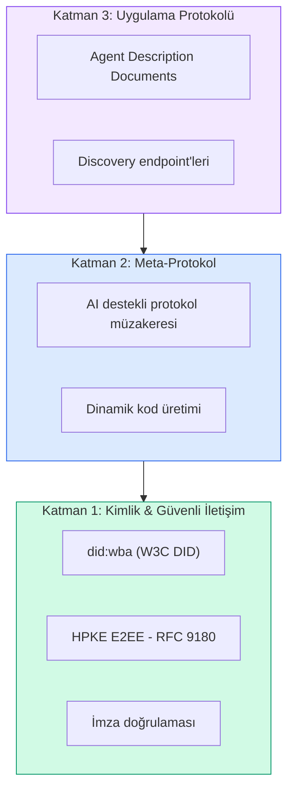

#### DID Documents (Gerçek Yapı)

ANP `did:wba` (Web-Based Agent) adlı özel bir DID metodu kullanır. `did:wba:example.com:user:alice` DID'i `https://example.com/user/alice/did.json`'a çözülür:

```json
{
  "@context": [
    "https://www.w3.org/ns/did/v1",
    "https://w3id.org/security/suites/jws-2020/v1",
    "https://w3id.org/security/suites/secp256k1-2019/v1"
  ],
  "id": "did:wba:example.com:user:alice",
  "verificationMethod": [
    {
      "id": "did:wba:example.com:user:alice#key-1",
      "type": "EcdsaSecp256k1VerificationKey2019",
      "controller": "did:wba:example.com:user:alice",
      "publicKeyJwk": {
        "crv": "secp256k1",
        "x": "NtngWpJUr-rlNNbs0u-Aa8e16OwSJu6UiFf0Rdo1oJ4",
        "y": "qN1jKupJlFsPFc1UkWinqljv4YE0mq_Ickwnjgasvmo",
        "kty": "EC"
      }
    },
    {
      "id": "did:wba:example.com:user:alice#key-x25519-1",
      "type": "X25519KeyAgreementKey2019",
      "controller": "did:wba:example.com:user:alice",
      "publicKeyMultibase": "z9hFgmPVfmBZwRvFEyniQDBkz9LmV7gDEqytWyGZLmDXE"
    }
  ],
  "authentication": [
    "did:wba:example.com:user:alice#key-1"
  ],
  "keyAgreement": [
    "did:wba:example.com:user:alice#key-x25519-1"
  ],
  "humanAuthorization": [
    "did:wba:example.com:user:alice#key-1"
  ],
  "service": [
    {
      "id": "did:wba:example.com:user:alice#agent-description",
      "type": "AgentDescription",
      "serviceEndpoint": "https://example.com/agents/alice/ad.json"
    }
  ]
}
```

Dikkat edilecek temel şeyler:
- **Anahtar ayrımı** zorlanır. İmza anahtarları (secp256k1) şifreleme anahtarlarından (X25519) ayrıdır.
- **`humanAuthorization`** ANP'ye özgüdür. Bu anahtarlar kullanılmadan önce açık insan onayı (biyometrik, parola, HSM) gerektirir. Fon transferleri gibi yüksek-riskli işlemler bu yoldan geçer.
- **`keyAgreement`** anahtarları HPKE uçtan uca şifreleme için kullanılır (RFC 9180).
- **service** bölümü Agent Description dokümanına bağlanır.

#### ANP'de Güven Nasıl Çalışır

ANP web-of-trust ya da endorsement grafiği kullan**maz**. Güven iki yönlüdür ve etkileşim başına doğrulanır:

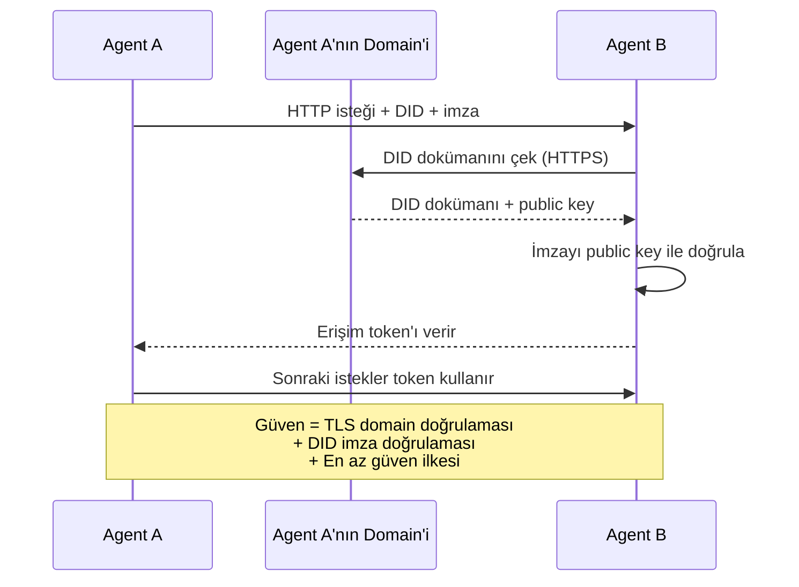

Güven üç kaynaktan gelir:
1. **Domain seviyesi TLS** DID dokümanı host'unu doğrular
2. **DID kriptografik imzaları** agent'ın kimliğini doğrular
3. **En az güven ilkesi** yalnızca minimum izinleri verir

Dedikodu temelli güven yayılımı ya da PageRank skorlaması yok. Her agent'ı doğrudan DID'i üzerinden doğrularsın.

#### Meta-Protokol Müzakeresi

Bu ANP'nin en yeni özelliği. Farklı ekosistemlerden iki agent karşılaştığında, önceden anlaşılmış veri formatlarına ihtiyaçları yok. Doğal dilde müzakere ederler:

```json
{
  "action": "protocolNegotiation",
  "sequenceId": 0,
  "candidateProtocols": "I can communicate using:\n1. JSON-RPC with hotel booking schema\n2. REST with OpenAPI 3.1 spec\n3. Natural language over HTTP",
  "modificationSummary": "Initial proposal",
  "status": "negotiating"
}
```

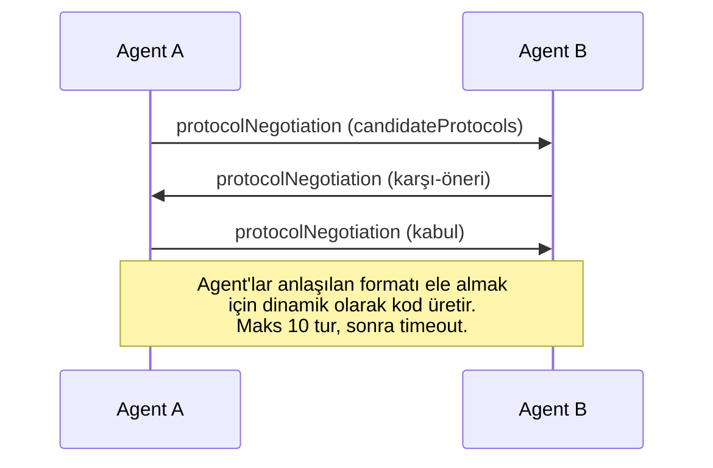

Agent'lar bir formatta anlaşana kadar ileri-geri gider (maks 10 tur), sonra onu ele almak için dinamik kod üretirler. Durum değerleri: `negotiating`, `rejected`, `accepted`, `timeout`.

Bu, daha önce hiç karşılaşmamış iki agent'ın kimsenin paylaşılan bir şemayı önceden tanımlamasına gerek kalmadan nasıl iletişim kuracaklarını çözebileceği anlamına gelir.

### Karşılaştırma (Düzeltilmiş)

| | MCP | A2A | ACP | ANP |
|---|---|---|---|---|
| **Yaratan** | Anthropic | Google / Linux Foundation | IBM / BeeAI | Topluluk |
| **Spec formatı** | JSON-RPC | JSON-RPC / REST / gRPC | OpenAPI 3.1 (REST) | JSON-RPC |
| **Birincil kullanım** | Agent'tan Tool'a | Agent'tan Agent'a | Agent'tan Agent'a | Agent'tan Agent'a |
| **Keşif** | Tool listesi | `/.well-known/agent-card.json` | `GET /agents`, `/.well-known/agent.yml` | `/.well-known/agent-descriptions`, DID service endpoint'leri |
| **Kimlik** | İmali (yerel) | Güvenlik şemaları (OAuth, mTLS) | Sunucu seviyesi | W3C DID (`did:wba`) E2EE ile |
| **Denetim izi** | Yok | Temel (task geçmişi) | TrajectoryMetadata (tool çağrıları, akıl yürütme) | Resmi olarak belirtilmemiş |
| **State machine** | Yok | 9 task durumu | 7 run durumu | Yok |
| **Streaming** | Yok | SSE | SSE | Transport-bağımsız |
| **Eşsiz özellik** | Tool şemaları | Agent Card'lar + Skill'ler | Trajectory denetim izi | Meta-protokol müzakeresi |
| **En iyi olduğu** | Tool'lar & veri | Dinamik iş birliği | Düzenlenmiş endüstriler | Org-ötesi güven |
| **Durum** | Stabil | Stabil (v1.0) | A2A'ya birleşiyor | Aktif geliştirme |

### Birlikte Nasıl Çalışırlar

Bu protokoller birbirini dışlamaz. Gerçekçi bir kurumsal sistem birden çoğunu kullanır:

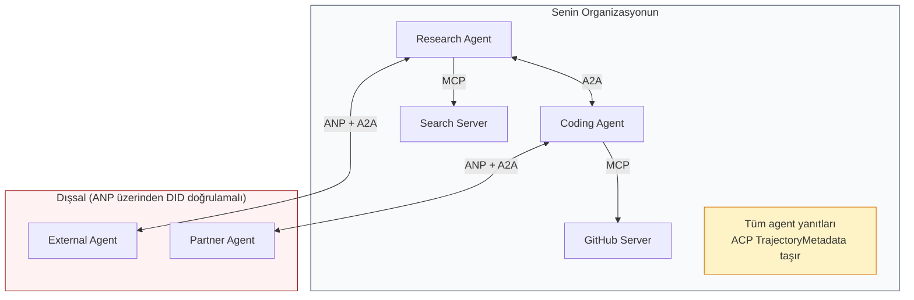

- **MCP** her agent'ı kendi tool'larına bağlar
- **A2A** agent'lar arasındaki iş birliğini yürütür (iç ve dış)
- **ACP** denetlenebilirlik için yanıtları trajectory metadata ile sarar
- **ANP** kontrol etmediğin agent'lar için kimlik doğrulaması sağlar

## İnşa Et

### Adım 1: Temel Mesaj Tipleri

Her çoklu-agent sistemi bir mesaj formatıyla başlar. Gerçek protokollerin kullandığına eşlenen tipler tanımlarız:

```typescript
import crypto from "node:crypto";

type MessageRole = "user" | "agent";

type MessagePart =
  | { kind: "text"; text: string }
  | { kind: "data"; data: unknown; mediaType: string }
  | { kind: "file"; name: string; url: string; mediaType: string };

type TrajectoryEntry = {
  reasoning: string;
  toolName?: string;
  toolInput?: unknown;
  toolOutput?: unknown;
  timestamp: number;
};

type AgentMessage = {
  id: string;
  role: MessageRole;
  parts: MessagePart[];
  trajectory?: TrajectoryEntry[];
  replyTo?: string;
  timestamp: number;
};

function createMessage(
  role: MessageRole,
  parts: MessagePart[],
  replyTo?: string
): AgentMessage {
  return {
    id: crypto.randomUUID(),
    role,
    parts,
    replyTo,
    timestamp: Date.now(),
  };
}

function textMessage(role: MessageRole, text: string): AgentMessage {
  return createMessage(role, [{ kind: "text", text }]);
}
```

Dikkat: `MessagePart` tıpkı gerçek A2A ve ACP spec'leri gibi çok modlu (metin, yapılandırılmış veri, dosyalar). `TrajectoryEntry`, ACP'nin TrajectoryMetadata'sıyla eşleşen akıl yürütme zincirini yakalar.

### Adım 2: A2A Agent Card ve Registry

Gerçek A2A spec'i ile eşleşen agent keşfi inşa et:

```typescript
type Skill = {
  id: string;
  name: string;
  description: string;
  tags: string[];
  inputModes: string[];
  outputModes: string[];
};

type AgentCard = {
  name: string;
  description: string;
  version: string;
  url: string;
  capabilities: {
    streaming: boolean;
    pushNotifications: boolean;
  };
  defaultInputModes: string[];
  defaultOutputModes: string[];
  skills: Skill[];
};

class AgentRegistry {
  private cards: Map<string, AgentCard> = new Map();

  register(card: AgentCard) {
    this.cards.set(card.name, card);
  }

  discoverBySkillTag(tag: string): AgentCard[] {
    return [...this.cards.values()].filter((card) =>
      card.skills.some((skill) => skill.tags.includes(tag))
    );
  }

  discoverByInputMode(mimeType: string): AgentCard[] {
    return [...this.cards.values()].filter(
      (card) =>
        card.defaultInputModes.includes(mimeType) ||
        card.skills.some((skill) => skill.inputModes.includes(mimeType))
    );
  }

  resolve(name: string): AgentCard | undefined {
    return this.cards.get(name);
  }

  listAll(): AgentCard[] {
    return [...this.cards.values()];
  }
}
```

Bu basit bir isim-yetenek haritasından önemli ölçüde daha zengin. Agent'ları skill tag'leri ile, input MIME tipleri ile ya da isim ile keşfedebilirsin, tıpkı gerçek A2A spec'inin desteklediği gibi.

### Adım 3: A2A Task Yaşam Döngüsü

Tam task state machine'ini inşa et:

```typescript
type TaskState =
  | "submitted"
  | "working"
  | "input-required"
  | "auth-required"
  | "completed"
  | "failed"
  | "canceled"
  | "rejected";

const TERMINAL_STATES: TaskState[] = [
  "completed",
  "failed",
  "canceled",
  "rejected",
];

type TaskStatus = {
  state: TaskState;
  message?: AgentMessage;
  timestamp: number;
};

type Artifact = {
  id: string;
  name: string;
  parts: MessagePart[];
};

type Task = {
  id: string;
  contextId: string;
  status: TaskStatus;
  artifacts: Artifact[];
  history: AgentMessage[];
};

type TaskEvent =
  | { kind: "statusUpdate"; taskId: string; status: TaskStatus }
  | {
      kind: "artifactUpdate";
      taskId: string;
      artifact: Artifact;
      append: boolean;
      lastChunk: boolean;
    };

type TaskHandler = (
  task: Task,
  message: AgentMessage
) => AsyncGenerator<TaskEvent>;

class TaskManager {
  private tasks: Map<string, Task> = new Map();
  private handlers: Map<string, TaskHandler> = new Map();
  private listeners: Map<string, ((event: TaskEvent) => void)[]> = new Map();

  registerHandler(agentName: string, handler: TaskHandler) {
    this.handlers.set(agentName, handler);
  }

  subscribe(taskId: string, listener: (event: TaskEvent) => void) {
    const existing = this.listeners.get(taskId) ?? [];
    existing.push(listener);
    this.listeners.set(taskId, existing);
  }

  async sendMessage(
    agentName: string,
    message: AgentMessage,
    contextId?: string
  ): Promise<Task> {
    const handler = this.handlers.get(agentName);
    if (!handler) {
      const task = this.createTask(contextId);
      task.status = {
        state: "rejected",
        timestamp: Date.now(),
        message: textMessage("agent", `No handler for ${agentName}`),
      };
      return task;
    }

    const task = this.createTask(contextId);
    task.history.push(message);
    task.status = { state: "submitted", timestamp: Date.now() };

    this.processTask(task, handler, message).catch((err) => {
      task.status = {
        state: "failed",
        timestamp: Date.now(),
        message: textMessage("agent", String(err)),
      };
    });
    return task;
  }

  getTask(taskId: string): Task | undefined {
    return this.tasks.get(taskId);
  }

  cancelTask(taskId: string): boolean {
    const task = this.tasks.get(taskId);
    if (!task || TERMINAL_STATES.includes(task.status.state)) return false;
    task.status = { state: "canceled", timestamp: Date.now() };
    this.emit(taskId, {
      kind: "statusUpdate",
      taskId,
      status: task.status,
    });
    return true;
  }

  private createTask(contextId?: string): Task {
    const task: Task = {
      id: crypto.randomUUID(),
      contextId: contextId ?? crypto.randomUUID(),
      status: { state: "submitted", timestamp: Date.now() },
      artifacts: [],
      history: [],
    };
    this.tasks.set(task.id, task);
    return task;
  }

  private async processTask(
    task: Task,
    handler: TaskHandler,
    message: AgentMessage
  ) {
    task.status = { state: "working", timestamp: Date.now() };
    this.emit(task.id, {
      kind: "statusUpdate",
      taskId: task.id,
      status: task.status,
    });

    try {
      for await (const event of handler(task, message)) {
        if (TERMINAL_STATES.includes(task.status.state)) break;

        if (event.kind === "statusUpdate") {
          task.status = event.status;
        }
        if (event.kind === "artifactUpdate") {
          const existing = task.artifacts.find(
            (a) => a.id === event.artifact.id
          );
          if (existing && event.append) {
            existing.parts.push(...event.artifact.parts);
          } else {
            task.artifacts.push(event.artifact);
          }
        }
        this.emit(task.id, event);
      }
    } catch (err) {
      task.status = {
        state: "failed",
        timestamp: Date.now(),
        message: textMessage("agent", String(err)),
      };
      this.emit(task.id, {
        kind: "statusUpdate",
        taskId: task.id,
        status: task.status,
      });
    }
  }

  private emit(taskId: string, event: TaskEvent) {
    for (const listener of this.listeners.get(taskId) ?? []) {
      listener(event);
    }
  }
}
```

Bu gerçek A2A task yaşam döngüsünü uygular: submitted, working, input-required, terminal durumlar. Handler'lar SSE streaming modeliyle eşleşen event'ler (durum güncellemeleri ve artefakt chunk'ları) yield eden async generator'lardır.

### Adım 4: ACP-Stili Denetim İzi

İletişimi trajectory takibiyle sar:

```typescript
type AuditEntry = {
  runId: string;
  agentName: string;
  input: AgentMessage[];
  output: AgentMessage[];
  trajectory: TrajectoryEntry[];
  status: "created" | "in-progress" | "completed" | "failed" | "awaiting";
  startedAt: number;
  completedAt?: number;
  sessionId?: string;
};

class AuditableRunner {
  private log: AuditEntry[] = [];
  private handlers: Map<
    string,
    (input: AgentMessage[]) => Promise<{
      output: AgentMessage[];
      trajectory: TrajectoryEntry[];
    }>
  > = new Map();

  registerAgent(
    name: string,
    handler: (input: AgentMessage[]) => Promise<{
      output: AgentMessage[];
      trajectory: TrajectoryEntry[];
    }>
  ) {
    this.handlers.set(name, handler);
  }

  async run(
    agentName: string,
    input: AgentMessage[],
    sessionId?: string
  ): Promise<AuditEntry> {
    const entry: AuditEntry = {
      runId: crypto.randomUUID(),
      agentName,
      input: structuredClone(input),
      output: [],
      trajectory: [],
      status: "created",
      startedAt: Date.now(),
      sessionId,
    };
    this.log.push(entry);

    const handler = this.handlers.get(agentName);
    if (!handler) {
      entry.status = "failed";
      return entry;
    }

    entry.status = "in-progress";
    try {
      const result = await handler(input);
      entry.output = structuredClone(result.output);
      entry.trajectory = structuredClone(result.trajectory);
      entry.status = "completed";
      entry.completedAt = Date.now();
    } catch (err) {
      entry.status = "failed";
      entry.trajectory.push({
        reasoning: `Error: ${String(err)}`,
        timestamp: Date.now(),
      });
      entry.completedAt = Date.now();
    }
    return entry;
  }

  getFullAuditLog(): AuditEntry[] {
    return structuredClone(this.log);
  }

  getAuditLogForAgent(agentName: string): AuditEntry[] {
    return structuredClone(
      this.log.filter((e) => e.agentName === agentName)
    );
  }

  getAuditLogForSession(sessionId: string): AuditEntry[] {
    return structuredClone(
      this.log.filter((e) => e.sessionId === sessionId)
    );
  }

  getTrajectoryForRun(runId: string): TrajectoryEntry[] {
    const entry = this.log.find((e) => e.runId === runId);
    return entry ? structuredClone(entry.trajectory) : [];
  }
}
```

Her agent yürütmesi tam bir denetim girdisi üretir: ne girdi, ne çıktı ve arada tool çağrılarının ve akıl yürütme adımlarının tam trajectory'si. Agent'a, oturuma ya da bireysel run'a göre sorgulayabilirsin.

### Adım 5: ANP-Stili Kimlik Doğrulaması

DID temelli kimlik ve doğrulama inşa et:

```typescript
type VerificationMethod = {
  id: string;
  type: string;
  controller: string;
  publicKeyDer: string;
};

type DIDDocument = {
  id: string;
  verificationMethod: VerificationMethod[];
  authentication: string[];
  keyAgreement: string[];
  humanAuthorization: string[];
  service: { id: string; type: string; serviceEndpoint: string }[];
};

type AgentIdentity = {
  did: string;
  document: DIDDocument;
  privateKey: crypto.KeyObject;
  publicKey: crypto.KeyObject;
};

class IdentityRegistry {
  private documents: Map<string, DIDDocument> = new Map();

  publish(doc: DIDDocument) {
    this.documents.set(doc.id, doc);
  }

  resolve(did: string): DIDDocument | undefined {
    return this.documents.get(did);
  }

  verify(did: string, signature: string, payload: string): boolean {
    const doc = this.documents.get(did);
    if (!doc) return false;

    const authKeyIds = doc.authentication;
    const authKeys = doc.verificationMethod.filter((vm) =>
      authKeyIds.includes(vm.id)
    );

    for (const key of authKeys) {
      const publicKey = crypto.createPublicKey({
        key: Buffer.from(key.publicKeyDer, "base64"),
        format: "der",
        type: "spki",
      });
      const isValid = crypto.verify(
        null,
        Buffer.from(payload),
        publicKey,
        Buffer.from(signature, "hex")
      );
      if (isValid) return true;
    }
    return false;
  }

  requiresHumanAuth(did: string, operationKeyId: string): boolean {
    const doc = this.documents.get(did);
    if (!doc) return false;
    return doc.humanAuthorization.includes(operationKeyId);
  }
}

function createIdentity(domain: string, agentName: string): AgentIdentity {
  const did = `did:wba:${domain}:agent:${agentName}`;
  const { publicKey, privateKey } = crypto.generateKeyPairSync("ed25519");

  const publicKeyDer = publicKey
    .export({ format: "der", type: "spki" })
    .toString("base64");

  const keyId = `${did}#key-1`;
  const encKeyId = `${did}#key-x25519-1`;

  const document: DIDDocument = {
    id: did,
    verificationMethod: [
      {
        id: keyId,
        type: "Ed25519VerificationKey2020",
        controller: did,
        publicKeyDer,
      },
      {
        id: encKeyId,
        type: "X25519KeyAgreementKey2019",
        controller: did,
        publicKeyDer,
      },
    ],
    authentication: [keyId],
    keyAgreement: [encKeyId],
    humanAuthorization: [],
    service: [
      {
        id: `${did}#agent-description`,
        type: "AgentDescription",
        serviceEndpoint: `https://${domain}/agents/${agentName}/ad.json`,
      },
    ],
  };

  return { did, document, privateKey, publicKey };
}

function signPayload(identity: AgentIdentity, payload: string): string {
  return crypto
    .sign(null, Buffer.from(payload), identity.privateKey)
    .toString("hex");
}
```

Bu gerçek ANP kimlik modelini yansıtır: agent'ların ayrı authentication, key agreement ve human authorization anahtarlı DID dokümanları vardır. `IdentityRegistry` DID çözümlemesini simüle eder (üretimde bu agent'ın domain'ine HTTP fetch'ler olurdu).

### Adım 6: Protokol Gateway

Dört protokolü birleşik bir sisteme bağla:

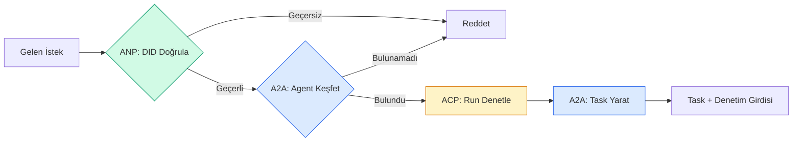

```typescript
class ProtocolGateway {
  private registry: AgentRegistry;
  private taskManager: TaskManager;
  private auditRunner: AuditableRunner;
  private identityRegistry: IdentityRegistry;

  constructor(
    registry: AgentRegistry,
    taskManager: TaskManager,
    auditRunner: AuditableRunner,
    identityRegistry: IdentityRegistry
  ) {
    this.registry = registry;
    this.taskManager = taskManager;
    this.auditRunner = auditRunner;
    this.identityRegistry = identityRegistry;
  }

  async delegateTask(
    fromDid: string,
    signature: string,
    targetAgent: string,
    message: AgentMessage,
    sessionId?: string
  ): Promise<{ task: Task; audit: AuditEntry } | { error: string }> {
    if (!this.identityRegistry.verify(fromDid, signature, message.id)) {
      return { error: "Identity verification failed" };
    }

    const card = this.registry.resolve(targetAgent);
    if (!card) {
      return { error: `Agent ${targetAgent} not found in registry` };
    }

    const audit = await this.auditRunner.run(
      targetAgent,
      [message],
      sessionId
    );
    const task = await this.taskManager.sendMessage(targetAgent, message);

    return { task, audit };
  }

  discoverAndDelegate(
    fromDid: string,
    signature: string,
    skillTag: string,
    message: AgentMessage
  ): Promise<{ task: Task; audit: AuditEntry } | { error: string }> {
    const candidates = this.registry.discoverBySkillTag(skillTag);
    if (candidates.length === 0) {
      return Promise.resolve({
        error: `No agents found with skill tag: ${skillTag}`,
      });
    }
    return this.delegateTask(
      fromDid,
      signature,
      candidates[0].name,
      message
    );
  }
}
```

Gateway tek bir çağrıda dört şey yapar:
1. **ANP**: DID imzası ile arayanın kimliğini doğrular
2. **A2A**: Hedef agent'ı keşfeder ve yeteneklerini kontrol eder
3. **ACP**: Yürütmeyi trajectory'li bir denetim izine sarar
4. **A2A**: Tam yaşam döngüsü takibiyle bir task yaratır

### Adım 7: Hepsini Birleştir

```typescript
async function protocolDemo() {
  const registry = new AgentRegistry();
  registry.register({
    name: "researcher",
    description: "Searches and summarizes findings",
    version: "1.0.0",
    url: "https://researcher.local/a2a/v1",
    capabilities: { streaming: true, pushNotifications: false },
    defaultInputModes: ["text/plain"],
    defaultOutputModes: ["text/plain", "application/json"],
    skills: [
      {
        id: "web-research",
        name: "Web Research",
        description: "Searches the web",
        tags: ["research", "search", "summarization"],
        inputModes: ["text/plain"],
        outputModes: ["application/json"],
      },
    ],
  });
  registry.register({
    name: "coder",
    description: "Writes code from specs",
    version: "1.0.0",
    url: "https://coder.local/a2a/v1",
    capabilities: { streaming: false, pushNotifications: false },
    defaultInputModes: ["text/plain", "application/json"],
    defaultOutputModes: ["text/plain"],
    skills: [
      {
        id: "code-gen",
        name: "Code Generation",
        description: "Generates code",
        tags: ["coding", "generation"],
        inputModes: ["text/plain", "application/json"],
        outputModes: ["text/plain"],
      },
    ],
  });

  const taskManager = new TaskManager();
  const auditRunner = new AuditableRunner();

  const researchTrajectory: TrajectoryEntry[] = [];

  taskManager.registerHandler(
    "researcher",
    async function* (task, message) {
      yield {
        kind: "statusUpdate" as const,
        taskId: task.id,
        status: { state: "working" as const, timestamp: Date.now() },
      };

      researchTrajectory.push({
        reasoning: "Searching for React 19 documentation",
        toolName: "web_search",
        toolInput: { query: "React 19 compiler features" },
        toolOutput: {
          results: ["react.dev/blog/react-19", "github.com/react/react"],
        },
        timestamp: Date.now(),
      });

      researchTrajectory.push({
        reasoning: "Extracting key findings from search results",
        toolName: "doc_analysis",
        toolInput: { url: "react.dev/blog/react-19" },
        toolOutput: {
          summary:
            "React 19 compiler auto-memoizes, no manual useMemo needed",
        },
        timestamp: Date.now(),
      });

      yield {
        kind: "artifactUpdate" as const,
        taskId: task.id,
        artifact: {
          id: crypto.randomUUID(),
          name: "research-results",
          parts: [
            {
              kind: "data" as const,
              data: {
                findings: [
                  "React 19 compiler auto-memoizes components",
                  "No more manual useMemo/useCallback needed",
                  "Compiler runs at build time, not runtime",
                ],
                sources: ["react.dev/blog/react-19"],
              },
              mediaType: "application/json",
            },
          ],
        },
        append: false,
        lastChunk: true,
      };

      yield {
        kind: "statusUpdate" as const,
        taskId: task.id,
        status: { state: "completed" as const, timestamp: Date.now() },
      };
    }
  );

  auditRunner.registerAgent("researcher", async () => ({
    output: [
      textMessage("agent", "React 19 compiler auto-memoizes components"),
    ],
    trajectory: researchTrajectory,
  }));

  const identityRegistry = new IdentityRegistry();

  const coderIdentity = createIdentity("coder.local", "coder");
  const researcherIdentity = createIdentity("researcher.local", "researcher");

  identityRegistry.publish(coderIdentity.document);
  identityRegistry.publish(researcherIdentity.document);

  const gateway = new ProtocolGateway(
    registry,
    taskManager,
    auditRunner,
    identityRegistry
  );

  console.log("=== Protocol Demo ===\n");

  console.log("1. Agent Discovery (A2A)");
  const researchAgents = registry.discoverBySkillTag("research");
  console.log(
    `   Found ${researchAgents.length} agent(s):`,
    researchAgents.map((a) => a.name)
  );

  console.log("\n2. Identity Verification (ANP)");
  const message = textMessage("user", "Research React 19 compiler features");
  const signature = signPayload(coderIdentity, message.id);
  const verified = identityRegistry.verify(
    coderIdentity.did,
    signature,
    message.id
  );
  console.log(`   Coder DID: ${coderIdentity.did}`);
  console.log(`   Signature verified: ${verified}`);

  console.log("\n3. Task Delegation (A2A + ACP + ANP)");
  const result = await gateway.delegateTask(
    coderIdentity.did,
    signature,
    "researcher",
    message,
    "session-001"
  );

  if ("error" in result) {
    console.log(`   Error: ${result.error}`);
    return;
  }

  console.log(`   Task ID: ${result.task.id}`);
  console.log(`   Task state: ${result.task.status.state}`);
  console.log(`   Artifacts: ${result.task.artifacts.length}`);

  console.log("\n4. Audit Trail (ACP)");
  console.log(`   Run ID: ${result.audit.runId}`);
  console.log(`   Status: ${result.audit.status}`);
  console.log(`   Trajectory steps: ${result.audit.trajectory.length}`);
  for (const step of result.audit.trajectory) {
    console.log(`     - ${step.reasoning}`);
    if (step.toolName) {
      console.log(`       Tool: ${step.toolName}`);
    }
  }

  console.log("\n5. Full Audit Log");
  const fullLog = auditRunner.getFullAuditLog();
  console.log(`   Total runs: ${fullLog.length}`);
  for (const entry of fullLog) {
    const duration = entry.completedAt
      ? `${entry.completedAt - entry.startedAt}ms`
      : "in-progress";
    console.log(`   ${entry.agentName}: ${entry.status} (${duration})`);
  }
}

protocolDemo().catch((err) => {
  console.error("Protocol demo failed:", err);
  process.exitCode = 1;
});
```

## Ne Ters Gider

Protokoller mutlu yolu çözer. İşte üretimde ne kırılır:

**Şema kayması.** Agent A `application/json` çıktı reklamı yapan bir Agent Card yayınlar. Ama JSON şeması sürümler arası değişir. Agent B eski formatı parse eder ve çöp alır. Çözüm: skill'lerini ve çıktı şemalarını sürümle. A2A spec'i Agent Card'larda `version` desteklerinin nedeni budur.

**State machine ihlalleri.** Bir agent handler `completed` event'i yield eder, sonra daha fazla artefakt yield etmeye çalışır. Task değişmezdir. Kodun sessizce güncellemeleri düşürür ya da exception fırlatır. Çözüm: yield'tan önce terminal durumu kontrol et. Yukarıdaki `TaskManager` bunu terminal durumlardan sonra `break` ile zorunlu kılar.

**Güven çözümleme başarısızlıkları.** Agent A, Agent B'nin DID'ini doğrulamaya çalışır ama Agent B'nin domain'i çökmüştür. DID dokümanı çekilemez. Açıkta mı (doğrulanmamış agent'ları kabul) yoksa kapalıda mı (her şeyi reddet) başarısız olursun? ANP en az güven ilkesiyle kapalıda başarısız olmayı önerir.

**Trajectory şişmesi.** ACP trajectory log'lama güçlüdür ama pahalıdır. Run başına 200 tool çağrısı yapan karmaşık bir agent devasa denetim girdileri üretir. Çözüm: trajectory'yi yapılandırılabilir verbosity seviyelerinde log'la. Uyumluluk için tool isimleri ve IO'yu kaydet, düzenlenmemiş workload'lar için akıl yürütme adımlarını atla.

**Keşif gürültülü sürü (thundering herd).** 50 agent başlangıçta eş zamanlı `GET /agents` sorgular. Çözüm: Agent Card'ları TTL ile cache'le, keşif aralıklarını dağıt ya da polling yerine push tabanlı kayıt kullan.

## Kullan

### Gerçek Implementasyonlar

**A2A** en olgunu. Google'ın [resmi spec'i](https://github.com/google/A2A) Linux Foundation altında açık kaynak. Python ve TypeScript için SDK'lar. Agent'ların dinamik keşif ve iş birliğine ihtiyacı varsa, buradan başla.

**ACP** A2A'ya birleşiyor. IBM'in [BeeAI projesi](https://github.com/i-am-bee/acp) ACP'yi REST-öncelikli alternatif olarak yarattı, ama trajectory metadata kavramı A2A ekosistemine emiliyor. Transport olarak A2A kullansan bile ACP desenlerini (trajectory log'lama, run yaşam döngüsü) kullan.

**ANP** en deneysel. [Topluluk repo'sunda](https://github.com/agent-network-protocol/AgentNetworkProtocol) bir Python SDK (AgentConnect) var. Meta-protokol müzakere kavramı gerçekten yenilikçi. Org-ötesi agent dağıtımları için izlemeye değer.

**MCP** zaten Faz 13'te kapsanmıştır. Agent'ların tool kullanmasını istiyorsan, MCP standarttır.

### Doğru Protokolü Seçmek

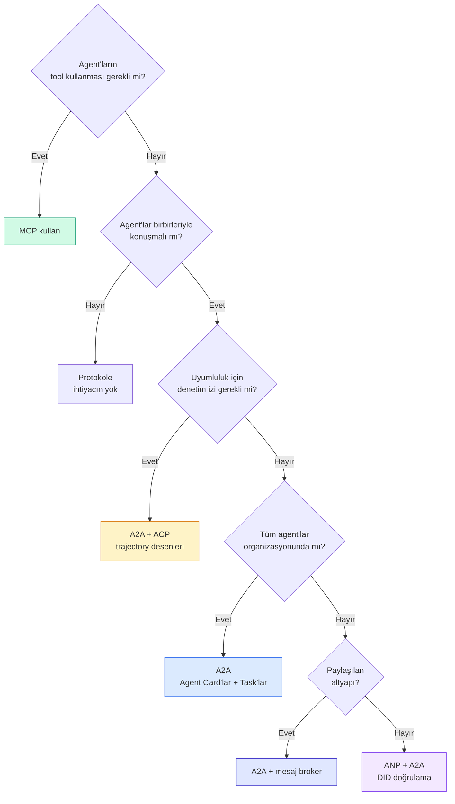

## Yayınla

Bu ders şunları üretir:
- `code/main.ts` — dört protokol deseninin tam implementasyonu
- `outputs/prompt-protocol-selector.md` — sistemin için protokol seçmene yardım eden bir prompt

## Alıştırmalar

1. **Çoklu-hop görev delegasyonu.** Bir agent handler'ın alt görevleri diğer agent'lara delege edebilmesi için `TaskManager`'ı genişlet. Araştırmacı bir task alır, "arama" ve "özetleme" alt görevlerini iki uzman agent'a delege eder, ikisinin de tamamlanmasını bekler, sonra sonuçları kendi artefaktlarına birleştirir.

2. **Streaming denetim izi.** `AuditableRunner`'ı streaming mode'u desteklemek için değiştir. Tam sonucu beklemek yerine, trajectory girdileri eklendikçe gerçek zamanlı olarak `AuditEntry` güncellemeleri yield et. Denetim anlık görüntüleri üreten bir async generator kullan.

3. **DID rotasyonu.** `IdentityRegistry`'ye anahtar rotasyonu ekle. Bir agent, `previousDid` referansını koruyarak güncellenmiş anahtarlarla yeni bir DID dokümanı yayınlayabilmeli. Doğrulayıcılar bir grace period boyunca hem mevcut hem önceki anahtardan imzaları kabul etmeli.

4. **Protokol müzakeresi.** ANP'nin meta-protokol kavramını uygula. İki agent aday formatlarla `protocolNegotiation` mesajları alışverişi yapar (ör. "JSON-RPC konuşabilirim" - "REST tercih ederim"). Maks 3 turdan sonra bir formatta anlaşır ya da timeout olur. Anlaşılan format hangi `TaskManager` ya da `AuditableRunner`'ı kullanacaklarını belirler.

5. **Oran sınırlı keşif.** Yapılandırılabilir TTL ile Agent Card sorgularını cache'leyen ve agent başına saniyede keşif sorgularını sınırlayan bir `RateLimitedRegistry` wrapper ekle. 100 agent'ın başlangıçta birbirini keşfettiği bir thundering herd simüle et ve farkı ölç.

## Anahtar Terimler

| Terim | İnsanların söylediği | Aslında ne anlama geliyor |
|------|----------------|----------------------|
| MCP | "AI tool'ları için protokol" | Agent'ların tool keşfetmesi ve kullanması için istemci-sunucu protokolü. Agent-tool, agent-agent değil. |
| A2A | "Google'ın agent protokolü" | Linux Foundation altında agent iş birliği için peer-to-peer protokol. Agent Card'lar üzerinden keşif, 9 durumlu task yaşam döngüsü, SSE üzerinden streaming. JSON-RPC, REST ve gRPC bağlamlarını destekler. |
| ACP | "Kurumsal agent mesajlaşma" | IBM/BeeAI'nin agent run'ları için TrajectoryMetadata ile REST API'si: her yanıt akıl yürütme ve tool çağrıları zincirini taşır. A2A'ya birleşiyor. |
| ANP | "Merkeziyetsiz agent kimliği" | Kriptografik kimlik için `did:wba` (DID), E2EE için HPKE ve daha önce karşılaşmamış agent'lar için AI destekli meta-protokol müzakeresi kullanan topluluk protokolü. |
| Agent Card | "Agent'ın kartviziti" | `/.well-known/agent-card.json`'da skill'leri, desteklenen MIME tiplerini, güvenlik şemalarını ve protokol bağlamlarını betimleyen JSON dokümanı. |
| DID | "Merkeziyetsiz ID" | Agent'ın kendi domain'inde host edilen kriptografik olarak doğrulanabilir kimlikler için W3C standardı. ANP `did:wba` metodunu kullanır. |
| TrajectoryMetadata | "Denetim fişi" | ACP'nin her agent yanıtına akıl yürütme adımları, tool çağrıları ve onların input/output'larını ekleme mekanizması. |
| Meta-protokol | "Agent'ların nasıl konuşacaklarını müzakere etmesi" | ANP'nin agent'ların veri formatlarında dinamik olarak anlaşmak için doğal dil kullanması ve sonra bunları ele almak için kod üretmesi yaklaşımı. |
| Task | "Bir iş birimi" | A2A'nın gönderimden tamamlanmaya kadar işi takip eden durumlu nesnesi. Terminal olduğunda değişmez. |

## İleri Okuma

- [Google A2A spec'i](https://github.com/google/A2A) — resmi spec ve SDK'lar (v1.0.0, Linux Foundation)
- [IBM/BeeAI ACP spec'i](https://github.com/i-am-bee/acp) — agent run'lar ve trajectory metadata için OpenAPI 3.1 spec'i
- [Agent Network Protocol](https://github.com/agent-network-protocol/AgentNetworkProtocol) — DID temelli kimlik, E2EE, meta-protokol müzakeresi
- [Model Context Protocol dokümanları](https://modelcontextprotocol.io/) — Anthropic'in MCP spec'i (Faz 13'te kapsanır)
- [W3C Decentralized Identifiers](https://www.w3.org/TR/did-core/) — ANP'yi destekleyen kimlik standardı
- [RFC 9180 (HPKE)](https://www.rfc-editor.org/rfc/rfc9180) — ANP'nin E2EE için kullandığı şifreleme şeması
- [FIPA Agent Communication Language](http://www.fipa.org/specs/fipa00061/SC00061G.html) — modern agent protokollerinin akademik öncülü
